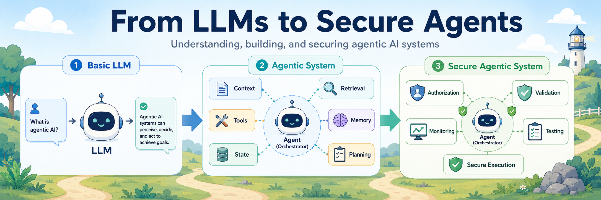
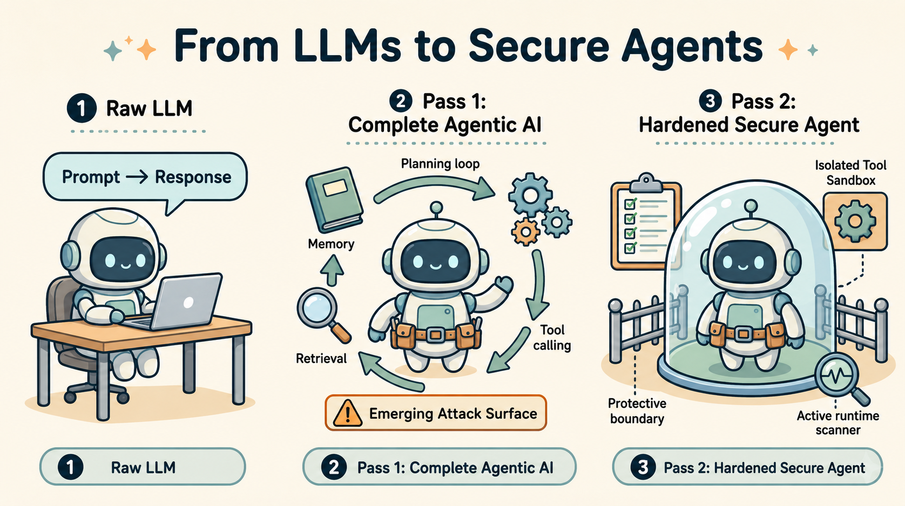
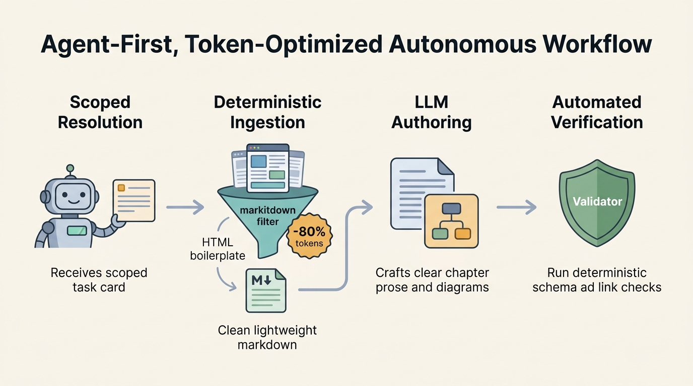

<div align="center">

<h1>From LLMs to Secure Agents</h1>

<p><strong>A deep, visual, source-grounded guide to understanding complete agentic AI systems and learning how to secure them.</strong></p>

<p><a href="https://renatomignone.github.io/From-LLMs-to-Secure-Agents/"></a> <a href="ROADMAP.md"></a> <a href="ROADMAP.md"></a> <a href="docs/evidence-policy.md"></a> <a href="docs/visuals-policy.md"></a></p>

<p>Architecture first · Security second · Sources and visuals traced</p>

</div>

## The idea

Agent security is difficult to learn from isolated vulnerability lists. This project first builds a **complete mental model of an agentic system**, including architecture, context, memory, retrieval, tools, identity, execution, human control, observability, protocols, and end-to-end workflows. It then revisits the same system through a **threat model, controls, tests, and secure reference architectures**.



The guide assumes **working familiarity with large language models and prompts**. It gives only short refreshers when an agentic concept needs them. API and Python experience helps, but is not required. The focus is the agentic system, not model internals or prompt engineering.

The reader follows a concise **main path** through the complete system. Specialized mechanisms, framework details, emerging protocols, regulation, and research live in clearly labeled **deep-dive branches** that can remain collapsed until needed.

The presentation combines **precise technical writing** with clear diagrams, reproducible plots, and approachable illustrations. It also maps current engineering vocabulary to stable system concepts, so terms such as context engineering, harness engineering, and loop engineering remain useful instead of becoming detached trend labels.

## Two learning passes

| Pass | Goal | Main sections |
| --- | --- | --- |
| **1. Understand** | Explain how the complete system works | foundations, architectures, building blocks, policy, lifecycle, interfaces, protocols, workflows |
| **2. Secure** | Revisit that system through concrete threats and controls | threat model, component risks, governance, secure lifecycle, reference architectures, assurance |

**Detailed security starts only after Pass 1 is complete.** Architecture chapters contain a short security preview that links forward.

## Guide structure

```text
knowledge/
  00-prerequisites/
  01-agent-foundations/
  02-agent-architectures/
  03-building-blocks/
  04-frameworks-and-protocols/
  05-end-to-end-workflows/
  06-threat-model/
  07-security-by-component-and-workflow-stage/
  08-secure-reference-architectures/
  09-security-testing-evaluation-and-assurance/
  10-open-research-questions/
```

Every guide directory has a local `AGENTS.md` and `chapter-plan.md`. Together they define scope, prerequisites, teaching order, sources, visuals, examples, and the boundary between the two passes.

## Agent-first, token-optimized architecture



This repository is engineered from the ground up for **agentic authoring with extreme token efficiency**:

1. **Scoped Unit Resolution**: The agent resolves exactly one unit at a time via `python3 scripts/main.py state resolve`. The full roadmap is never loaded into working memory during authoring runs, protecting the context window.
2. **Deterministic Web Ingestion**: Web specifications, RFCs, and primary documentation are parsed into clean Markdown using `markitdown` (`python3 scripts/main.py fetch <url> -o /tmp/source.md`). This eliminates up to 85% of raw token bloat (HTML tags, stylesheets, tracking scripts, and cookie banners) before LLM ingestion.
3. **High-Grade LLM Authoring**: Language models focus purely on what they do best: authoring engaging, crystal-clear technical prose, intuitive analogies, and approachable visual prompts in simple English.
4. **Automated Verification Gates**: Mechanical validators enforce schema correctness, local visual manifests, bidirectional citations, and instruction word budgets, guaranteeing deterministic quality without model drift.

## Reproducible autonomous workflow

A coding agent can resume from machine-readable project state, resolve the next unit, research and write **only that unit**, design and generate multiple visual cartoon diagrams across key concepts, validate both the repo and the static site, and stop at review. A separate continuation reviews and completes that unit before the guide advances.

```text
Read AGENTS.md and continue the guide from the last checkpoint. Proactively design and generate multiple visual cartoon illustrations per chapter (covering architecture flows, trust boundaries, state transitions, and attack paths) wherever visuals improve reader understanding.
```

Each completed unit includes:

- checked source records with exact claims and canonical links;
- multiple canonical 2D cartoon visual illustrations (strictly no text-based ASCII schemas);
- smooth reading progression with next-unit navigation links;
- small runnable examples when the plan requires them;
- deterministic repository validation and static site build verification (`pytest` and `npm --prefix site run build`);
- updated project state and a concise changelog entry.

## Modular CLI toolkit

All repository operations are unified through the modular CLI in [`scripts/main.py`](scripts/main.py):

```bash
# Resolve current unit and operational state
python3 scripts/main.py state resolve

# Fetch clean, token-efficient Markdown from an external specification
python3 scripts/main.py fetch "https://www.rfc-editor.org/rfc/rfc8693.html" -o /tmp/rfc8693.md

# Run repository validation
python3 scripts/main.py validate
```

## Publishing and static website

**Markdown under `knowledge/` is the canonical knowledge format.** The static website is a deterministic projection of this knowledge base built with Astro and Starlight, deployed to GitHub Pages at:

🔗 **[renatomignone.github.io/From-LLMs-to-Secure-Agents](https://renatomignone.github.io/From-LLMs-to-Secure-Agents/)**

To develop or build the site locally:

```bash
cd site
npm ci
npm run dev    # Start local development server with auto-rebuilding pipeline
npm run build  # Build production static site to site/dist/
npm run check  # Verify site integrity, links, images, and endpoints
```

See [`docs/site-policy.md`](docs/site-policy.md) and [`site/AGENTS.md`](site/AGENTS.md) for publishing invariants.

## Repository map

| Path | Purpose |
| --- | --- |
| `AGENTS.md` | Compact entry point for every agent run |
| `PROJECT_STATUS.md` | Operational progress and resume state |
| `ROADMAP.md` | Stable dependency-ordered guide |
| `docs/` | Focused project policies |
| `knowledge/` | Canonical chapters and local plans |
| `sources/` | Verified source records mirroring the chapter hierarchy |
| `assets/images/` | Image folders mirroring the chapter hierarchy, plus repository images |
| `scripts/` | Modular CLI toolkit, validation suite, and regression tests |
| `examples/` | Runnable examples and security labs mirroring the chapter hierarchy |
| `site/` | Static documentation website (Astro & Starlight) |

## Author & Maintainer

**Renato Mignone** ([GitHub](https://github.com/RenatoMignone))
AI Systems & Security Researcher.

## Contributing

Contributions are welcome. Please read [`CONTRIBUTING.md`](CONTRIBUTING.md) and [`CODE_OF_CONDUCT.md`](CODE_OF_CONDUCT.md) before submitting issues or pull requests.

## Security

Please report vulnerabilities confidentially according to [`SECURITY.md`](SECURITY.md).

## License

This project is licensed under the MIT License. See [`LICENSE`](LICENSE) for details.

