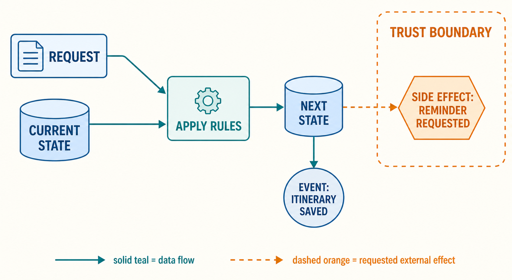

# Requests, events, state, and side effects

## Why this matters

Imagine that Maya presses **Save itinerary** after choosing Florence for a day trip. The application receives her request, changes its stored itinerary, and records that the itinerary was saved. It may then ask a notification service to send a reminder. These are four different facts. If the reminder service is slow, the itinerary can still be saved. If a duplicate request arrives, the application may need to decide whether to make the same change again.

This distinction makes later agent workflows readable. A model or an agent can ask for work, but the request is not the work's result. Keep separate what was asked for, what the system now remembers, what it recorded as having happened, and what changed beyond the local operation. The [project guide](../chapter-plan.md) places this vocabulary before [agent foundations](../01-agent-foundations/chapter-plan.md).

## Simple mental model

Think of a library desk. A reader says, “Please reserve this book.” That is a **request**: an input asking the librarian to try an action. The catalogue moves from “available” to “reserved.” That remembered condition is the library's **state**. The desk can print a slip saying “reservation created.” That slip is an **event record**: it says something happened, with enough context for another part of the library to react. Finally, an email service may send the reader a confirmation. Sending the email is a **side effect**, because it changes something outside the catalogue update.

The useful reading order is: request, old state, transition, next state, event, and side effect. It prevents a common shortcut, “the system did it,” from hiding which result is known and which is only requested.

## Position in the agent workflow

Use this workflow legend as the map for the itinerary story.



*Figure 1. State-transition notation. The next state, the emitted event, and an external side effect are separate outputs of a transition.*

Read it from left to right. An incoming message reaches a running application process. The process compares the message with what it currently remembers and applies its rules. If it accepts the request, it produces a next state. It can also emit an event for other components and ask an external service to act. Later agent diagrams use the same notation, even when the incoming message is a model-selected tool request rather than a button press.

## How it works

### A request asks; an event reports

A **request** is directed at a receiver: it asks that receiver to try some work. An HTTP request is a familiar example. HTTP defines method semantics, including whether the client requests a state change, but the application decides what each request means for its own data. [RFC 9110](https://www.rfc-editor.org/rfc/rfc9110.html) also makes an important distinction: a method can be safe from the client's point of view even though the server performs an incidental effect, such as writing an access log.

An **event** looks backward rather than forward. It is a record that an occurrence took place, plus its context. CloudEvents, a vendor-neutral event format specification, uses exactly this distinction: an occurrence is a captured statement of fact during system operation, and an event expresses that occurrence and its context. [CloudEvents 1.0](https://github.com/cloudevents/spec/blob/main/cloudevents/spec.md) does not make the event true by itself or define its delivery guarantee. It gives different systems a common envelope for carrying it.

| Message | Direction of meaning | Example | It does not prove |
| --- | --- | --- | --- |
| Request | “Please try this.” | `save_itinerary` | The state was changed. |
| Event | “This occurred.” | `itinerary.saved` | Every interested component received it. |

One physical message can contain either kind, and a receiving component may turn an event into a new request. The names describe the message's role in this part of the workflow, not its file format or transport.

### State changes one transition at a time

**State** is the information a system currently uses to describe its situation. For this chapter, the itinerary store's state is the saved itinerary and its status. A **state transition** is the named step from the old situation to the next one. It is clearer to write both states than to say merely “update it.”

```text
old state:  no itinerary for Maya on 2026-09-12
request:    save Florence day trip
transition: create itinerary
next state: itinerary #it-204 exists, status = saved
event:      itinerary.saved for #it-204
effect:     reminder delivery requested
```

The event names a fact about the transition. It is not a duplicate name for the state. The store answers “what is true now?” The event answers “what occurred?” Both can be useful, and they can disagree temporarily if one record succeeds while another operation is delayed or fails.

## Main variants

| Workflow shape | Request | State transition | Event or effect |
| --- | --- | --- | --- |
| Immediate web action | Browser asks the application to save. | The application writes the itinerary. | It replies to the browser and may record `itinerary.saved`. |
| Scheduled work | A clock triggers a reminder check. | The scheduler records that this run started. | It emits `reminder.due` or asks a mail service to send. |
| Event-driven work | A consumer receives `itinerary.saved`. | The consumer stores its own notification job. | It later requests delivery from a notification service. |

The last row shows why an event is not an instruction that guarantees one outcome. Several consumers can react, react later, or not be available. Each consumer owns its own transition and its own effects.

## Minimal implementation

This inline pseudocode keeps the outcomes visible without introducing a framework:

```text
receive save-itinerary request
read Maya's current itinerary state
if the request is allowed and the itinerary is not already saved:
    write the saved itinerary as next state
    record itinerary.saved as an event
    request reminder delivery as a side effect
return the state that the application observed
```

The order is intentional. First, the process decides whether it will change its state. Then it records the resulting occurrence. It may request outside work after that. This pseudocode does not promise that the reminder was sent, only that delivery was requested.

## Framework implementations

No framework is required. A web framework might call the first line a *route handler*. A message broker might call the event consumer a *subscriber*. A job system might call the later work a *task*. Translate each label back to the same questions: what arrived, what state did this component own, what fact did it record, and what did it ask another component to do?

## Data flow and state changes

The same itinerary values can appear in every step, but their movement does not by itself prove a state change. A browser can send Florence, and the application can respond with a validation error without changing its store. Conversely, a state transition can succeed even if the browser never receives the response.

Give each transition an identifier when the workflow needs to be traced. The mocked example from the system-map chapter uses a request identifier, applies one authorized transition, saves one task, and records one event:

```bash
python3 examples/00-prerequisites/01-reader-contract-and-system-map/task_transition.py
python3 -m unittest examples/00-prerequisites/01-reader-contract-and-system-map/tests/test_task_transition.py
```

It deliberately records a requested notification instead of contacting a real service. That small limit is the lesson: recording a request for an effect is not observing the effect's completion.

## Trust boundaries

At a trust boundary, keep each claim attached to its owner. The itinerary application owns the change in its store. The notification service owns whether it accepted and sent a reminder. An event transported across the boundary gives the other service information to process; it does not transfer the application's authority or make the other service's result part of the first transition.

Label a cross-boundary arrow with the event or request, its source, and its intended receiver. That is enough for this foundation chapter. The next prerequisite chapter adds identity and permission, while the later [threat model](../06-threat-model/chapter-plan.md) asks what authority and assets cross these boundaries.

## Reliability failures

An ordinary network failure can leave several facts unknown. The application may have saved the itinerary but lost its response. It may have recorded the event but not delivered it to a consumer yet. The notification service may have received a request while its response was lost. Do not replace those facts with one broad status such as “done.”

Repeated requests make the same distinction useful. HTTP calls a method **idempotent** when multiple identical requests have the same intended effect on the server as one request. [RFC 9110](https://www.rfc-editor.org/rfc/rfc9110.html) notes that incidental effects such as logs can still occur more than once. This chapter does not prescribe retry or duplicate-handling designs. It only gives the vocabulary needed to see why those designs matter.

## Worked example

Here is one mocked success path, written as JSON-like records:

```json
{
  "request": {"id": "req-204", "action": "save_itinerary", "destination": "Florence"},
  "before": {"itinerary": null},
  "after": {"itinerary": {"id": "it-204", "destination": "Florence", "status": "saved"}},
  "event": {"type": "itinerary.saved", "itinerary_id": "it-204"},
  "side_effect": {"type": "reminder.delivery_requested", "status": "requested"}
}
```

The request is not part of the resulting state. The `before` and `after` records make the state transition inspectable. The event records the completed save. The side-effect record says only that delivery was requested. If delivery later succeeds, the notification service can emit a separate event such as `reminder.sent`.

## Limitations and trade-offs

These four labels simplify real systems. A component can keep state in memory, in a database, or in several places. An event can be generated from a state change, a timer, or an observed external fact. Some systems use the word “event” loosely for any queued message. State whether the message is asking for work or reporting an occurrence, and the ambiguity becomes manageable.

An event log is also not automatically a complete history. Events can be missing, duplicated, delayed, or interpreted differently by consumers. Likewise, a state snapshot does not explain every earlier transition. Later lifecycle, observability, and reliability chapters treat those design choices in detail.

## Security preview

Security analysis later asks who may request a transition, whether the recorded event and state can be relied on, and what authority an outside effect uses. This chapter does not assess attacks or prescribe controls. It supplies the workflow labels that the [threat model](../06-threat-model/chapter-plan.md) will map to assets, actors, authority, boundaries, and effects.

## Open research questions

Where should retry semantics first become part of the main learning path? The answer depends on when readers first need to reason about duplicate requests, late events, and uncertain side-effect completion rather than just trace a single success path.

## Key takeaways

- A request asks a component to try work. An event records an occurrence and its context.
- A state transition changes what one component remembers from an old state to a next state.
- An event record and a side effect are separate from the state change they follow.
- “Requested,” “recorded,” and “completed” are different facts, especially when systems communicate across a network.

## References

- [RFC 9110: HTTP Semantics](https://www.rfc-editor.org/rfc/rfc9110.html)
- [CloudEvents Specification](https://github.com/cloudevents/spec/blob/main/cloudevents/spec.md)
