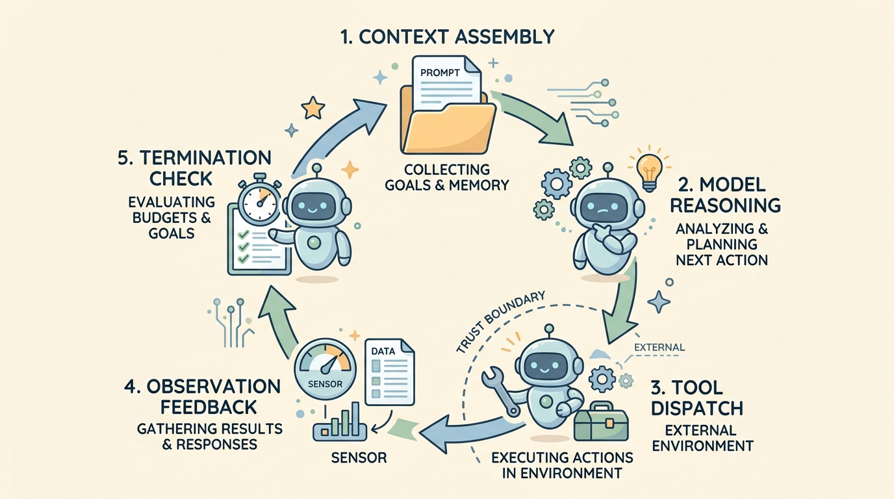

<!--
---
title: The agent loop
unit_id: P1-01-02
summary: Explains the internal mechanics of the agent execution loop, detailing how
  models perceive environment feedback, decide actions, and execute tools across iterative
  turns.
prerequisites:
- Read [What is an agent](01-what-is-an-agent.md).
- Read [Prerequisites](../00-prerequisites/chapter-plan.md).
learning_objectives:
- Trace the step-by-step lifecycle of a single turn in an agent execution loop.
- Differentiate between the inner reasoning cycle and outer runtime wrappers.
- Implement a framework-free agent loop with step budgets, schema validation, and
  error recovery.
source_records:
- p1-01-02-yao-react-2022
- p1-01-02-ibm-loop-engineering-2024
- p1-01-02-anthropic-effective-agents-2024
visual_assets:
- assets/images/01-agent-foundations/02-the-agent-loop/01-agent-loop-cycle.png
example_paths: []
pass: architecture
learning_path: main
status: complete
last_reviewed: '2026-08-15'
---
-->

# The agent loop

## Why this matters

A single call to a language model is a one-shot prediction: you send a prompt, and the model returns text. In real-world software engineering, complex problems can rarely be solved in a single attempt. Tasks like debugging a broken build, auditing cloud infrastructure, or researching across multiple databases require trial, feedback, and correction.

The agent loop provides the operational engine that transforms a static model into an interactive problem solver. By repeatedly sending tool outputs and environmental feedback back to the model, the loop enables iterative problem-solving. Understanding the mechanics of this loop allows engineers to design robust runtime safeguards, prevent runaway token consumption, and prepare for security challenges such as prompt injection and unauthorized tool execution.

## Simple mental model

Think of a person playing a game of Battleship.

The player does not announce ten coordinates all at once. Instead, they operate in a continuous loop:
1. **Perceive**: Look at the board and review past hits and misses.
2. **Decide**: Choose the next square to target based on current clues.
3. **Act**: Call out the coordinate (for example, "B-4").
4. **Observe**: Listen to the opponent's response ("Hit!").
5. **Evaluate**: Update the board marker and check if the opponent's fleet is sunk.

If the ship is still floating, the player repeats the cycle. In an AI agent system, the host application manages the game board, while the language model plays the role of the decision maker calling out coordinates and interpreting the feedback.

## Position in the agent workflow

Use this diagram to trace the 5-phase perception-reasoning-action cycle that drives an autonomous agent run.



*Figure 1. The cyclic agent execution loop. The host runtime prepares prompt context, the model reasons and selects an action, the host dispatches the tool across the trust boundary, the environment returns observations, and termination checks evaluate whether to continue or stop.*

Follow the cycle clockwise starting from the top:
1. **Context Assembly**: The host assembles the prompt context, collecting the user goal, system policies, and accumulated history.
2. **Model Reasoning**: The reasoning model evaluates the situation, analyzes observations, and selects the next tool call or final response.
3. **Tool Dispatch**: The host intercepts the model's action request and executes the tool in the external environment across the trust boundary.
4. **Observation Feedback**: The environment returns tool results or error messages, which are fed back into the agent context.
5. **Termination Check**: The host evaluates stop criteria (goal completion, step budget, token limits) before starting the next turn.

## How it works

### The anatomy of an execution turn

Every iteration of the agent loop is called a **turn** or **step**. A single turn consists of five sequential phases:

1. **Context Assembly**: The host gathers the system prompt, available tool definitions (schemas), user goal, and the chronological record of prior actions and observations into a fresh prompt context.
2. **Model Inference**: The host invokes the language model API. The model processes the context, generates internal reasoning (often called "thoughts"), and outputs either a structured tool call or a final answer.
3. **Dispatch and Execution**: If the model requests a tool call, the host intercepts the request, validates the function name and arguments against declared schemas, and executes the code against the target environment.
4. **Observation Feedback**: The output or error from the tool execution is serialized into structured text and appended to the message history as an observation.
5. **Termination Check**: The host verifies whether stopping conditions have been met. If the model indicated task completion, or if runtime limits (step count, token budget, wall-clock timeout) are reached, the loop exits. Otherwise, it proceeds to the next turn.

### Inner reasoning loop versus outer loop engineering

It is critical to distinguish between the **inner loop** and the **outer loop**:

- **Inner reasoning loop**: The cognitive cycle formalized in papers like [ReAct (Yao et al., 2022)](https://arxiv.org/abs/2210.03629). This is the model's self-directed process of reasoning over observations and choosing the next action.
- **Outer loop engineering**: The deterministic software scaffolding surrounding the model, described in enterprise practices like [IBM Loop Engineering (2024)](https://www.ibm.com/think/topics/loop-engineering). Outer loop engineering handles rate limiting, authentication, error retries, context window truncation, telemetry logging, and hard safety constraints.

| Dimension | Inner Reasoning Loop | Outer Loop Engineering |
| --- | --- | --- |
| Primary controller | The language model | Deterministic host software |
| Core responsibility | Interpreting data, problem solving, selecting tools | Managing lifecycle, validating schemas, enforcing security policies |
| Failure handling | Re-evaluating observations after an error | Terminating stalled runs, retrying network errors, catching exceptions |
| Predictability | Non-deterministic (probabilistic model output) | Deterministic (strict algorithmic rules) |

## Main variants

1. **Synchronous Single-Action Loop**: The model emits exactly one tool call per turn, waits for the host to execute it, and receives the observation in the subsequent turn.
2. **Parallel Tool Calling Loop**: The model emits multiple independent tool calls simultaneously (such as querying three search terms at once). The host executes them concurrently and returns all observations in one turn.
3. **Streaming Agent Loop**: The model streams reasoning tokens and tool arguments incrementally. The host parses arguments as they arrive and prepares downstream infrastructure before generation finishes.
4. **Human-in-the-Loop Pausing**: The host pauses the loop before executing privileged actions (such as deleting files or sending payments) until a human operator approves or rejects the call.

## Minimal implementation

The following Python program implements a typed agent loop with step budgets, schema validation, and error feedback.

```python
from dataclasses import dataclass, field
import json
from typing import Any, Callable, Dict, List, Optional

@dataclass
class Tool:
    name: str
    description: str
    func: Callable[..., str]

class AgentRuntime:
    def __init__(self, tools: List[Tool], max_turns: int = 5):
        self.tools: Dict[str, Tool] = {t.name: t for t in tools}
        self.max_turns = max_turns

    def execute_tool(self, tool_name: str, arguments: Dict[str, Any]) -> str:
        if tool_name not in self.tools:
            return f"ERROR: Tool '{tool_name}' is not registered."
        try:
            return self.tools[tool_name].func(**arguments)
        except Exception as e:
            return f"ERROR: Tool execution failed with exception: {str(e)}"

    def run(self, goal: str, model_client: Any) -> str:
        history: List[Dict[str, str]] = [
            {"role": "system", "content": "You solve tasks step by step using tools. When finished, start your reply with 'FINAL:'."},
            {"role": "user", "content": goal}
        ]

        for turn in range(1, self.max_turns + 1):
            # 1. Model inference
            response = model_client.predict(history)

            # 2. Check for completion
            if response.startswith("FINAL:"):
                return response.replace("FINAL:", "").strip()

            # 3. Parse action request (simulating structured tool call)
            try:
                action = json.loads(response)
                tool_name = action.get("tool")
                args = action.get("args", {})
            except json.JSONDecodeError:
                observation = "ERROR: Output must be valid JSON tool call or start with 'FINAL:'."
                history.append({"role": "assistant", "content": response})
                history.append({"role": "user", "content": f"Observation: {observation}"})
                continue

            # 4. Execute tool
            observation = self.execute_tool(tool_name, args)

            # 5. Append to history for next turn
            history.append({"role": "assistant", "content": response})
            history.append({"role": "user", "content": f"Observation: {observation}"})

        return "ERROR: Maximum turn budget exhausted without completion."
```

## Framework implementations

- **Anthropic Building Effective Agents**: Anthropic's [guidance (2024)](https://www.anthropic.com/research/building-effective-agents) emphasizes keeping the basic loop simple: a standard `while` loop that calls the Messages API with tool declarations and feeds `tool_result` blocks back into the conversation.
- **OpenAI Responses and Agents SDK**: Formats tool invocations as first-class `tool_calls` message items and manages the execution-observation recursion automatically through SDK abstractions.
- **LangGraph**: Models the agent loop as a cyclical graph (`START -> model -> tools -> model -> END`), giving developers fine-grained control over intermediate state checkpoints.

## Data flow and state changes

Trace the state of the conversation history as the loop progresses across turns:

```text
Turn 0 (Initialization):
  History = [ SystemPrompt, UserGoal("Check server status and restart if down") ]

Turn 1:
  Model Output: call_tool("ping_server", host="web-01")
  Host Action: Runs ping_server(host="web-01") -> returns "Status: 500 Internal Error"
  History += [ AssistantCall("ping_server", ...), ToolObservation("Status: 500 Internal Error") ]

Turn 2:
  Model Output: call_tool("restart_service", host="web-01", service="nginx")
  Host Action: Runs restart_service(...) -> returns "Service nginx restarted successfully"
  History += [ AssistantCall("restart_service", ...), ToolObservation("Success") ]

Turn 3:
  Model Output: "FINAL: Server web-01 was reporting 500 Internal Error; nginx has been restarted."
  Host Action: Detects final answer, breaks loop, returns message to user.
```

## Trust boundaries

1. **Context Boundary**: The model does not execute code directly. It emits structured text requesting an execution. The host runtime is the sole entity authorized to interact with the environment.
2. **Parameter Validation Boundary**: All arguments supplied by the model must be treated as untrusted input. The host must validate types, bounds, and permissions before passing arguments to system APIs.
3. **Environment Boundary**: The environment returns data that may originate from untrusted external sources (such as third-party web pages). This data enters the agent context as an observation, where it could contain prompt injection payloads.

## Reliability failures

- **Stuck in Loop / Thrashing**: The model attempts the same failing action repeatedly because it does not comprehend the error observation.
- **Context Bloat**: Verbose tool outputs (for example, a tool returning a 50,000-line log file) consume the entire context window, driving up latency and causing truncation of earlier instructions.
- **Premature Halting**: The model encounters a minor warning in a tool observation and assumes the entire task is impossible, aborting without attempting alternative tools.

## Worked example

Consider an agent diagnosing disk space on a remote server:

1. **Goal**: *"Find the largest log directory and delete files older than 30 days."*
2. **Turn 1 (Inspect)**: The agent calls `disk_usage(path="/var/log")`. Observation: `{"size": "45GB", "status": "warning"}`.
3. **Turn 2 (Analyze)**: The agent calls `list_old_files(path="/var/log", older_than_days=30)`. Observation: `["/var/log/syslog.1.gz", "/var/log/app-2025.log"] (Total: 40GB)`.
4. **Turn 3 (Act)**: The agent calls `delete_files(paths=["/var/log/syslog.1.gz", "/var/log/app-2025.log"])`. Observation: `{"deleted_count": 2, "freed_bytes": "40GB"}`.
5. **Turn 4 (Verify)**: The agent calls `disk_usage(path="/var/log")`. Observation: `{"size": "5GB", "status": "healthy"}`.
6. **Turn 5 (Complete)**: The agent outputs: *"Cleaned up 40GB of old logs. /var/log is now at 5GB (healthy)."*

## Limitations and trade-offs

- **Cost vs. Capability**: Each additional turn in the loop resends the entire accumulated conversation history, causing quadratic token scaling if history is not pruned.
- **Latency**: Multi-turn loops require sequential round-trip API calls. A five-turn agent run can easily take 15 to 30 seconds to complete.
- **Error Amplification**: If the model misinterprets an early observation, all subsequent decisions in the loop build upon that flawed premise.

## Security preview

The cyclic nature of the agent loop creates unique attack surfaces. In [threat modeling](../06-threat-model/chapter-plan.md) and Pass 2 security modules, we examine how malicious data inside an observation can redirect the loop (indirect injection), how attackers can trigger infinite loops to exhaust API budgets (denial of service), and how tool parameters must be constrained to prevent privilege escalation.

## Open research questions

- What dynamic pruning strategies allow long-running agent loops to retain critical reasoning state while discarding unneeded observation noise?
- How can hosts reliably detect non-productive semantic loops without terminating legitimate exploratory problem-solving?

## Key takeaways

- The **agent loop** is the cyclic process of assembling context, predicting actions, executing tools, receiving observations, and evaluating termination.
- **Inner loops** govern model reasoning over observations; **outer loops** enforce engineering guardrails, rate limits, and safety invariants.
- Robust agent loops require explicit termination limits, including max turn counts, token budgets, and strict tool schema validation.
- Observations from tools re-enter the model context as untrusted input that can influence subsequent loop decisions.

## References

- Shunyu Yao, Jeffrey Zhao, Dian Yu, Nan Du, Izhak Shafran, Karthik Narasimhan, and Yuan Cao. *ReAct: Synergizing Reasoning and Acting in Language Models*. International Conference on Learning Representations (ICLR), October 2022. [DOI: 10.48550/arXiv.2210.03629](https://doi.org/10.48550/arXiv.2210.03629).
- IBM Think. *What is loop engineering?* IBM Technical Documentation, 2024. [IBM Reference](https://www.ibm.com/think/topics/loop-engineering).
- Anthropic. *Building Effective Agents*. Anthropic Research & Engineering Guidance, December 2024. [Anthropic Guide](https://www.anthropic.com/research/building-effective-agents).

---

[Next Unit: Workflows versus agents →](03-workflows-versus-agents.md)
