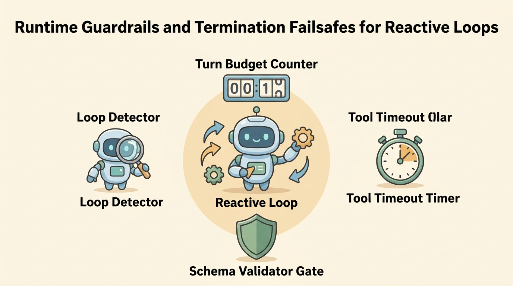

<!--
---
title: Single-agent and reactive loops
unit_id: P1-02-02
summary: Explores the internal mechanics, state progression, and failure modes of
  single-agent ReAct loops, detailing how models interleave reasoning with dynamic
  tool actions and how host runtimes enforce termination guardrails.
prerequisites:
- Read [Architecture selection criteria](01-architecture-selection-criteria.md).
- Read [The agent loop](../01-agent-foundations/02-the-agent-loop.md).
learning_objectives:
- Trace the step-by-step mechanics of the ReAct (Reason + Act) loop pattern.
- Manage context accumulation, observation overload, and semantic drift across multi-turn
  runs.
- Implement deterministic host guardrails including turn budgets, tool timeouts, and
  loop detectors.
- Diagnose reactive loop failure modes such as thrashing, tool hallucination, and
  observation poisoning.
source_records:
- p1-02-02-yao-react-2022
- p1-02-02-anthropic-tool-loops-2024
- p1-02-02-langgraph-react-2024
visual_assets:
- assets/images/02-agent-architectures/02-single-agent-and-reactive-loops/01-react-loop-mechanics.png
- assets/images/02-agent-architectures/02-single-agent-and-reactive-loops/02-context-accumulation-and-drift.png
- assets/images/02-agent-architectures/02-single-agent-and-reactive-loops/03-reactive-loop-guardrails.png
example_paths: []
pass: architecture
learning_path: main
status: complete
last_reviewed: '2026-08-17'
---
-->

# Single-agent and reactive loops

## Why this matters

A single language model call can generate text, summarize documents, or classify sentiment. However, solving problems that require discovering facts, interacting with APIs, and recovering from errors requires an iterative execution harness. The **single-agent reactive loop** is the fundamental engine that transforms a static language model into an active problem solver.

Unlike a hardcoded script where every step is locked in code, a reactive agent inspects its environment at every turn, decides which action to take next, observes the result, and adjusts its strategy. While this pattern offers immense flexibility, it also introduces non-deterministic execution paths, rapid context window consumption, and the danger of infinite loops. Mastering the mechanics and guardrails of the reactive loop is a prerequisite before building complex [Building blocks](../03-building-blocks/chapter-plan.md) and multi-agent systems.

## Simple mental model

Imagine a detective investigating a puzzling mystery in an unfamiliar building:

1. **Observe & Reason (Thought)**: The detective stands in the foyer, reviews the case notes (the user goal), notices a locked oak door on the left, and reasons: *"I need to inspect what is behind that door. I should check the key rack on the desk first."*
2. **Execute Action (Tool Call)**: The detective walks over to the desk and picks up the brass key labeled "Room 101".
3. **Environment Feedback (Observation)**: The key fits into the keyhole, but when turned, the lock mechanism jams.
4. **Iterate (New Thought)**: Seeing the jammed lock, the detective does not give up or crash. The detective reasons: *"The lock is rusted. I need to find another way in. Let me check the exterior window."*

A reactive agent behaves exactly like this detective: it does not plan every single micro-action at the start; instead, it reacts dynamically to each piece of environmental evidence until the case is solved.

## Position in the agent workflow

The visual below illustrates the canonical cyclic flow of a reactive agent operating within the ReAct (Reasoning + Acting) paradigm.


*Figure 1. The ReAct loop cycle. The agent alternates between model-directed reasoning, structured tool invocation, environment execution, and observation ingestion until reaching its termination condition.*

Building upon [Agent foundations](../01-agent-foundations/chapter-plan.md), the reactive loop represents the purest form of single-entity autonomy, where a single language model acts as both the decision planner and the tool dispatcher.

## How it works

The core reactive loop combines model-directed reasoning with host-enforced deterministic execution through four sequential stages:

1. **Prompt Assembly & Context Ingestion**: The host runtime constructs the context prompt, containing the system instructions, user goal, available tool schemas, and chronological history of past thoughts, tool calls, and observations.
2. **Reasoning & Tool Selection (Thought + Action)**: The model processes the context and emits structured output. In modern implementations, this consists of a reasoning trace ("Thought") paired with an explicit tool call payload (`tool_name` and `arguments`).
3. **Host Dispatch & Environment Execution**: The host intercepts the tool call, validates the parameters against the tool schema, checks permissions, and executes the underlying function against the external environment.
4. **Observation Formatting & Loop Continuation**: The host serializes the tool result into a standardized observation message, appends it to the conversation history, and invokes the model for the next turn.

### Context accumulation and semantic drift

As a reactive loop progresses, every tool call and observation is permanently appended to the prompt history. While this allows the agent to recall prior steps, it creates substantial operational challenges.

The following visual depicts how context growth affects agent focus over extended runs:


*Figure 2. Context accumulation and semantic drift across multi-turn agent runs. Excessive observation payloads dilute model attention away from the original goal.*

When observations contain large JSON payloads or verbose error dumps, the model suffers from **semantic drift**: the original user instructions at the beginning of the context lose attention weight relative to recent bulky observations, causing the agent to forget constraints or wander off-task.

## Main variants

1. **Pure ReAct (Interleaved Thought and Action)**: The classic paradigm introduced by Yao et al. (2022), where the model explicitly generates verbal reasoning before emitting each action.
2. **Direct Tool Calling (Function Calling)**: Modern model APIs emit structured JSON tool calls directly without generating verbose markdown text blocks, reducing latency while preserving execution structure.
3. **Structured Reflection Loops**: A variant where the agent is forced to execute a dedicated self-critique step at the conclusion of each turn to verify whether the latest observation brought it closer to the goal.

## Minimal implementation

The following Python script demonstrates a robust single-agent reactive loop with turn limits, tool dispatch, and observation recording:

```python
from typing import Dict, Any, List, Callable
import json

class ReactiveAgentHost:
    def __init__(self, model_client, tools: Dict[str, Callable], max_turns: int = 5):
        self.model_client = model_client
        self.tools = tools
        self.max_turns = max_turns

    def run(self, goal: str) -> Dict[str, Any]:
        """Executes the reactive loop until completion or budget exhaustion."""
        history: List[Dict[str, str]] = [
            {"role": "system", "content": "You are an autonomous assistant. Use tools to satisfy the goal. Reply 'FINAL_ANSWER: <text>' when done."},
            {"role": "user", "content": goal}
        ]

        for turn in range(1, self.max_turns + 1):
            # Step 1: Model generates thought and action decision
            response = self.model_client.predict(history)

            # Step 2: Check for termination condition
            if "FINAL_ANSWER:" in response:
                final_text = response.split("FINAL_ANSWER:", 1)[1].strip()
                return {"status": "SUCCEEDED", "turns": turn, "result": final_text}

            # Step 3: Parse structured tool call
            try:
                tool_call = json.loads(response)
                tool_name = tool_call["name"]
                tool_args = tool_call.get("arguments", {})
            except Exception as parse_err:
                history.append({"role": "assistant", "content": response})
                history.append({"role": "user", "content": f"Tool call parsing error: {parse_err}. Output valid JSON."})
                continue

            # Step 4: Execute tool in host environment
            if tool_name not in self.tools:
                observation = f"Error: Tool '{tool_name}' does not exist."
            else:
                try:
                    tool_fn = self.tools[tool_name]
                    observation = str(tool_fn(**tool_args))
                except Exception as exec_err:
                    observation = f"Tool execution failed: {exec_err}"

            # Step 5: Append to context memory
            history.append({"role": "assistant", "content": response})
            history.append({"role": "user", "content": f"Observation: {observation}"})

        return {"status": "ABORTED", "reason": "Max turns reached", "turns": self.max_turns}
```

## Framework implementations

- **LangGraph**: Implements single-agent loops using a two-node cyclical graph: an `agent` node (model reasoning) connected to a `tools` node (environment execution), linked by a conditional edge that inspects whether tool calls were returned.
- **Anthropic Agent Patterns**: Highlights the autonomous tool loop as the primary pattern for unstructured tasks, emphasizing compact tool definitions and aggressive observation trimming.
- **Google Agent Development Kit (ADK)**: Uses stateful ReAct loop abstractions that manage tool calling lifecycle events and checkpoint memory buffers automatically.

## Data flow and state changes

Trace the data flow through a three-turn reactive investigation:

| Turn | Agent State | Action Dispatched | Observation Received | Context Change |
| --- | --- | --- | --- | --- |
| $t = 1$ | `START` | `search_logs(service="auth")` | `401 Unauthorized: Invalid Token` | Appended tool call + log snippet. |
| $t = 2$ | `INVESTIGATING` | `inspect_cert(domain="auth.internal")` | `Certificate expired 2 hours ago` | Appended cert inspection data. |
| $t = 3$ | `CONCLUDING` | `FINAL_ANSWER: Auth failing due to expired cert.` | *(None - Run Terminates)* | Final output returned to user. |

## Trust boundaries

1. **Host-Model Separation**: The language model only emits text suggestions; the host environment retains exclusive authority to actually execute system calls and network requests.
2. **Schema Sanitization Gate**: All arguments emitted by the model must be validated against strict types (e.g., Pydantic schemas) before being passed to system tools.
3. **Environment Observation Isolation**: External observation data (such as web pages or database records) must be treated as untrusted text to prevent prompt injection hijacking.

## Reliability failures

- **Thrashing and Repetitive Loops**: The agent repeatedly calls the same failing tool with identical arguments because it lacks sufficient reasoning capacity to recognize a dead end.
- **Tool Hallucination**: The model attempts to invoke imaginary tools that were never defined in the system prompt.
- **Observation Poisoning**: An external service returns an unexpected format or hostile prompt payload, causing the model to abandon its original objective.

## Worked example

Consider a customer account lookup task:
1. **User Goal**: *"Find the primary contact email for client Acme Corp."*
2. **Turn 1 (Thought & Action)**: Agent reasons: *"I need Acme Corp's client ID first."* Agent calls `lookup_company(name="Acme Corp")`.
3. **Turn 1 (Observation)**: Host returns `{"id": "C-9821", "status": "active"}`.
4. **Turn 2 (Thought & Action)**: Agent reasons: *"I have client ID C-9821. Now I will fetch contacts."* Agent calls `get_contacts(client_id="C-9821")`.
5. **Turn 2 (Observation)**: Host returns `[{"name": "Alice Smith", "role": "Primary", "email": "alice@acme.com"}]`.
6. **Turn 3 (Final Answer)**: Agent reasons: *"Primary contact found."* Agent outputs: `FINAL_ANSWER: The primary contact email for Acme Corp is alice@acme.com.`

## Limitations and trade-offs

The visual below summarizes the critical runtime guardrails required to keep reactive loops safe and bounded:



*Figure 3. Runtime guardrails for reactive agent loops. The host harness enforces strict boundaries to prevent runaway execution, timeouts, parameter corruption, and infinite thrashing.*

### Reactive loop trade-offs

- **Flexibility vs Predictability**: Reactive loops handle unexpected errors and edge cases gracefully, but produce non-deterministic execution paths that are hard to unit test.
- **Autonomy vs Token Cost**: Because context history grows linearly with every turn, long-horizon tasks can consume massive token budgets quickly.

## Security preview

Because a reactive agent loop grants the model runtime discretion over tool parameters and sequential execution, it represents an expanded security attack surface. An attacker embedding an indirect prompt injection in a database record or web page can hijack the agent's next thought, redirecting it to exfiltrate data or delete files. We examine these attack vectors and mitigation controls in [threat modeling](../06-threat-model/chapter-plan.md) and Pass 2 security chapters.

## Open research questions

- How can runtimes implement lossless observation compression to prevent semantic drift in 50+ turn agent runs?
- What formal methods can guarantee termination of model-directed loops without hardcoded turn limits?

## Key takeaways

- The **ReAct loop** couples verbal reasoning traces with structured tool execution and observation feedback in an iterative cycle.
- The host runtime must remain the authoritative controller, enforcing turn limits, schema validation, and tool timeouts.
- Extended agent runs suffer from **context accumulation** and **semantic drift**, requiring active observation summarization and filtering.
- Pure reactive agents are ideal for single-domain exploratory tasks with compact toolsets, but require supervision or decomposition for large, multi-domain problems.

## References

- Yao, S., Zhao, J., Yu, D., Du, N., Shafran, I., Narasimhan, K., & Cao, Y. *ReAct: Synergizing Reasoning and Acting in Language Models*. International Conference on Learning Representations (ICLR), 2023. [arXiv:2210.03629](https://arxiv.org/abs/2210.03629).
- Anthropic. *Building Effective Agents: Autonomous Tool Loops*. Anthropic Research & Engineering Guidance, December 2024. [Anthropic Research](https://www.anthropic.com/research/building-effective-agents).
- LangChain. *LangGraph: Cyclic State Graphs and ReAct Agents*. LangChain Documentation, 2024. [LangGraph Documentation](https://docs.langchain.com/oss/python/langgraph/workflows-agents).

---

[Next Unit: Sequential routing and parallel workflows →](03-sequential-routing-and-parallel-workflows.md)
