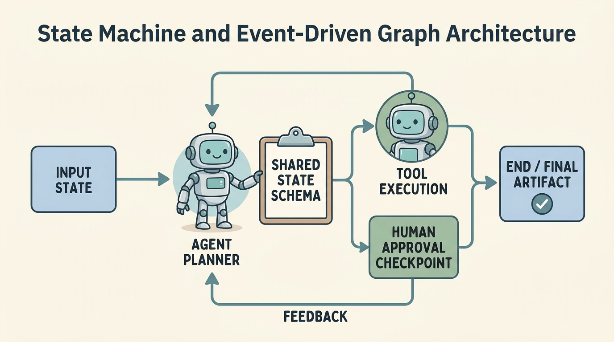
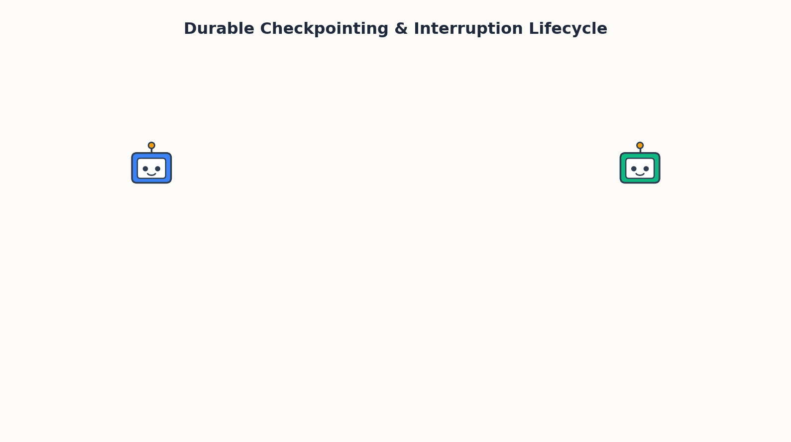

<!--
---
title: State machines and event-driven graphs
unit_id: P1-02-06
summary: Explores state machines and event-driven graphs for AI agents, detailing
  typed state schemas, cyclic nodes, conditional edge routing, durable checkpointing,
  and asynchronous human-in-the-loop interruption.
prerequisites:
- Read [Architecture selection criteria](01-architecture-selection-criteria.md).
- Read [Evaluator-optimizer and reflection](05-evaluator-optimizer-and-reflection.md).
learning_objectives:
- Model agent workflows as deterministic state graphs with explicit state schemas
  and state reducers.
- Implement cyclic execution topologies with conditional branching edges and termination
  guards.
- Integrate durable checkpoint stores to snapshot state across long-running executions.
- Construct asynchronous human-in-the-loop interruption gates for sensitive tool actions.
source_records:
- p1-02-06-langchain-langgraph-2024
- p1-02-06-temporal-durable-execution-2024
- p1-02-06-harel-statecharts-1987
visual_assets:
- assets/images/02-agent-architectures/06-state-machines-and-event-driven-graphs/01-state-machine-graph-architecture.png
- assets/images/02-agent-architectures/06-state-machines-and-event-driven-graphs/02-durable-checkpoint-and-interruption.png
example_paths:
- examples/02-agent-architectures/06-state-machines-and-event-driven-graphs/state_graph_runtime.py
pass: architecture
learning_path: deep-dive
status: complete
last_reviewed: '2026-08-17'
---
-->

# State machines and event-driven graphs

## Why this matters

Open-ended agent loops can wander unpredictably when tasks grow complex. When an agent manages multi-turn customer dialogues, complex financial transactions, or multi-day software migrations, relying on a loose while-loop risks unrecoverable failures, unbounded token consumption, and lost execution context if the process crashes.

A **state machine** structures agent execution as a set of discrete states connected by explicit transitions and guarded rules (Harel, 1987). When extended into **event-driven graphs**, agent architectures gain the ability to support cyclic loops, manage shared typed state schemas, pause cleanly for external human approval events, and persist progress durably to disk. Mastering state machines and event graphs provides the architectural bedrock for durable multi-agent coordination and production [Building blocks](../03-building-blocks/chapter-plan.md).

## Simple mental model

Think of an airport air traffic control tower coordinating flights:

1. **Explicit Flight States**: An aircraft is in one defined state at a time (such as *Approaching*, *Holding Pattern*, *Cleared to Land*, *Taxiing*, or *Parked at Gate*).
2. **Deterministic & Guarded Transitions**: An aircraft cannot jump directly from *Approaching* to *Parked*. It must transition through *Cleared to Land* only after the runway sensor confirms the tarmac is clear.
3. **Event-Driven Signals**: Changes in state are triggered by specific events (such as pilot radio transmissions, wind shear sensor alerts, or radar pings).
4. **Flight Logbook (Durable State)**: Every state change, clearance code, and pilot confirmation is recorded atomically in the tower logbook. If a controller changeover occurs mid-flight, the new controller reads the exact checkpoint logbook and resumes control without confusion.

In software orchestration, an agent graph treats computational steps as flight waypoints, updating a shared state schema and reacting predictably to internal tool results and external human signals.

## Position in the agent workflow

The figures below outline the cyclic graph architecture and the durable checkpointing lifecycle.



*Figure 1. The state machine and event-driven graph architecture. Nodes execute computation or model reasoning, conditional edges evaluate routing predicates, and a typed state schema channels data across iterations.*



*Figure 2. Durable checkpointing and asynchronous interruption lifecycle. State is snapshotted atomically at every step, allowing safe long-running pauses for external human approval events.*

As covered in [Architecture selection criteria](01-architecture-selection-criteria.md), state graphs provide the maximum control, observability, and fault tolerance when building mission-critical agents.

## How it works

A state graph organizes agent execution across five fundamental primitives (LangChain, 2024; Temporal, 2024):

1. **State Schema (`StateSchema`)**: A centralized, typed data structure holding conversation history, working memory, tool payloads, and workflow flags. Every node reads from and writes to this schema.
2. **State Reducers (Channels)**: Rules defining how node outputs merge into the existing state. For instance, an `add_messages` reducer appends new messages rather than overwriting existing conversation history.
3. **Nodes (Computation Steps)**: Python functions or model callers that receive the current state, perform a discrete unit of work (e.g., call an LLM, query a database, run a code sandbox), and return state updates.
4. **Edges (Transitions)**:
   - **Fixed Edges**: Direct paths connecting node $A$ directly to node $B$.
   - **Conditional Edges**: Dynamic routing functions that evaluate state variables and return the string key of the next node (e.g., routing to `tool_node` if tool calls exist, or `END` if the task is done).
5. **Checkpointer (Persistence Layer)**: A storage backend (such as SQLite, PostgreSQL, or Redis) that saves an immutable snapshot of the graph state at each superstep. This enables time-travel debugging, failure recovery, and asynchronous interruption.

### Cyclic vs. directed acyclic graphs

While traditional pipelines are Directed Acyclic Graphs (DAGs) that execute in one direction without loops, agentic state machines are inherently **cyclic**. A node can route back to a previous node (e.g., `agent` -> `tools` -> `agent`) until explicit exit conditions are satisfied.

## Main variants

1. **Finite State Machines (FSM)**: Strict, deterministic graphs where each state permits only a fixed set of transitions governed by explicit code logic.
2. **Actor-Model Graphs (Pregel / Bulk Synchronous Parallel)**: Graph architectures where multiple independent nodes compute concurrently in discrete lockstep rounds, communicating solely through message-passing over state channels.
3. **Event-Sourced Durable Workflows**: Workflows where state transitions are recorded as an append-only sequence of immutable events, enabling exact deterministic replay and recovery from server crashes (Temporal, 2024).

## Minimal implementation

The following Python example demonstrates a functional state graph engine supporting cyclic routing, typed state snapshots, and human-in-the-loop interruption gates:

<details>
<summary>Expand minimal Python implementation</summary>

```python
from typing import Dict, Any, List, Callable, Optional
import json

class GraphState:
    """Explicit typed state container flowing across graph nodes."""
    def __init__(self, messages: Optional[List[Dict[str, str]]] = None, variables: Optional[Dict[str, Any]] = None):
        self.messages = messages or []
        self.variables = variables or {}
        self.current_node: str = "START"
        self.status: str = "INITIALIZED"

    def to_dict(self) -> Dict[str, Any]:
        return {
            "messages": self.messages,
            "variables": self.variables,
            "current_node": self.current_node,
            "status": self.status
        }

    @classmethod
    def from_dict(cls, data: Dict[str, Any]) -> "GraphState":
        state = cls(data.get("messages"), data.get("variables"))
        state.current_node = data.get("current_node", "START")
        state.status = data.get("status", "INITIALIZED")
        return state

class StateGraphEngine:
    """Deterministic cyclic graph runner with checkpointing and interruption gates."""
    def __init__(self):
        self.nodes: Dict[str, Callable[[GraphState], GraphState]] = {}
        self.edges: Dict[str, str] = {}
        self.conditional_edges: Dict[str, Callable[[GraphState], str]] = {}
        self.interrupt_before: List[str] = []
        self.checkpoints: Dict[str, str] = {}

    def add_node(self, name: str, func: Callable[[GraphState], GraphState]):
        self.nodes[name] = func

    def add_edge(self, from_node: str, to_node: str):
        self.edges[from_node] = to_node

    def add_conditional_edges(self, from_node: str, router_func: Callable[[GraphState], str]):
        self.conditional_edges[from_node] = router_func

    def set_interrupt_before(self, node_names: List[str]):
        self.interrupt_before = node_names

    def save_checkpoint(self, thread_id: str, step: int, state: GraphState) -> str:
        checkpoint_id = f"{thread_id}-step-{step}"
        self.checkpoints[checkpoint_id] = json.dumps(state.to_dict())
        return checkpoint_id

    def run(self, initial_state: GraphState, thread_id: str = "thread_1", max_steps: int = 10) -> Dict[str, Any]:
        state = initial_state
        current = "START"
        step = 0

        while current != "END" and step < max_steps:
            step += 1
            self.save_checkpoint(thread_id, step, state)

            if current == "START":
                next_node = self.edges.get("START", "agent")
            elif current in self.conditional_edges:
                edge_router = self.conditional_edges[current]
                next_node = edge_router(state)
            else:
                next_node = self.edges.get(current, "END")

            if next_node == "END":
                state.current_node = "END"
                state.status = "COMPLETED"
                self.save_checkpoint(thread_id, step + 1, state)
                break

            if next_node in self.interrupt_before and state.variables.get("approved") is not True:
                state.current_node = next_node
                state.status = "INTERRUPTED_AWAITING_APPROVAL"
                ckpt = self.save_checkpoint(thread_id, step + 1, state)
                return {
                    "status": "INTERRUPTED",
                    "checkpoint_id": ckpt,
                    "target_node": next_node,
                    "state": state.to_dict()
                }

            exec_node = self.nodes[next_node]
            state = exec_node(state)
            state.current_node = next_node
            current = next_node

        return {
            "status": "COMPLETED" if state.status == "COMPLETED" else "MAX_STEPS_EXCEEDED",
            "state": state.to_dict(),
            "steps": step
        }

    def resume(self, checkpoint_id: str, payload: Dict[str, Any], thread_id: str = "thread_1") -> Dict[str, Any]:
        raw = self.checkpoints[checkpoint_id]
        state = GraphState.from_dict(json.loads(raw))
        state.variables.update(payload)
        state.status = "RESUMED"
        return self.run(state, thread_id=thread_id)
```

</details>

## Framework implementations

- **LangGraph**: Implements Pregel-based state graphs where nodes are Python callables and state is managed via Pydantic or TypedDict schemas. Offers built-in memory checkpointers (SqliteSaver, PostgresSaver) and `interrupt()` hooks for human review.
- **Temporal & AWS Step Functions**: Provides durable execution engines where workflow code is guaranteed to complete despite server restarts, using event-sourced journals to replay state.
- **Google Agent Development Kit (ADK)**: Uses workflow graphs to structure deterministic multi-step verification and human escalation policies around model agents.

## Data flow and state changes

Trace the execution state of an agent handling a customer refund with a human review gate:

| Step | Current Node | Event / Action | State Mutation | Status Flag |
| --- | --- | --- | --- | --- |
| 1 | `START` | User requests $1,200 refund | `messages += [user_msg]` | `RUNNING` |
| 2 | `agent_reasoner` | LLM identifies high amount; plans `issue_refund` | `variables['pending_tool'] = 'issue_refund'` | `RUNNING` |
| 3 | `human_gate` | Trigger hit: `interrupt_before=['tool_exec']` | Checkpoint saved: `ckpt-03` | `INTERRUPTED` |
| 4 | External UI | Human manager inspects and signs approval | `variables['approved'] = True` | `RESUMED` |
| 5 | `tool_exec` | Graph resumes at `ckpt-03`; calls payment API | `variables['refund_id'] = 'rf_9841'` | `RUNNING` |
| 6 | `END` | Agent drafts confirmation to user | `messages += [assistant_msg]` | `COMPLETED` |

## Trust boundaries

1. **State Store Isolation Boundary**: Checkpointer databases store full conversation history and internal variables. Multi-tenant systems must enforce tenant isolation keys to prevent one user from reading or modifying another user's checkpoint threads.
2. **External Event Ingress Boundary**: Resumption webhooks and external event signals must be cryptographically signed and authenticated before mutating graph state or advancing interrupted workflows.
3. **Reducer Sanitization Boundary**: State reducers merging untrusted tool outputs into global state must validate schemas to prevent prototype pollution or variable clobbering.

## Reliability failures

- **Cyclic Livelocks**: An agent and tool node loop back and forth indefinitely without making progress because routing edge predicates fail to enforce a hard maximum step count.
- **Divergent Replay Bugs**: Non-deterministic code (such as unseeded random generators or raw `datetime.now()` calls inside node bodies) causing event-sourced workflows to diverge during crash recovery.
- **Stale State Resumption**: Resuming a long-paused workflow after hours or days when external context (such as account balance or API credentials) has expired or changed.

## Worked example

Consider an automated DevOps database migration agent:
1. **Node 1 (`analyze_schema`)**: Agent reads the target migration script and identifies that dropping a column is destructive.
2. **Conditional Edge**: Router checks `is_destructive == True` and branches to `human_approval_gate`.
3. **Checkpoint Interruption**: Graph engine snapshots state to PostgreSQL checkpointer and halts execution. A webhook sends a Slack notification with approval buttons to the lead engineer.
4. **Resumption Event**: Two hours later, the engineer clicks "Approve". Slack webhook sends an event payload `{"approved": True}` to the state machine API.
5. **Node 2 (`execute_migration`)**: Graph loads the snapshot from Postgres, applies the approval payload, executes the migration in a sandboxed runner, and proceeds to `END`.

## Limitations and trade-offs

- **Serialization Overhead**: Saving complete graph snapshots at every node transition adds I/O latency and database storage costs for large state payloads.
- **Architectural Rigidity**: Explicit state graphs require upfront schema design and transition modeling, offering less emergent flexibility than unconstrained single-prompt loops.

## Security preview

State graphs centralize system state into a unified schema, making state integrity paramount. If an attacker injects malicious instructions through tool outputs that overwrite critical state keys (such as `user_role = "admin"` or `skip_verification = True`), the graph routing edges may execute unauthorized branches. We examine state tampering, privilege escalation, and memory poisoning in [threat modeling](../06-threat-model/chapter-plan.md) and Pass 2 security chapters.

## Open research questions

- How can dynamic graph compilers automatically generate formal state machine invariants from natural language task specifications?
- What techniques can verify graph determinism and prevent livelocks in open-ended multi-agent graph meshes?

## Key takeaways

- **State machines** convert unstructured agent execution into predictable, deterministic graphs with explicit nodes, edges, and state schemas.
- **Cyclic event-driven graphs** enable iterative agent reasoning and tool usage while preserving deterministic termination bounds.
- **Durable checkpointers** record immutable state snapshots at each superstep, enabling crash recovery, auditability, and time-travel inspection.
- **Interruption gates** provide clean, asynchronous human-in-the-loop controls without holding compute resources while waiting for external events.

## References

- LangChain. *LangGraph: Multi-Agent Workflows and State Machines*. LangChain Technical Documentation, 2024. [LangChain Docs](https://docs.langchain.com/oss/python/langgraph/).
- Temporal Technologies. *Durable Execution: Designing Resilient AI Workflows and State Machines*. Temporal Engineering Blog, 2024. [Temporal Blog](https://temporal.io/blog/durable-execution-for-ai-agents).
- Harel, D. *Statecharts: A Visual Formalism for Complex Systems*. Science of Computer Programming, 8(3), 231-274, 1987. [ScienceDirect](https://www.sciencedirect.com/science/article/pii/0167642387900359).

---

[Next Unit: Supervisors, handoffs, and agent-as-tool →](chapter-plan.md)
