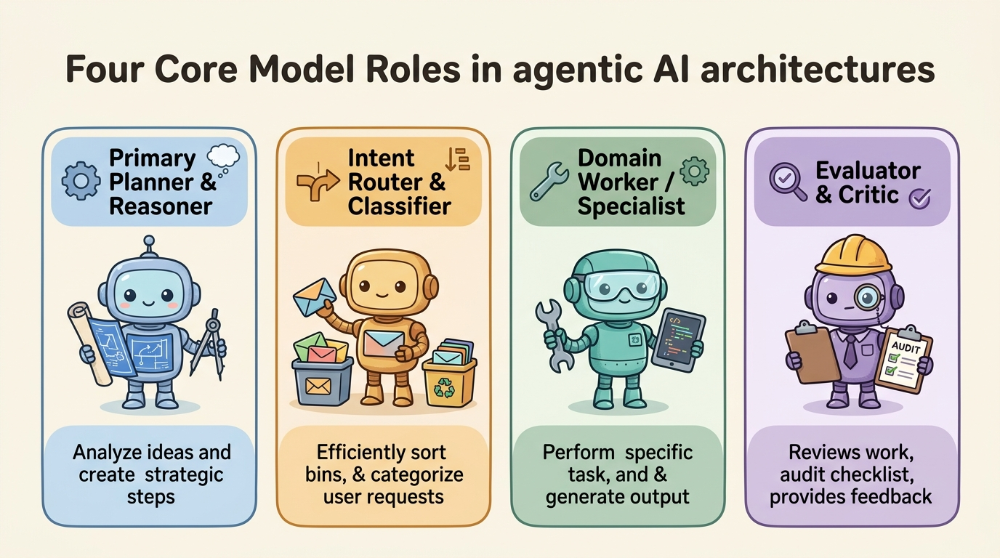
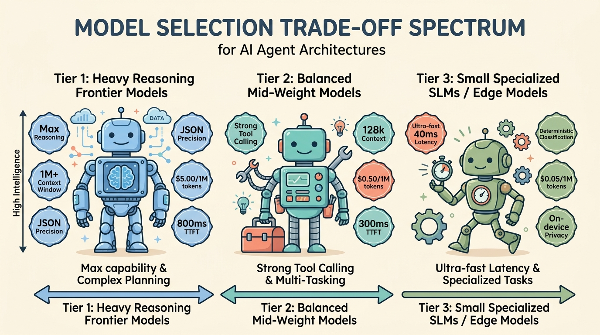

<!--
---
title: Model roles and selection
unit_id: P1-03-01-01
summary: Explains model roles, capability profiles, selection dimensions, provider
  adapters, and cost-latency-quality trade-offs in production agentic systems.
prerequisites:
- Read [Building blocks](../chapter-plan.md).
- Read [Architecture trade-offs](../../02-agent-architectures/08-architecture-trade-offs.md).
learning_objectives:
- Differentiate the core model roles in agent architectures: planner, router, worker,
    and evaluator.
- Evaluate models across capability dimensions including reasoning depth, latency,
  token pricing, context retention, and structured tool schema compliance.
- Implement provider adapters to decouple application logic from vendor-specific API
  formats.
- Mitigate operational model risks including unannounced provider model drift, rate
  limits, and context truncation.
source_records:
- p1-03-01-01-chen-frugalgpt-2023
- p1-03-01-01-ong-routellm-2024
- p1-03-01-01-google-adk-models-2024
visual_assets:
- assets/images/03-building-blocks/01-models-and-routing/01-model-roles-and-selection/01-model-roles-taxonomy.png
- assets/images/03-building-blocks/01-models-and-routing/01-model-roles-and-selection/02-model-selection-tradeoff-spectrum.png
example_paths:
- examples/03-building-blocks/01-models-and-routing/01-model-roles-and-selection/model_role_adapter.py
pass: architecture
learning_path: main
status: complete
last_reviewed: '2026-08-17'
---
-->

# Model roles and selection

## Why this matters

A common misconception in AI development is that an agent is simply a single language model wrapped in a while loop. In production systems, however, relying on a single model configuration for all tasks creates severe bottlenecks. Using a frontier reasoning model to perform basic classification wastes money and adds hundreds of milliseconds of latency; conversely, using a lightweight model for complex multi-step planning leads to hallucinated tool parameters and corrupted state.

**Model role differentiation and selection** structures an agentic system by assigning specialized model tiers to distinct operational responsibilities (Chen et al., 2023; Ong et al., 2024). By pairing fast small models for routing with frontier reasoning models for strategic decomposition, architectures achieve significant cost reductions while improving overall task reliability. Mastering model selection is the first essential step in assembling the complete [Building blocks](../chapter-plan.md) of agentic systems.

## Simple mental model

Think of staffing a film production crew:

1. **The Director (Planner / Reasoner)**: Possesses deep creative vision and narrative expertise. Decomposes the master script into daily scene schedules, coordinates actors, and manages overall production coherence.
2. **The Assistant Director (Intent Router)**: Rapidly triages incoming daily requests (weather alerts, catering delivery, wardrobe issues), instantly directing them to the appropriate department without bothering the Director.
3. **Specialized Crew Members (Domain Workers)**: Sound engineers, camera operators, and lighting technicians who excel at narrow, highly technical tasks.
4. **The Continuity Supervisor (Evaluator / Critic)**: Carefully inspects each recorded take against the script and costume continuity sheets, flagging mistakes before final approval.

In an agentic architecture, assigning every task to the Director is ruinously expensive; matching each responsibility to the appropriate specialist creates a fast, cost-effective production pipeline.

## Position in the agent workflow

The figures below outline the four specialized model roles and compare model selection tiers across latency, cost, and reasoning capability.



*Figure 1. The four specialized model roles in agent systems. Distinct model capability profiles are bound to specific operational responsibilities across planning, routing, execution, and evaluation.*



*Figure 2. Model selection and capability trade-off spectrum. Production systems strategically tier models to optimize latency and token budgets while maintaining high tool calling precision.*

As introduced in [Building blocks plan](../chapter-plan.md), model selection establishes the foundational intelligence layer that powers [Context construction](../02-context-construction/chapter-plan.md) and tool calling.

## How it works

Configuring models in production agentic systems involves three core mechanisms (Google, 2024; Ong et al., 2024):

### 1. Functional model roles

- **Primary Planner & Reasoner**: Frontier models (such as Gemini 1.5 Pro, Claude 3.5 Sonnet, GPT-4o) tasked with high-level goal decomposition, multi-step dependency analysis, and complex synthesis.
- **Intent Router & Classifier**: Ultra-low-latency models (such as Llama 3.2 3B, Gemini Flash, or lightweight fine-tuned classifiers) tasked with classifying user intents and routing payloads in under 50 milliseconds.
- **Domain Worker**: Mid-tier models with specialized training in code generation, SQL synthesis, or structured data extraction.
- **Evaluator & Judge**: High-precision models configured with a temperature of 0.0, evaluating candidate outputs against strict deterministic test suites and semantic rubrics.

### 2. Selection criteria dimensions

When choosing a model for a specific role, systems evaluate seven objective dimensions:
1. **Reasoning Depth**: Ability to solve novel logical puzzles, follow complex system instructions, and avoid hallucination.
2. **Time-to-First-Token (TTFT) & Throughput**: Milliseconds required to initiate generation, critical for user-facing interactive interfaces.
3. **Token Economics**: Pricing per million input and output tokens, determining system scalability under high query volumes (Chen et al., 2023).
4. **Structured Output & Tool Adherence**: Reliability in adhering strictly to JSON schemas and invoking API functions without syntax errors.
5. **Effective Context Length**: Maximum context window size combined with high needle-in-a-haystack retrieval recall across large token spans.
6. **Data Privacy & Residency**: Compliance constraints requiring on-premise inference (e.g., via Ollama/vLLM) or specific geographic cloud regions.
7. **Model Version Pinning**: Pinning exact dated model snapshots (e.g., `gemini-1.5-pro-002`) rather than floating aliases (e.g., `gemini-pro-latest`) to prevent silent runtime behavior changes.

### 3. Provider adapters

To prevent vendor lock-in, agents use **provider adapters** that abstract vendor-specific SDKs behind a unified calling interface, standardizing message schemas, tool definitions, and token usage telemetry.

## Main variants

1. **Static Role-Based Binding**: Each agent component is hardcoded to a specific model profile at startup (e.g., Router = Small SLM, Planner = Frontier LLM).
2. **Dynamic Complexity Cascades**: The system attempts task completion with a fast Tier 3 model first; if the model emits low confidence or fails validation, it automatically escalates to a Tier 1 model (Chen et al., 2023).
3. **Hybrid Cloud / On-Device Ensembles**: Sensitive personal data is processed exclusively on-device by local SLMs, while non-sensitive strategic queries route to cloud frontier models.

## Minimal implementation

The following Python script demonstrates the Provider Adapter pattern, binding specialized model profiles to discrete architectural roles:

<details>
<summary>Expand minimal Python implementation</summary>

```python
from typing import Dict, Any
from dataclasses import dataclass
from enum import Enum

class ModelRole(Enum):
    PLANNER = "planner"
    ROUTER = "router"
    WORKER = "worker"
    EVALUATOR = "evaluator"

@dataclass
class ModelProfile:
    name: str
    provider: str
    cost_per_1m_tokens: float
    context_window: int
    tier: str

class ProviderAdapter:
    """Standardizes API calling signatures across diverse model vendors."""
    def __init__(self, role_registry: Dict[ModelRole, ModelProfile]):
        self.registry = role_registry

    def call_role(self, role: ModelRole, prompt: str) -> Dict[str, Any]:
        profile = self.registry.get(role)
        if not profile:
            raise ValueError(f"No model configured for role: {role}")

        # Normalized provider response
        response_text = f"[{profile.provider}::{profile.name}] Processed role {role.value}."
        mock_tokens = len(prompt.split()) + 30
        cost = (mock_tokens / 1_000_000) * profile.cost_per_1m_tokens

        return {
            "role": role.value,
            "model": profile.name,
            "provider": profile.provider,
            "content": response_text,
            "tokens_used": mock_tokens,
            "estimated_cost_usd": round(cost, 6)
        }
```

</details>

## Framework implementations

- **Google Agent Development Kit (ADK)**: Decouples agents from underlying foundation models via pluggable `ModelClient` interfaces, supporting Gemini Pro, Flash, and local Gemma models.
- **OpenAI Agents SDK & Swarm**: Supports configuring different model strings per agent definition, enabling seamless handoffs between lightweight triage models and heavyweight reasoning models.
- **LangChain / LiteLLM**: Provides unified client adapters translating standard chat completion schemas across 100+ commercial and open-source model providers.

## Data flow and state changes

Trace the progression of a multi-tier agent request:

| Phase | Active Role | Model Assigned | Input Context | Output Generated | Cost / Latency Profile |
| --- | --- | --- | --- | --- | --- |
| 1 | Intent Router | Small SLM (Tier 3) | User Query | Target: `sql_billing_worker` | 30ms / $0.00001 |
| 2 | Domain Worker | Mid-weight (Tier 2) | Schema + Query | Generated SQL statement | 350ms / $0.0003 |
| 3 | Evaluator | Frontier LLM (Tier 1) | SQL + Policy | Evaluation: `PASS (Schema Safe)` | 800ms / $0.002 |

## Trust boundaries

1. **Provider Egress Boundary**: Transmitting user context to third-party commercial model APIs crosses an organizational boundary. Workflows handling regulated data (such as HIPAA or GDPR) must verify zero-data-retention agreements or utilize self-hosted local models.
2. **Model Version Drift Boundary**: Cloud providers periodically update underlying model weights behind unversioned endpoints. Production agents must pin explicit model snapshot versions to guarantee determinism.
3. **Telemetry & Credential Boundary**: API keys for external model providers must be managed in secure vaults and never exposed to model prompts or client-side code.

## Reliability failures

- **Silent Output Drift**: A cloud vendor silently updates a model alias, causing previously functional JSON parsing prompts to produce unexpected markdown wrapping.
- **Rate Limit Throttling (HTTP 429)**: High-concurrency agent workflows exhausting provider tokens-per-minute (TPM) quotas without configured fallback models.
- **Context Window Truncation**: A model silently truncating conversation history when input size exceeds physical context boundaries, resulting in lost system instructions.

## Worked example

Consider building an enterprise legal contract analysis agent:
1. **Routing Phase**: A fast Tier 3 classifier inspects an uploaded 50-page document and classifies it as a commercial NDA.
2. **Extraction Phase**: A high-throughput Tier 2 model with a 1M token context window parses the entire document, extracting key liability clauses into structured JSON.
3. **Reasoning & Risk Phase**: A Tier 1 frontier reasoning model inspects the extracted clauses against internal corporate risk policies, identifying non-standard indemnification terms.
4. **Result**: The system delivers deep legal reasoning on high-risk clauses while keeping processing costs 80% lower than running the entire 50-page document through a frontier model at every step.

## Limitations and trade-offs

- **Adapter Abstraction Leakage**: Advanced proprietary model features (such as provider-specific caching headers or specialized tool formats) may not map cleanly across generic provider adapters.
- **Maintenance Overhead**: Managing multi-model deployments requires monitoring separate API keys, usage quotas, and pricing changes across multiple vendors.

## Security preview

Model selection directly affects vulnerability susceptibility. Smaller models are often more vulnerable to direct prompt injections and jailbreaks due to reduced instruction-following capacity. Conversely, sending enterprise data to external model endpoints introduces data exfiltration risks. We analyze instruction hierarchy attacks, context contamination, and provider security in [Instructions, context, and model security](../../07-security-by-component-and-workflow-stage/01-instructions-context-and-models/chapter-plan.md) and Pass 2 security chapters.

## Open research questions

- How can automated routing classifiers reliably predict model failure before executing a prompt on a lower-tier model?
- What standardized benchmarks can reliably measure a model's adherence to structured JSON schemas under adversarial distraction?

## Key takeaways

- Modern agent systems assign specialized **model roles** (Planner, Router, Worker, Evaluator) rather than relying on a single monolithic model.
- Model selection requires balancing **reasoning depth, latency (TTFT), token economics, context recall, and tool schema adherence**.
- **Provider adapters** isolate application code from vendor-specific SDK APIs and prevent platform lock-in.
- Always pin exact **model snapshot versions** in production to prevent silent performance regressions caused by upstream provider model updates.

## References

- Chen, L., Zaharia, M., & Zou, J. *FrugalGPT: How to Use Large Language Models While Reducing Cost and Improving Performance*. arXiv preprint, 2023. [arXiv:2305.05176](https://arxiv.org/abs/2305.05176).
- Ong, I., Almahairi, A., Wu, V., Chiang, W. L., Wu, T., Gonzalez, J. E., & Stoica, I. *RouteLLM: Learning to Route to Large Language Models with Preference Data*. arXiv preprint, 2024. [arXiv:2406.18665](https://arxiv.org/abs/2406.18665).
- Google. *Google Agent Development Kit: Model Configurations and Capability Profiles*. Google Developer Documentation, 2024. [Google ADK](https://adk.dev/agents/).

---

[Next Unit: Routing cascades and fallbacks →](chapter-plan.md)
