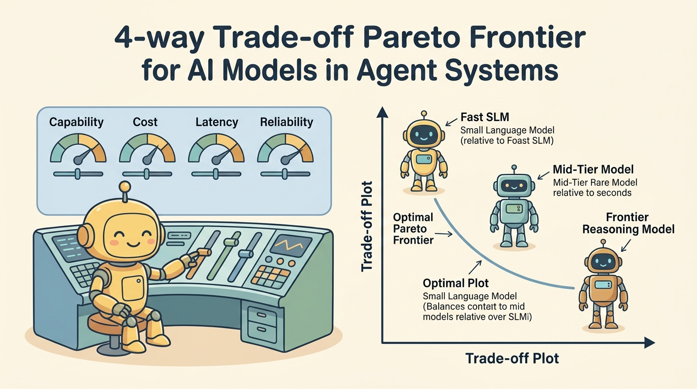
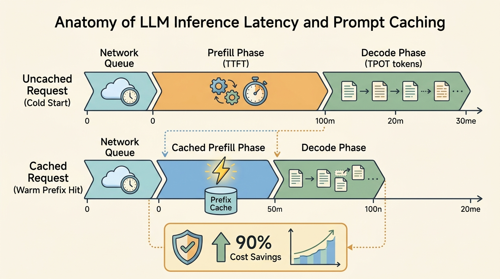

<!--
---
title: Capability, cost, latency, and reliability
unit_id: P1-03-01-03
summary: Analyzes the multi-dimensional trade-offs between model capability, token
  economics, latency profiles, and operational reliability in production agent workflows.
prerequisites:
- Read [Model roles and selection](01-model-roles-and-selection.md).
- Read [Routing, cascades, and fallbacks](02-routing-cascades-and-fallbacks.md).
learning_objectives:
- Deconstruct inference latency into Time to First Token (TTFT), inter-token latency
  (TPOT), and queue delays across streaming and non-streaming modes.
- Calculate total agent loop economics including prompt token vs completion token
  pricing, context caching discounts, and reasoning token overheads.
- Evaluate model capability trade-offs across reasoning depth, tool schema adherence,
  and long-context needle degradation.
- Enforce production reliability via snapshot version pinning, rate limit (RPM/TPM)
  throttling, and deterministic sampling controls.
source_records:
- p1-03-01-03-kwon-vllm-serving-2023
- p1-03-01-03-openai-latency-versioning-2024
- p1-03-01-03-anthropic-prompt-caching-2024
visual_assets:
- assets/images/03-building-blocks/01-models-and-routing/03-capability-cost-latency-and-reliability/01-tradeoff-pareto-frontier.png
- assets/images/03-building-blocks/01-models-and-routing/03-capability-cost-latency-and-reliability/02-latency-anatomy-and-caching.png
example_paths:
- examples/03-building-blocks/01-models-and-routing/03-capability-cost-latency-and-reliability/cost_latency_profiler.py
pass: architecture
learning_path: main
status: complete
last_reviewed: '2026-08-18'
---
-->

# Capability, cost, latency, and reliability

## Why this matters

Building production agent systems requires balancing competing operational forces. While frontier reasoning models achieve high accuracy on complex benchmarks, calling a frontier model on every iteration of a multi-step agent loop leads to prohibitive inference costs, high end-to-end latency, and vulnerability to provider rate limits.

Production agent engineering is the discipline of navigating the **Pareto frontier** across four interdependent dimensions: capability, cost, latency, and reliability (Kwon et al., 2023; OpenAI, 2024; Anthropic, 2024). An agent that takes 45 seconds to generate an answer will frustrate human users, while an agent that costs $0.50 per turn will bankrupt automated enterprise workflows. Understanding the precise mechanics of token pricing, prompt caching, prefill latency, and model version stability allows architects to deliver responsive, deterministic, and cost-effective autonomous systems.

## Simple mental model

Think of assembling a commercial logistics fleet:

1. **Heavy Cargo Aircraft (Frontier Reasoning Model)**: Can carry massive payloads across continents (high capability, huge context window), but consumes immense fuel ($5.00+ per million tokens) and requires long loading and runway clearance times (high TTFT and latency).
2. **Delivery Van (Fast SLM)**: Rapidly navigates urban streets with low fuel consumption ($0.10 to $0.80 per million tokens) and near-instant acceleration (low latency), but cannot transport a 20-ton industrial generator (limited deep multi-hop reasoning).
3. **Dedicated Express Lane (Prompt Caching & Paged KV Attention)**: Pre-inspects standard shipping containers so recurring cargo bypasses security inspection checkpoints, cutting transit time by 80% and shipping toll fees by up to 90%.
4. **Maintenance Schedule & Vehicle VIN Pinning (Version Pinning & Rate Limits)**: Guarantees that every vehicle deployed has exact verified mechanical specifications (pinned model snapshots) and enforces strict highway weight limits (TPM/RPM limits) to prevent traffic gridlock.

Agent architects do not choose a single universal vehicle. They route packages to the right vehicle tier and optimize transit lanes to ensure timely delivery within budget.

## Position in the agent workflow

The figures below illustrate the multi-dimensional trade-off balancing console and the granular latency breakdown across prefill, caching, and token generation phases.



*Figure 1. Capability, cost, latency, and reliability trade-off Pareto frontier. Production systems position distinct agent tasks along the optimal trade-off curve rather than defaulting all steps to high-cost frontier endpoints.*



*Figure 2. LLM inference latency anatomy and prompt caching acceleration. Prompt caching dramatically reduces the prefill phase (TTFT), while generation latency scales linearly with output token count.*

As shown in [Routing, cascades, and fallbacks](02-routing-cascades-and-fallbacks.md), understanding these profiles enables gateways to dynamically match each subtask to its optimal execution tier.

## How it works

Optimizing model selection requires measuring four foundational dimensions:

### 1. Capability dimensions and evaluation

Model capability is not a monolithic score. In agentic workflows, capability breaks down into four operational axes:
- **Multi-Step Reasoning Depth**: The ability to formulate valid sequential plans, verify intermediate tool outputs, and recover from execution errors without hallucinating.
- **Strict Structured Output Adherence**: The capability to reliably emit valid JSON schemas matching requested Pydantic models or tool signatures without formatting syntax errors.
- **Long-Context Retrieval Fidelity**: Maintaining needle-in-a-haystack recall across 100k+ tokens without suffering "lost-in-the-middle" attention degradation.
- **Instruction Hierarchy Robustness**: Distinguishing system instructions from untrusted user data and retrieved third-party tool outputs.

### 2. Latency anatomy: TTFT vs TPOT

Total completion latency is governed by two distinct computational phases in modern transformer serving engines (Kwon et al., 2023):
$$\text{Total Latency} = \text{Network Delay} + \text{Queue Delay} + \text{TTFT} + (N_{\text{output}} \times \text{TPOT})$$

- **Time to First Token (TTFT)**: The duration from request dispatch until the model emits its first token. This corresponds to the **prefill phase**, where the model processes the entire prompt in parallel and builds the initial Key-Value (KV) cache. TTFT scales with prompt length ($N_{\text{input}}$).
- **Time Per Output Token (TPOT)**: The duration required to generate each subsequent token during the auto-regressive **decode phase**. In decode, tokens are generated sequentially (memory-bandwidth bound). Typical cloud TPOT ranges from 10ms to 40ms per token.
- **Streaming vs Non-Streaming**: In interactive user interfaces, streaming output masks decode latency because human reading speed (~5 tokens/sec) is lower than model generation speed (~30-100 tokens/sec). However, in programmatic agent tool loops, the agent runtime cannot execute a tool call until the full JSON payload is completely generated and parsed.

### 3. Token economics and context caching

Inference costs are calculated per million tokens, with asymmetric pricing between input prompts, cached prompts, and output completions:
- **Output Token Multiplier**: Output tokens are typically 3x to 5x more expensive than uncached input tokens due to sequential GPU decode overhead and KV cache memory retention.
- **Prompt Caching Economics**: Modern providers (Anthropic, OpenAI, Google) allow prompt prefixes exceeding 1,024 tokens (such as static system instructions, API schemas, and few-shot examples) to be cached in GPU memory (Anthropic, 2024; OpenAI, 2024). Cache reads provide a 50% to 90% cost discount and reduce TTFT by up to 80%.
- **Reasoning / Thinking Token Overhead**: Frontier reasoning models generate hidden "chain-of-thought" tokens before outputting the final response. These internal tokens are billed as output tokens, often multiplying total per-turn costs by 3x to 10x.

### 4. Reliability, version pinning, and rate limits

Operational stability depends on predictable execution environments:
- **Snapshot Version Pinning**: Production systems must reference specific immutable snapshot identifiers (e.g., `gpt-4o-2024-08-06` or `claude-3-5-sonnet-20241022`) rather than floating alias pointers (e.g., `gpt-4o` or `claude-3-5-sonnet-latest`). Floating aliases introduce silent prompt drift, subtle behavioral changes, and unexpected tool signature parsing failures when providers deploy backend updates.
- **Rate Limit Throttling (RPM & TPM)**: Cloud providers enforce hard quotas on Requests Per Minute (RPM) and Tokens Per Minute (TPM). Multi-agent architectures with parallel tool workers can easily saturate TPM limits, triggering HTTP 429 errors.
- **Deterministic Sampling Controls**: Setting `temperature = 0.0` or fixing a `seed` parameter reduces output variance. However, true bitwise determinism is rarely guaranteed across distributed cloud clusters due to non-associative floating-point addition in dynamic batching kernels.

## Main variants

1. **Serverless Multi-Tenant Cloud APIs**: Pay-per-token model with zero infrastructure management. Subject to multi-tenant noisy-neighbor latency jitter and global rate limits.
2. **Provisioned Throughput Units (PTUs)**: Reserved GPU capacity providing guaranteed TTFT/TPOT SLAs, zero HTTP 429 rate limits, and predictable monthly billing for high-volume enterprise agents.
3. **Self-Hosted Open Weights (vLLM / SGLang)**: Deploying open models (e.g., Llama 3, Qwen 2.5) on private GPU clusters. Eliminates third-party data sharing and rate limits while requiring dedicated infrastructure management and KV cache memory tuning (PagedAttention).

## Minimal implementation

The following implementation profiles inference latency, computes cached token savings, and tracks rate limit token consumption:

<details>
<summary>Expand minimal Python implementation</summary>

```python
from dataclasses import dataclass
import time
from typing import Dict, List, Tuple

@dataclass(frozen=True)
class ModelProfile:
    name: str
    pinned_version: str
    cost_per_m_input: float
    cost_per_m_cached: float
    cost_per_m_output: float
    typical_ttft_ms: float
    typical_tpot_ms: float

CATALOG = {
    "frontier": ModelProfile("Frontier", "gpt-4o-2024-08-06", 2.50, 1.25, 10.00, 650.0, 25.0),
    "slm": ModelProfile("SLM", "claude-3-5-haiku-20241022", 0.80, 0.08, 4.00, 180.0, 12.0),
}

class InferenceProfiler:
    """Profiles latency and cost with prompt cache accounting."""
    @staticmethod
    def evaluate(model_key: str, uncached_in: int, cached_in: int, out_tokens: int) -> Dict[str, float]:
        m = CATALOG[model_key]
        cost = (uncached_in * m.cost_per_m_input + cached_in * m.cost_per_m_cached + out_tokens * m.cost_per_m_output) / 1e6
        is_cached = cached_in > 0
        ttft = m.typical_ttft_ms * (0.25 if is_cached else 1.0)
        generation_time = out_tokens * m.typical_tpot_ms
        return {
            "total_cost_usd": round(cost, 6),
            "ttft_ms": round(ttft, 2),
            "total_latency_ms": round(ttft + generation_time, 2),
        }
```

</details>

## Framework implementations

- **OpenAI API & SDK**: Native support for prompt caching (automatic on prefixes >1024 tokens), structured outputs with strict JSON schemas, and snapshot version pinning.
- **Anthropic Claude API**: Explicit prompt cache control blocks (`cache_control={"type": "ephemeral"}`), high-speed Haiku endpoints, and detailed cache-read/cache-creation token usage metrics.
- **vLLM Inference Server**: Industry-standard open-source engine implementing PagedAttention, chunked prefill, and prefix caching for self-hosted models.
- **LiteLLM**: Unified proxy that standardizes pricing calculations, tracks organization-wide spend budgets, and enforces token-rate quotas across 100+ providers.

## Data flow and state changes

Trace the lifecycle of a prompt processed by a cached model gateway:

| Step | Gateway Subsystem | State / Event | Computational Action | Telemetry Metric Recorded |
| --- | --- | --- | --- | --- |
| 1 | Ingress & Quota Check | `EVALUATING_BUDGET` | Verify client TPM and RPM limits | `rate_limit_headroom = 42%` |
| 2 | Prompt Prefix Hashing | `CACHE_LOOKUP` | Compute hash of static system prompt and tools | `cache_hit = TRUE (8,000 tokens)` |
| 3 | Prefill (Prefill Engine) | `PREFILL_ACTIVE` | Reuse cached KV tensor; process only fresh delta | `ttft_ms = 145 ms (saved 78%)` |
| 4 | Decode (Decode Engine) | `DECODE_ACTIVE` | Auto-regressively generate structured tool call | `tpot_ms = 22.4 ms / token` |
| 5 | Accounting & Egress | `COMPLETED` | Deduct discounted token fees and return response | `cost_usd = $0.00312` |

## Trust boundaries

1. **Version Drift & Behavioral Contract Boundary**: Upstream model updates can subtly alter tool calling syntax or reasoning behavior. Pinning immutable model snapshot versions maintains the validation and testing boundary.
2. **Multi-Tenant Latency Jitter Boundary**: In shared public cloud infrastructure, sudden traffic surges from unrelated tenants can cause TTFT spikes (noisy neighbor effect). Mission-critical agent loops require latency timeouts and fallback routes.
3. **Financial Budget & Spend Exhaustion Boundary**: Autonomous loops running in unbounded recursion can rapidly consume thousands of dollars in token fees. Strict per-session token budget limiters must enforce execution cutoffs.

## Reliability failures

- **Floating Alias Drift**: Pointing production agents to `gpt-4o` rather than `gpt-4o-2024-08-06`. A silent provider backend model update causes the model to omit mandatory JSON keys, breaking downstream code execution.
- **Context Degradation (Lost in the Middle)**: Packing 150,000 tokens into a model's context window. Although the context window accommodates the tokens, the model fails to retrieve key constraints located in the middle 50% of the prompt.
- **Thundering Herd Rate Limit Cascades**: When five parallel agent workers simultaneously retry failed requests without jitter, the synchronized burst immediately triggers HTTP 429 rate limit lockouts across the entire API key.

## Worked example

Consider an enterprise customer support triage agent handling 50,000 inquiries per day:
- **Baseline (Pure Frontier Uncached)**: Every query dispatches to a frontier model with 6,000 tokens of system instructions and context. Cost: $0.025 per request $\times$ 50,000 = **$1,250/day** ($37,500/month). Average latency: 4.8 seconds.
- **Optimized Tiered Architecture**:
  1. System prompt (5,500 tokens) is structured with prompt cache headers (cache hit rate: 94%).
  2. Router directs 80% of standard FAQ inquiries to a fast SLM ($0.80/M input).
  3. Escalates remaining 20% complex account disputes to a pinned frontier model.
- **Outcome**: Daily inference cost drops to **$142/day** ($4,260/month, an **88.6% cost reduction**), while average end-to-end response latency drops from 4.8s to 1.1s.

## Limitations and trade-offs

- **Cache Invalidation vs Dynamic Context**: Dynamic system prompts (e.g., injecting current timestamps or changing user IDs at the start of the prompt) invalidate the prompt cache prefix, destroying caching cost benefits.
- **Strict Determinism Limitations**: Even with `temperature = 0.0`, floating-point arithmetic across dynamic GPU batches can occasionally produce nondeterministic token selections. Critical validation must occur at the software gate rather than relying solely on model-level determinism.

## Security preview

Inference economics and reliability mechanisms introduce direct security implications:
- **Denial-of-Wallet (Resource Exhaustion)**: Attackers craft recursive prompts designed to force models into emitting maximum reasoning tokens or invalidating cache prefixes, multiplying organizational cloud spend.
- **Model Downgrade Attacks**: Adversaries manipulate routing classifications to force high-risk authentication decisions into weaker SLMs lacking hardened safety filters.
- **Cache Side-Channel Probing**: Variations in TTFT can potentially reveal whether another tenant or user recently processed similar confidential documents through shared prefix caches.

We examine denial-of-wallet defenses, model abuse controls, and side-channel risks in [Instructions, context, and model security](../../07-security-by-component-and-workflow-stage/01-instructions-context-and-models/chapter-plan.md).

## Open research questions

- How can serving engines dynamically schedule multi-agent KV caches to maximize cross-agent prefix sharing without introducing cross-tenant side channels?
- What formal verification metrics can reliably quantify long-context degradation before deploying agents to production?

## Key takeaways

- **Inference latency** consists of prefill (TTFT, parallel prompt processing) and decode (TPOT, auto-regressive sequential generation).
- **Prompt caching** provides up to 90% cost savings and 80% TTFT reduction by keeping static prompt prefixes warm in GPU memory.
- **Model version pinning** using exact snapshot identifiers prevents silent model drift and breaking changes in production tool schemas.
- Effective agent architectures balance capability, cost, latency, and reliability by matching specific subtasks to optimal model tiers on the Pareto frontier.

## References

- Kwon, W., Li, Z., Zhuang, S., Sheng, Y., Zheng, L., Yu, C. H., Gonzalez, J. E., Zhang, H., & Stoica, I. *Efficient Memory Management for Large Language Model Serving with PagedAttention*. Proceedings of the 29th ACM Symposium on Operating Systems Principles (SOSP), 2023. [DOI: 10.1145/3600006.3613165](https://doi.org/10.1145/3600006.3613165).
- OpenAI. *Latency Optimization, Prompt Caching, and Model Version Pinning Guide*. OpenAI Platform Documentation, 2024. [OpenAI Platform](https://platform.openai.com/docs/guides/latency-optimization).
- Anthropic. *Prompt Caching and Operational Resilience in Claude API*. Anthropic Claude Documentation, 2024. [Anthropic Docs](https://docs.anthropic.com/en/docs/build-with-claude/prompt-caching).

---

[Next Unit: Routing evaluation →](chapter-plan.md)
