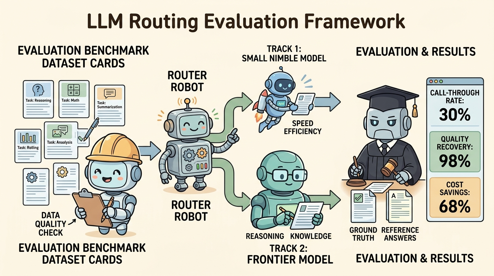
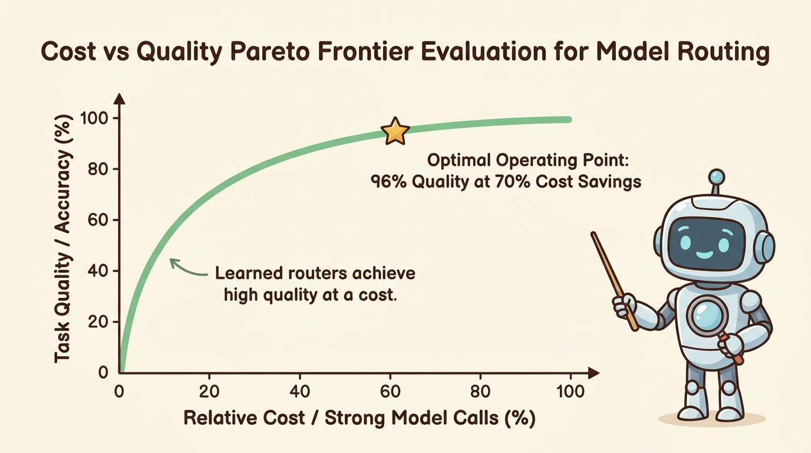

<!--
---
title: Routing evaluation
unit_id: P1-03-01-04
summary: Explains quantitative evaluation frameworks, cost-quality Pareto benchmarks,
  and judge calibration techniques for model routers and cascades.
prerequisites:
- Read [Model roles and selection](01-model-roles-and-selection.md).
- Read [Routing, cascades, and fallbacks](02-routing-cascades-and-fallbacks.md).
- Read [Capability, cost, latency, and reliability](03-capability-cost-latency-and-reliability.md).
learning_objectives:
- Deconstruct router evaluation metrics including Call-Through Rate, Quality Recovery,
  and Cost Reduction on Pareto curves.
- Implement offline and online router evaluation benchmarks using ground truth and
  calibrated LLM judges.
- Mitigate router evaluation biases including position, length, and domain distribution
  shifts.
- Formulate routing policies that optimize composite cost-latency-accuracy objectives
  under latency SLAs.
source_records:
- p1-03-01-04-ong-routellm-2024
- p1-03-01-04-chen-frugalgpt-2023
- p1-03-01-04-zheng-judging-llm-2023
visual_assets:
- assets/images/03-building-blocks/01-models-and-routing/04-routing-evaluation/01-routing-evaluation-framework.png
- assets/images/03-building-blocks/01-models-and-routing/04-routing-evaluation/02-cost-quality-pareto-eval.png
example_paths:
- examples/03-building-blocks/01-models-and-routing/04-routing-evaluation/router_evaluator.py
pass: architecture
learning_path: main
status: complete
last_reviewed: '2026-08-18'
---
-->

# Routing evaluation

## Why this matters

Deploying a model router without rigorous evaluation creates hidden risks in production agent architectures. A router that aggressively routes traffic to small models can degrade task success rates and cause downstream tool failures. Conversely, an overly conservative router routes simple queries to expensive frontier models, inflating operational costs and wasting GPU capacity.

Systematic routing evaluation quantifies the exact trade-off between inference expenditure and agent performance (Ong et al., 2024; Chen et al., 2023). By establishing empirical benchmarks across quality recovery, invocation distributions, and latency profiles, engineering teams can continuously validate routing decisions, detect capability regressions, and tune classification thresholds against concrete Service Level Agreements (SLAs).

## Simple mental model

Think of an automated package sorting facility:

1. **The Test Conveyor (Benchmark Dataset)**: A standardized batch of sample packages with known destinations, dimensions, and fragility ratings.
2. **The Sorting Sorter (Router Under Evaluation)**: The automated scanner deciding whether each package travels on the low-cost standard ground belt (Small Language Model) or the high-priority air freight line (Frontier Reasoning Model).
3. **The Quality Inspector (Evaluation Judge)**: An independent auditor checking whether packages routed via ground transport arrived intact and on schedule compared to air freight guarantees.
4. **The Efficiency Scorecard (Pareto Metrics)**: A summary dashboard measuring what percentage of packages used expensive air transport (Call-Through Rate) and how close overall on-time delivery matched a 100% air fleet (Quality Recovery).

Evaluating the sorter means finding the optimal setting where 98% of delivery quality is maintained while slashing shipping expenses by 70%.

## Position in the agent workflow

The figures below illustrate the end-to-end routing evaluation pipeline and the resulting cost versus quality Pareto curve.



*Figure 1. LLM Routing Evaluation Framework. Test queries from a representative benchmark are dispatched through the candidate router, generating outputs across model tiers that are scored by ground truth verifiers and calibrated LLM judges.*



*Figure 2. Cost vs Quality Pareto Frontier Evaluation for Model Routing. Learned routers push system performance toward the upper-left Pareto frontier, delivering near-frontier quality at a fraction of full frontier invocation costs.*

Following the capability trade-offs established in [Capability, cost, latency, and reliability](03-capability-cost-latency-and-reliability.md), routing evaluation validates that the chosen gateway strategy matches real-world operational requirements.

## How it works

Router evaluation combines statistical performance metrics with offline and online validation methodologies:

### 1. Core routing metrics

To evaluate a routing policy $\pi$, four primary metrics are measured against baseline endpoints (Ong et al., 2024; Chen et al., 2023):

- **Call-Through Rate ($PG$)**: The proportion of total queries that the router forwards to the strong (expensive) model tier:
  $$PG = \frac{N_{\text{strong}}}{N_{\text{total}}} \times 100\%$$
- **Quality Recovery ($Q_{\text{rel}}$)**: The task accuracy or benchmark win-rate achieved by the router relative to sending 100% of queries to the strong model:
  $$Q_{\text{rel}} = \frac{\text{Score}(\pi) - \text{Score}(\text{Weak Baseline})}{\text{Score}(\text{Strong Baseline}) - \text{Score}(\text{Weak Baseline})} \times 100\%$$
- **Cost Reduction ($C_{\text{saved}}$)**: The percentage decrease in total token expenditure compared to the static frontier baseline:
  $$C_{\text{saved}} = \left(1 - \frac{\text{Cost}(\pi)}{\text{Cost}(\text{Strong Baseline})}\right) \times 100\%$$
- **Latency P95 / P99 Overhead**: The additional execution delay introduced by the router classifier itself before dispatching the underlying LLM call.

### 2. Evaluation methodologies: Offline vs online

- **Offline Golden Set Benchmarking**: Running a fixed test suite of historic prompts where both the weak model and strong model have generated responses. The router classifier is evaluated on its ability to assign queries to the smallest capable model without degrading accuracy.
- **Pairwise LLM-as-a-Judge Scoring**: For open-ended generative tasks lacking exact string ground truth, an independent evaluator model (such as GPT-4o or Claude 3.5 Sonnet) conducts blind pairwise comparisons between routed outputs and strong baseline responses (Zheng et al., 2023).
- **Online Shadow Routing**: Duplicating a sample of production traffic in real time. The router makes decisions in shadow mode without affecting user responses, allowing latency and routing distributions to be verified against live user behavior.

### 3. Mitigating judge biases

When using LLM-as-a-judge for routing evaluation, three systematic biases must be controlled (Zheng et al., 2023):
- **Position Bias**: Evaluator models tend to favor whichever response is presented first. This is neutralized by running evaluations twice with swapped order ($A/B$ and $B/A$) and discarding inconsistent verdicts.
- **Verbosity Bias**: Judge models frequently prefer longer, more verbose answers even when shorter answers are equally accurate. Prompts must explicitly instruct judges to penalize unneeded verbosity.
- **Self-Enhancement Bias**: Models often favor answers generated by their own family or architecture. Using an external, vendor-neutral judge prevents skewed scoring.

## Main variants

1. **Exact-Match Automated Harness**: Evaluates deterministic tasks (code syntax, regex extraction, math problem solving) using automated test assertions and unit test pass rates.
2. **Preference-Trained Metric Classifiers**: Evaluates multi-turn conversational agents using reward models or embedding classifiers trained on human preference datasets (such as Chatbot Arena Elo ratings).
3. **Cost-Constrained Cascade Evaluator**: Evaluates multi-step fallback cascades by measuring the exit rate at each cascade stage and calculating the total amortized cost per resolved turn.

## Minimal implementation

The following implementation defines an evaluation harness comparing routing policies against static baselines:

<details>
<summary>Expand minimal Python implementation</summary>

```python
from dataclasses import dataclass
from typing import Callable, List, Tuple

@dataclass(frozen=True)
class BenchmarkQuery:
    query_id: str
    prompt: str
    min_capability_tier: str  # "slm" or "frontier"

@dataclass
class ModelProfile:
    name: str
    tier: str
    cost_per_query: float

def evaluate_routing_policy(
    policy_name: str,
    router_fn: Callable[[BenchmarkQuery], str],
    dataset: List[BenchmarkQuery],
    slm: ModelProfile,
    frontier: ModelProfile,
) -> dict:
    strong_calls = 0
    total_cost = 0.0
    correct = 0
    frontier_baseline_cost = frontier.cost_per_query * len(dataset)

    for q in dataset:
        tier = router_fn(q)
        chosen = frontier if tier == "frontier" else slm
        total_cost += chosen.cost_per_query
        if chosen.tier == "frontier":
            strong_calls += 1

        # Accuracy: frontier handles all; SLM handles only SLM-tier tasks
        if q.min_capability_tier == "slm" or chosen.tier == "frontier":
            correct += 1

    n = len(dataset)
    return {
        "policy": policy_name,
        "call_through_rate": (strong_calls / n) * 100.0,
        "accuracy": (correct / n) * 100.0,
        "avg_cost": total_cost / n,
        "cost_savings": ((frontier_baseline_cost - total_cost) / frontier_baseline_cost) * 100.0,
    }
```

</details>

The full runnable test script is available in [router_evaluator.py](../../../examples/03-building-blocks/01-models-and-routing/04-routing-evaluation/router_evaluator.py).

## Data flow and state changes

1. **Benchmark Ingestion**: The evaluation harness loads tagged benchmark queries annotated with task categories, reference solutions, and capability thresholds.
2. **Routing Prediction**: The candidate router processes query metadata and prompt embeddings, generating a destination assignment (`slm` vs `frontier`).
3. **Execution & Generation**: The designated model endpoint generates the completion. For offline evaluations, precomputed response caches prevent redundant inference calls.
4. **Scoring & Verification**: The response is scored via unit tests or blind LLM judges.
5. **Pareto Compilation**: Accuracy, cost, and latency metrics are aggregated to construct the empirical Pareto frontier plot.

## Trust boundaries

- **Router Inference Boundary**: Router classifiers must operate within the trusted execution environment and cannot pass raw user tokens to untrusted third-party classifiers without data scrubbing.
- **Judge Isolation Boundary**: When using external LLM judges, evaluation prompts containing proprietary system instructions or sensitive customer data must be redacted or sanitized.
- **Ground Truth Integrity**: Benchmark datasets must be cryptographically versioned to prevent test set contamination or prompt injection payloads embedded in test suites.

## Reliability failures

- **Benchmark Contamination**: Evaluating routers on datasets whose examples appeared in the training corpora of the underlying models inflates accuracy scores.
- **Distribution Shift**: A router tuned on generic chatbot queries will misclassify domain-specific enterprise prompts (such as SQL generation or medical reasoning).
- **Threshold Sensitivity Drift**: Small updates to underlying model versions can alter the probability distributions emitted by embedding classifiers, causing sudden spikes in strong model invocation rates.

## Limitations and trade-offs

- **Offline vs Online Fidelity**: Offline test suites rarely capture the dynamic, multi-turn state accumulation and tool execution errors that occur in live agent sessions.
- **Judge Cost Overhead**: Running frontier model judges over large test suites creates substantial evaluation expenses, requiring sampled evaluation runs.
- **Static vs Adaptive Thresholds**: Fixed classification thresholds fail to adapt to real-time provider latency surges or sudden rate-limit exhaustion.

## Security preview

In Pass 2, model routing security expands into adversarial threat modeling. Attackers can craft adversarial prompt prefixes designed to manipulate classifier confidence scores, forcing the router to downgrade security-critical planning tasks to unaligned small models (downgrade attacks) or deliberately route high volumes of junk queries to frontier models to exhaust financial budgets (denial-of-wallet attacks). These vulnerabilities and their mitigations are analyzed in [Instructions, context, and model security](../../07-security-by-component-and-workflow-stage/01-instructions-context-and-models/chapter-plan.md).

## Open research questions

- How can routers dynamically evaluate multi-step agent trajectories with intermediate tool execution states rather than isolated single-turn prompts?
- What calibration algorithms can provably detect and eliminate reward model bias when using synthetic feedback for router training?

## Key takeaways

- Routing evaluation balances model capability, latency constraints, and inference cost using empirical Pareto frontier benchmarks.
- Key metrics include Call-Through Rate to strong models, Quality Recovery percentage, and Cost Savings relative to static frontier baselines.
- LLM-as-a-judge evaluation requires explicit controls for position bias, verbosity bias, and self-enhancement bias.
- Offline benchmarks must be complemented by online shadow routing to detect domain distribution shifts in production.

## References

- Ong, I., Almahairi, A., Wu, V., Chiang, W.-L., Wu, T., Gonzalez, J. E., & Zhang, H. *RouteLLM: Learning to Route LLMs with Preference Data*. Proceedings of the International Conference on Learning Representations (ICLR), 2025. [arXiv:2406.18665](https://arxiv.org/abs/2406.18665).
- Chen, L., Zaharia, M., & Zou, J. *FrugalGPT: How to Use Multiple LLMs Efficiently*. Advances in Neural Information Processing Systems (NeurIPS), 2023. [arXiv:2305.05176](https://arxiv.org/abs/2305.05176).
- Zheng, L., Zhang, H., Chiang, W.-L., Xing, R., Qiu, S., Shen, S., Wang, H., Zhang, X., Zhuang, S., Liu, Y., Gonzalez, J. E., & Stoica, I. *Judging LLM-as-a-Judge with MT-Bench and Chatbot Arena*. Advances in Neural Information Processing Systems (NeurIPS), 2023. [arXiv:2306.05685](https://arxiv.org/abs/2306.05685).

---

[Next Unit: Context construction plan →](../02-context-construction/chapter-plan.md)
