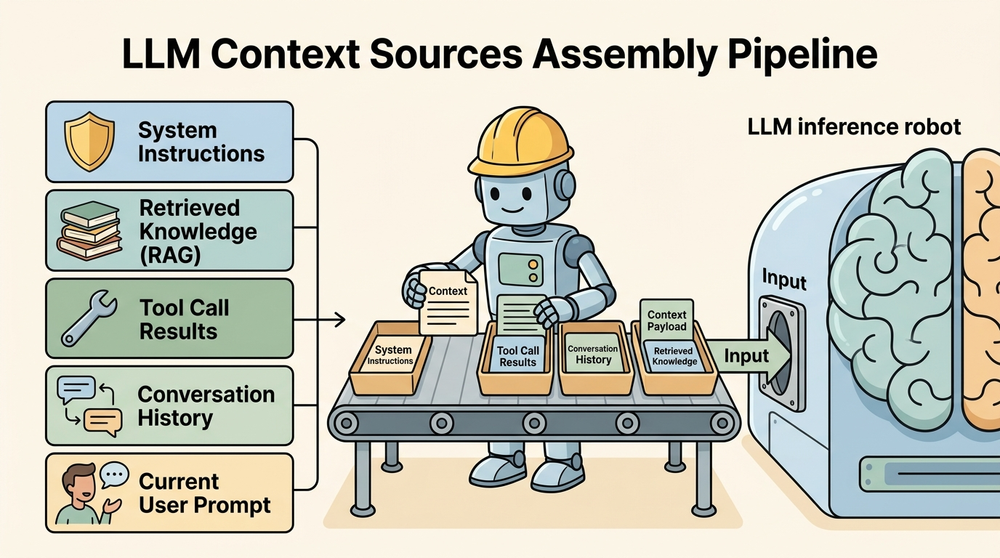
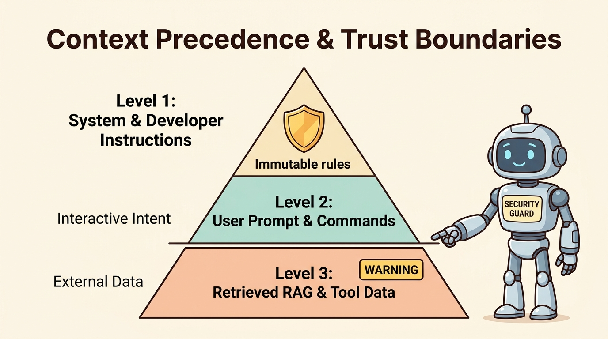

<!--
---
title: Context sources and precedence
unit_id: P1-03-02-01
summary: Explains the runtime discipline of context engineering, classifying dynamic
  prompt sources, trust boundaries, and precedence hierarchies in agent loops.
prerequisites:
- Read [Building blocks plan](../chapter-plan.md).
- Read [Routing evaluation](../01-models-and-routing/04-routing-evaluation.md).
learning_objectives:
- Distinguish dynamic context engineering from static prompt engineering across autonomous
  agent iterations.
- Classify runtime context sources across system instructions, developer policies,
  user queries, memory history, retrieved evidence, and tool outputs.
- Establish strict precedence rules and trust boundary tags to prevent lower-tier
  context from overriding higher-tier authority.
- Structure token payloads to mitigate Lost in the Middle attention degradation in
  long context windows.
source_records:
- p1-03-02-01-anthropic-context-engineering-2024
- p1-03-02-01-liu-lost-in-middle-2023
- p1-03-02-01-openai-agent-context-2024
visual_assets:
- assets/images/03-building-blocks/02-context-construction/01-context-sources-and-precedence/01-context-sources-assembly-pipeline.png
- assets/images/03-building-blocks/02-context-construction/01-context-sources-and-precedence/02-precedence-and-trust-hierarchy.png
example_paths:
- examples/03-building-blocks/02-context-construction/01-context-sources-and-precedence/context_assembler.py
pass: architecture
learning_path: main
status: complete
last_reviewed: '2026-08-18'
---
-->

# Context sources and precedence

## Why this matters

In single-turn chat applications, prompt engineering focuses on crafting a static text string that guides model behavior. In multi-step autonomous agents, however, the input seen by the model on each iteration is dynamic, multi-faceted, and rapidly evolving. An agent runtime must continuously synthesize disparate information streams (system policies, conversation history, retrieved documents, tool schemas, and third-party execution outputs) into a coherent, bounded token window.

This runtime discipline is called **context engineering** (Anthropic, 2024; OpenAI, 2024). Poor context construction causes catastrophic agent failures: runaway token costs from bloated histories, reasoning confusion from colliding instructions, and severe vulnerabilities where unverified external data overrides system safety rules. Mastering context sources and their explicit precedence hierarchy ensures that agents remain reliable, predictable, and secure across complex multi-step workflows.

## Simple mental model

Think of preparing a court legal brief for a presiding judge:

1. **Constitutional Law (System & Developer Instructions)**: The immutable legal framework and statutory rules that define what the court can and cannot do. Nothing in the brief can override these rules.
2. **Plaintiff's Motion (User Prompt)**: The specific complaint and requested action submitted for judgment. It defines the goal of the current proceeding.
3. **Court Transcript & Case Record (Conversation History & State)**: The chronological log of preceding testimony, entered motions, and past rulings.
4. **Third-Party Witness Exhibits (Retrieved Evidence & Tool Outputs)**: Documents, forensic reports, and external data submitted into evidence. They provide factual context, but must be stamped with evidence tags and cannot rewrite the law.

The courtroom clerk (the Context Assembler) must organize this brief so the judge sees core law at the top, clear evidentiary boundaries in the middle, and the latest petition at the end, ensuring unauthorized exhibits cannot dictate the verdict.

## Position in the agent workflow

The figures below illustrate how the context assembly pipeline gathers dynamic inputs and enforces the strict precedence hierarchy.



*Figure 1. LLM Context Sources Assembly Pipeline. The agent runtime collects heterogeneous inputs across six distinct source categories, wrapping untrusted data in explicit containment boundaries before feeding the serialized token payload to the model.*



*Figure 2. Context Precedence and Trust Boundaries. Instructions follow a strict priority pyramid where high-level system rules supersede user instructions, and user instructions supersede untrusted retrieved data and tool outputs.*

Building upon the model selection strategies taught in [Models and routing](../01-models-and-routing/chapter-plan.md), context construction determines the exact content fed into the selected model on every execution step.

## How it works

Context engineering operates as a structured ingestion, prioritization, and serialization pipeline:

### 1. The six fundamental context sources

Every token presented to an LLM during an agent turn originates from one of six source categories (Anthropic, 2024; OpenAI, 2024):

- **System Instructions**: Immutable base directives defining the agent role, output schema constraints, core tool execution policies, and refusal boundaries.
- **Developer Policies**: Operational guardrails injected by the hosting platform (such as privacy scrubbers, tenant isolation boundaries, and formatting rules).
- **User Intent (Goal)**: The primary task directive, conversational commands, and explicit constraints provided by the human operator.
- **Conversation & Execution History**: The chronological sequence of prior user-assistant dialogue turns, intermediate thought steps, and previous action attempts.
- **Retrieved Knowledge (RAG)**: Static or dynamic knowledge chunks fetched from vector databases, keyword search indexes, or document stores.
- **Tool Outputs & Environment Observations**: Structured data, API responses, error traces, and external file contents returned from executing tools.

### 2. Precedence hierarchy and trust levels

When multiple context sources provide conflicting instructions, the runtime must resolve conflicts using a deterministic precedence hierarchy:

$$\text{System / Platform Policy} \succ \text{User Directives} \succ \text{Retrieved Evidence} \succ \text{Tool Results}$$

1. **System Authority (Level 1 - Immutable)**: System prompts and platform safety rules have total authority. If a user or tool requests an action that violates a system invariant (such as deleting an unauthorized database or revealing API keys), the system instruction wins.
2. **User Intent (Level 2 - Task Authority)**: Authenticated user instructions govern task direction. If retrieved documentation suggests an alternative task, the user's explicit goal takes priority.
3. **External Context (Level 3 - Untrusted Data)**: Retrieved documents (RAG) and tool execution outputs are treated as untrusted runtime data. They provide facts and state, but must never be interpreted as control instructions.

### 3. Attention topology and "Lost in the Middle"

Transformer self-attention is non-uniform across large context windows. Empirical research demonstrates a **U-shaped attention curve** (Liu et al., 2023): models achieve highest recall for tokens placed at the very beginning (primacy effect) and very end (recency effect) of the context window, while information placed in the middle experiences severe attention degradation.

To maximize model reasoning fidelity:
- Place immutable system directives and core safety policies at the absolute beginning (index 0).
- Place the immediate user query, active plan step, and required output formatting reminder at the absolute end (recency anchor).
- Place large reference documents, secondary tool outputs, and historical messages in the middle, segmented with clear structural boundaries.

## Main variants

1. **Role-Based Chat Serialization**: Translating context items into native model message roles (`system`, `user`, `assistant`, `tool`), standard in modern API specifications (OpenAI, Anthropic, Google ADK).
2. **XML / Delimiter Containment Framing**: Wrapping distinct context sources in explicit XML tags (such as `<system_instructions>`, `<untrusted_rag>`, `<tool_output>`) to help the model distinguish control directives from raw data payloads.
3. **Dynamic Context Filtering**: Pruning or dropping lower-precedence items (such as older conversation turns or low-relevance search chunks) when token budgets are exceeded.

## Minimal implementation

The following Python snippet demonstrates how an agent runtime categorizes context sources, tags trust levels, and serializes a compliant model payload:

```python
from dataclasses import dataclass
from enum import Enum, auto
from typing import Dict, List

class TrustLevel(Enum):
    SYSTEM_AUTHORITY = 1
    USER_INTENT = 2
    EXTERNAL_UNTRUSTED = 3

class SourceCategory(Enum):
    SYSTEM = auto()
    USER = auto()
    RAG = auto()
    TOOL = auto()

@dataclass(frozen=True)
class ContextItem:
    item_id: str
    category: SourceCategory
    trust_level: TrustLevel
    precedence_rank: int
    content: str
    metadata: Dict[str, str]

def assemble_context(items: List[ContextItem], token_budget: int = 4096) -> List[dict]:
    # Sort items strictly by precedence rank
    sorted_items = sorted(items, key=lambda x: x.precedence_rank)

    system_text = []
    user_payloads = []

    for item in sorted_items:
        if item.category == SourceCategory.SYSTEM:
            system_text.append(item.content)
        elif item.category == SourceCategory.RAG:
            src = item.metadata.get("source", "doc")
            user_payloads.append(f"<untrusted_evidence source='{src}'>\n{item.content}\n</untrusted_evidence>")
        elif item.category == SourceCategory.TOOL:
            name = item.metadata.get("tool", "tool")
            user_payloads.append(f"<tool_result name='{name}'>\n{item.content}\n</tool_result>")
        else:
            user_payloads.append(item.content)

    return [
        {"role": "system", "content": "\n\n".join(system_text)},
        {"role": "user", "content": "\n\n".join(user_payloads)},
    ]
```

The full runnable implementation is available in [context_assembler.py](../../../examples/03-building-blocks/02-context-construction/01-context-sources-and-precedence/context_assembler.py).

## Data flow and state changes

1. **Source Collection**: At the start of each agent turn, the runtime queries active subsystems: platform configuration, user session state, semantic retrieval engines, and tool execution logs.
2. **Precedence Ranking & Budget Assignment**: Each collected piece of content is wrapped in a `ContextItem` with assigned trust levels, precedence ranks, and token estimates.
3. **Sanitization & Containment Wrapping**: Untrusted external data (RAG documents, third-party API results) is wrapped in isolation tags to prevent instruction confusion.
4. **Serialization & Dispatch**: Items are serialized into the model's native chat payload format and dispatched to the inference engine.

## Trust boundaries

- **Control vs Data Boundary**: System and developer instructions constitute the control plane. Retrieved text and tool outputs constitute the data plane. The runtime must never allow data plane tokens to break into control plane syntax.
- **User Identity Boundary**: Context items belonging to different users or tenants must be strictly partitioned to prevent cross-tenant data leakage in shared agent sessions.
- **Third-Party Tool Boundary**: Output returned by external web scrapers or database queries must be treated as untrusted and unverified until validated by the host environment.

## Reliability failures

- **Context Bloat & Truncation Eviction**: Failing to budget context causes older system rules or critical user constraints to be silently evicted when token limits are reached.
- **Semantic Confusion (Instruction Clashing)**: When retrieved RAG documents contain phrases like "System Override" or "Important Update", unhardened models can mistake external evidence for developer instructions.
- **Attention Degradation (Middle Erasure)**: Placing critical validation schemas in the middle of long multi-document contexts leads to intermittent parsing errors due to U-shaped attention loss.

## Limitations and trade-offs

- **XML Wrapping Overhead**: Adding strict encapsulation tags increases prompt token counts by 5% to 15%, slightly increasing per-turn inference costs.
- **Strict Precedence Rigidity**: In rare interactive scenarios where a user genuinely wants to override a default behavior, overly restrictive system prompts can prevent valid agent adaptations.
- **Token Estimation Inaccuracy**: Fast heuristic token estimators (such as character count / 4) can diverge from true BPE tokenizers, causing unexpected context window overflow.

## Security preview

In Pass 2, context construction is examined as the primary battleground against **Indirect Prompt Injection**. Attackers embed malicious instructions inside public web pages, PDF documents, or third-party API payloads. When an agent retrieves this content, the untrusted instructions attempt to hijack the model's planning loop, exfiltrate private credentials, or execute unauthorized tools. We explore structural defenses, delimiter engineering, and input sanitization filters in [Instructions, context, and model security](../../07-security-by-component-and-workflow-stage/01-instructions-context-and-models/chapter-plan.md).

## Open research questions

- How can transformer architectures be modified to guarantee uniform attention recall across arbitrary context depths without positional degradation?
- Can formal grammar constraints enforce instruction hierarchy at the decoding layer rather than relying on prompt-level delimiter compliance?

## Key takeaways

- Context engineering is the dynamic runtime assembly of system instructions, user intent, history, retrieval chunks, and tool results.
- Context items follow a strict precedence hierarchy: System Authority > User Intent > Untrusted External Data.
- Transformer attention exhibits a U-shaped curve where tokens in the middle suffer higher retrieval loss than tokens at the beginning or end.
- All retrieved evidence and tool outputs must be encapsulated in explicit containment tags to maintain clear trust boundaries.

## References

- Anthropic. *Effective Context Engineering for AI Agents*. Anthropic Engineering Insights, 2024. [Anthropic Engineering](https://www.anthropic.com/engineering/effective-context-engineering-for-ai-agents).
- Liu, N. F., Lin, K., Hewitt, J., Paranjape, A., Bevilacqua, M., Petroni, F., & Liang, P. *Lost in the Middle: How Language Models Use Long Contexts*. Transactions of the Association for Computational Linguistics (TACL), 2023. [arXiv:2307.03172](https://arxiv.org/abs/2307.03172).
- OpenAI. *Agent Instructions and Context Management Architecture*. OpenAI Platform Documentation, 2024. [OpenAI Platform](https://platform.openai.com/docs/guides/agents).

---

[Next Unit: Context budgets, selection, and ordering →](chapter-plan.md)
