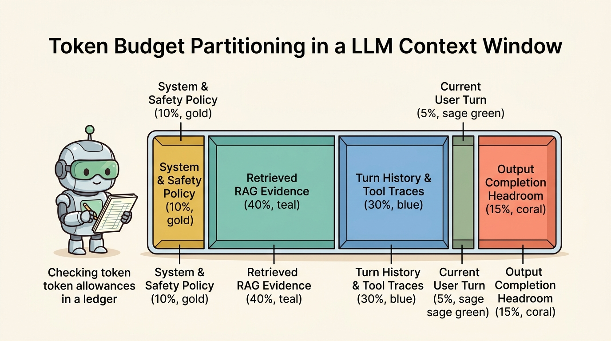
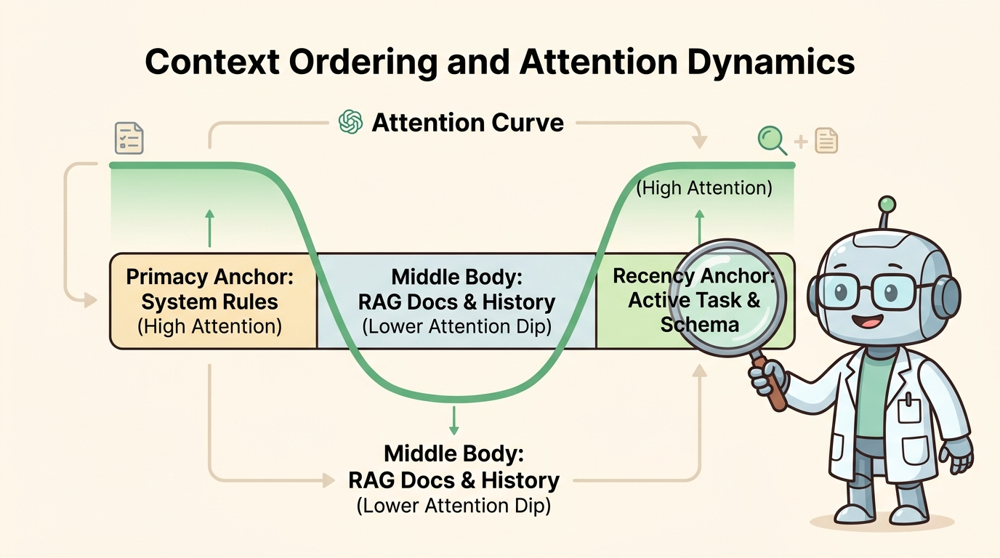

<!--
---
title: Context budgets, selection, and ordering
unit_id: P1-03-02-02
summary: Explains quantitative token budgeting, knapsack chunk selection algorithms,
  and attention-anchored positional ordering in agent context windows.
prerequisites:
- Read [Context sources and precedence](01-context-sources-and-precedence.md).
learning_objectives:
- Allocate token budgets dynamically across system policies, RAG evidence, conversation
  history, and completion headroom.
- Implement relevance-based knapsack and greedy selection algorithms for bounded context
  packing.
- Structure context ordering using primacy and recency anchors to counteract Lost
  in the Middle attention degradation.
- Formulate deterministic eviction and truncation policies that prevent silent degradation
  of safety invariants.
source_records:
- p1-03-02-02-anthropic-context-budget-2024
- p1-03-02-02-google-adk-context-2024
- p1-03-02-02-liu-attention-ordering-2023
visual_assets:
- assets/images/03-building-blocks/02-context-construction/02-context-budgets-selection-and-ordering/01-context-budget-partitioning.png
- assets/images/03-building-blocks/02-context-construction/02-context-budgets-selection-and-ordering/02-context-ordering-and-attention-anchors.png
example_paths:
- examples/03-building-blocks/02-context-construction/02-context-budgets-selection-and-ordering/budget_packager.py
pass: architecture
learning_path: main
status: complete
last_reviewed: '2026-08-18'
---
-->

# Context budgets, selection, and ordering

## Why this matters

Although modern large language models advertise context windows of 128k, 1M, or even 2M tokens, filling a context window to its theoretical ceiling causes severe operational penalties. Large prompts multiply Time to First Token (TTFT), inflate per-turn inference costs, and introduce subtle cognitive degradation where the model fails to follow intricate tool formatting instructions.

Production agent engineering requires rigorous **context budgeting, selection, and positional ordering** (Anthropic, 2024; Google, 2024; Liu et al., 2023). By establishing quantitative token allocations across system rules, knowledge retrieval, and execution traces, runtimes prevent unexpected context exhaustion while packing the highest-relevance information into optimal attention zones.

## Simple mental model

Think of packing a lightweight expedition backpack with a strict 20 kg weight limit:

1. **Survival Gear (System Reserve - Fixed Weight)**: First-aid kit, water purification tablets, and emergency beacon (5 kg). You never remove these items regardless of trail conditions.
2. **Trail Rations (Completion Headroom - Guaranteed Reserve)**: Food rations reserved for the upcoming hike (4 kg). If you fill the bag completely with rocks, you will starve on the return trip.
3. **Regional Maps & Field Guides (RAG Evidence - Dynamic Budget)**: Topographic maps for the specific valley you are traversing (7 kg). If you have ten guidebooks, you pack only the two with the highest trail detail and leave the rest at camp.
4. **Trail Journal (Dialogue History - Sliding Window)**: Daily log entries (3 kg). As the journal fills up, older entries are summarized or archived to make room for today's field notes.
5. **Top Pocket Access (Recency Anchor)**: Compass and immediate trail fork directions placed at the very top flap for instant, unobstructed retrieval.

A disciplined hiker never overpacks the bag, balances gear weight by priority, and keeps immediate survival tools directly at hand.

## Position in the agent workflow

The figures below illustrate token budget partitioning across five functional compartments and the resulting attention distribution across prompt positions.



*Figure 1. Token Budget Partitioning in an LLM Context Window. The runtime partitions the maximum context window into reserved fixed allocations and dynamic budgets, guaranteeing completion headroom.*



*Figure 2. Context Ordering and Attention Dynamics. Placing core system policies at the primacy anchor (index 0) and the immediate task prompt at the recency anchor (tail) maximizes model recall across the U-shaped attention curve.*

Building upon the source classification established in [Context sources and precedence](01-context-sources-and-precedence.md), budgeting and ordering govern the exact packing and placement of tokens within each turn.

## How it works

Managing context windows involves three interdependent operational stages:

### 1. Token budget partitioning

Total usable context is partitioned mathematically to prevent runtime overflow:

$$N_{\text{max}} = N_{\text{system}} + N_{\text{headroom}} + N_{\text{user}} + N_{\text{evidence}} + N_{\text{history}}$$

- **System Reserve ($N_{\text{system}}$)**: Fixed allocation (typically 500 to 2,000 tokens) reserved for immutable system prompts, tool schemas, and core safety policies.
- **Completion Headroom ($N_{\text{headroom}}$)**: Reserved token buffer (typically 1,000 to 4,096 tokens) dedicated exclusively to the model's output generation (including reasoning/thinking tokens and tool call arguments). If input prompt tokens encroach on this buffer, the model output will truncate mid-sentence.
- **User Intent Reserve ($N_{\text{user}}$)**: Dedicated allowance for the user's active prompt.
- **Dynamic Evidence Budget ($N_{\text{evidence}}$)**: Variable allocation for retrieved external knowledge chunks (RAG).
- **Execution History Budget ($N_{\text{history}}$)**: Sliding window allocation for prior conversational turns, tool call arguments, and execution outputs.

### 2. Selection algorithms: Packing the budget

When retrieved documents or conversation histories exceed their assigned budgets, the runtime executes selection algorithms:

- **Greedy Relevance Knapsack**: Candidate knowledge chunks are ranked by semantic similarity score $S_i$. Chunks are greedily packed into the evidence budget in descending score order until the token limit is reached.
- **Priority-Tier Eviction**: When total context overflows, items are evicted in reverse precedence order: older tool execution outputs are trimmed first, followed by historical chat messages, while system policies and active user prompts are permanently preserved.
- **Semantic Deduplication**: Near-duplicate retrieval chunks (cosine similarity $> 0.85$) are filtered out before token packing to prevent wasting budget on redundant phrasing.

### 3. Positional ordering and attention anchors

To overcome the U-shaped attention dip ("Lost in the Middle") identified by Liu et al. (2023), prompts must be sequenced intentionally:

1. **Primacy Anchor (Index 0)**: System role, core constraints, and platform security policies. High initial attention weights ensure these rules are permanently established.
2. **Middle Body Zone**: Retrieved RAG documents, historical tool execution logs, and background conversation turns. Structured XML delimiters (`<doc id='...'>`, `<tool_trace>`) are injected around each item to maintain clear structural separation during middle-zone attention decay.
3. **Recency Anchor (Tail)**: The active user query, current step execution plan, and a concise reminder of the required JSON output schema. Placing formatting reminders at the tail leverages the recency attention spike, drastically reducing JSON syntax errors.

## Main variants

1. **Static Budget Partitioning**: Fixed token limits assigned to each context compartment. Simple and deterministic, but rigid when retrieval demands spike.
2. **Elastic Dynamic Budgeting**: The runtime redistributes unused history tokens to the evidence budget when a complex search task requires deeper document context.
3. **Sliding-Window FIFO Truncation**: Dropping the oldest dialogue turns as new turns arrive, maintaining a fixed-size buffer of recent interactions.

## Minimal implementation

The following Python code demonstrates token budget allocation and attention-anchored prompt sequencing:

```python
from dataclasses import dataclass
from typing import List, Tuple

@dataclass(frozen=True)
class KnowledgeChunk:
    chunk_id: str
    text: str
    relevance: float
    tokens: int

def pack_and_order_context(
    system_policy: str,
    user_query: str,
    schema_reminder: str,
    chunks: List[KnowledgeChunk],
    history: List[str],
    evidence_budget: int = 1000,
) -> List[dict]:
    # 1. Greedy knapsack selection for RAG evidence
    sorted_chunks = sorted(chunks, key=lambda c: c.relevance, reverse=True)
    selected = []
    used_tokens = 0
    for c in sorted_chunks:
        if used_tokens + c.tokens <= evidence_budget:
            selected.append(c)
            used_tokens += c.tokens

    # 2. Structure middle body with delimiters
    docs_text = "\n".join([f"<doc id='{c.chunk_id}'>{c.text}</doc>" for c in selected])
    history_text = "\n".join([f"<turn>{h}</turn>" for h in history])

    # 3. Assemble with primacy (system) and recency (tail) anchors
    system_msg = {"role": "system", "content": system_policy}
    user_msg = {
        "role": "user",
        "content": f"# EVIDENCE\n{docs_text}\n\n# HISTORY\n{history_text}\n\n# TASK\n{user_query}\n\n# SCHEMA\n{schema_reminder}",
    }
    return [system_msg, user_msg]
```

The complete runnable implementation is available in [budget_packager.py](../../../examples/03-building-blocks/02-context-construction/02-context-budgets-selection-and-ordering/budget_packager.py).

## Data flow and state changes

1. **Capacity Inspection**: The context manager inspects the underlying model's context ceiling and subtracts completion headroom.
2. **Candidate Retrieval & Scoring**: The retrieval engine returns candidate knowledge chunks tagged with token counts and relevance scores.
3. **Knapsack Budget Packing**: The knapsack selector fills the evidence and history budgets, discarding candidate chunks that exceed limits.
4. **Anchor Assembly**: The prompt serializer constructs the primacy anchor (system), middle body (evidence and history), and recency anchor (task and schema).

## Trust boundaries

- **Budget Starvation Boundary**: Malicious or oversized third-party tool outputs must not be permitted to consume the entire dynamic budget and starve critical system instructions.
- **Evidence Containment**: All chunks packed into the middle body must retain strict XML wrapper boundaries to prevent prompt injection payloads from escaping into surrounding prompt text.
- **Schema Anchor Integrity**: The tail formatting reminder must be injected directly by the runtime control plane and cannot be modified by user or tool content.

## Reliability failures

- **Headroom Exhaustion (Mid-Generation Truncation)**: Failing to reserve adequate completion headroom results in truncated JSON outputs (HTTP status 200 with `finish_reason: "length"`), breaking downstream parsers.
- **Primacy-Recency Conflict**: If the recency anchor contains instructions that contradict the primacy system policy, the model may follow the recency anchor due to local attention bias.
- **Relevance Score Threshold Failure**: Packing low-relevance chunks simply because budget is available degrades reasoning accuracy; selection must enforce a minimum quality threshold.

## Limitations and trade-offs

- **Strict Headroom Inefficiency**: Reserving large headroom buffers (such as 4,096 tokens) reduces the space available for rich multi-document RAG context.
- **Knapsack Greedy Suboptimality**: Simple greedy sorting by relevance may select one large chunk while missing two smaller chunks with higher aggregate information density.
- **Dynamic Caching Conflicts**: Changing the ordering or selection of chunks in the middle body invalidates prompt cache prefixes, increasing TTFT latency.

## Security preview

In Pass 2, context budgeting is evaluated against **Context Flooding and Denial-of-Context Attacks**. Attackers intentionally emit massive payloads through tool responses or RAG documents to exhaust token budgets, forcing the runtime to evict historical security logs or developer guardrails. Defensive techniques such as strict per-source quota caps and immutable instruction pinning are detailed in [Instructions, context, and model security](../../07-security-by-component-and-workflow-stage/01-instructions-context-and-models/chapter-plan.md).

## Open research questions

- How can attention-aware compilers automatically reorder complex multi-agent scratchpads to minimize middle-zone attention loss?
- Can dynamic token budgeting algorithms adjust headroom in real time based on intermediate reasoning token generation rates?

## Key takeaways

- Total context capacity must be proactively partitioned into System Reserve, Completion Headroom, Dynamic Evidence, and History Budgets.
- Completion headroom must always be guaranteed to prevent catastrophic mid-generation truncation.
- Knowledge selection uses greedy knapsack ranking by relevance to maximize information density under token budgets.
- Context ordering follows a U-shaped attention profile: place core policies at the primacy anchor (index 0) and immediate instructions at the recency anchor (tail).

## References

- Anthropic. *Managing Context Budgets and Information Architecture in Long-Running Agents*. Anthropic Engineering Insights, 2024. [Anthropic Engineering](https://www.anthropic.com/engineering/effective-context-engineering-for-ai-agents).
- Google. *Session State, Context Windows, and Memory Budgeting in Agent Frameworks*. Google Agent Development Kit Documentation, 2024. [Google ADK](https://adk.dev/agents/).
- Liu, N. F., Lin, K., Hewitt, J., Paranjape, A., Bevilacqua, M., Petroni, F., & Liang, P. *Positional Sensitivity and Context Ordering in Language Model Inference*. Transactions of the Association for Computational Linguistics (TACL), 2023. [arXiv:2307.03172](https://arxiv.org/abs/2307.03172).

---

[Next Unit: History summaries and compression →](chapter-plan.md)
