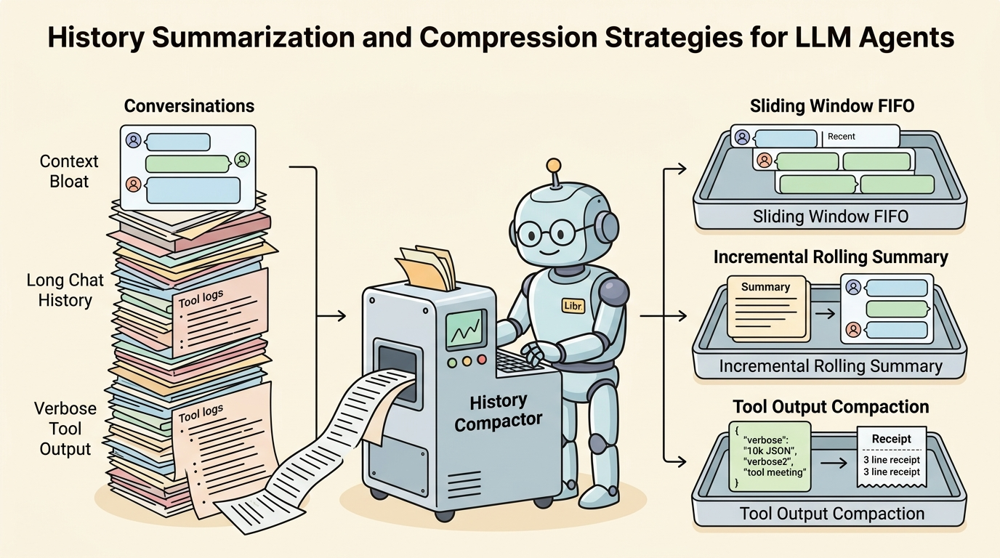
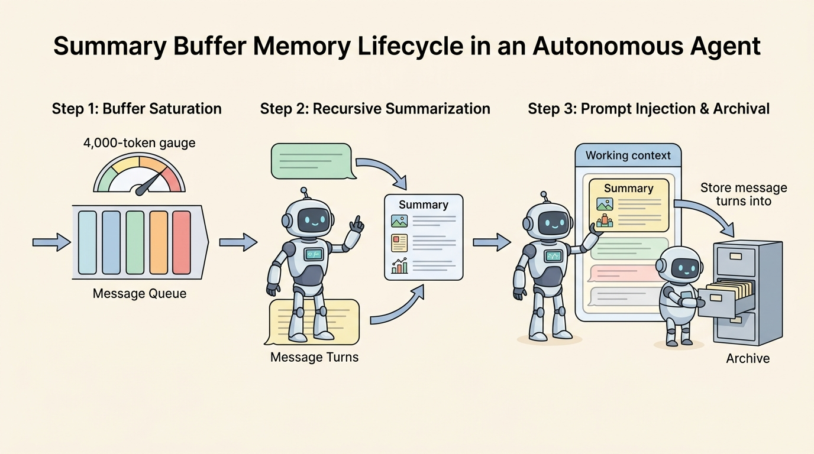

<!--
---
title: History, summaries, and compression
unit_id: P1-03-02-03
summary: Explains conversation history management, lossy and lossless token compaction,
  tool trace pruning, and recursive summarization for long-running agents.
prerequisites:
- Read [Context sources and precedence](01-context-sources-and-precedence.md).
- Read [Context budgets, selection, and ordering](02-context-budgets-selection-and-ordering.md).
learning_objectives:
- Deconstruct conversation history growth curves and quantify token accumulation across
  multi-step agent loops.
- Implement lossy vs lossless context compression techniques including sliding window
  FIFO, tool output compaction, and recursive summarization.
- Formulate structured state extraction protocols that preserve active goals, confirmed
  variables, and error states across compaction cycles.
- Mitigate information loss and cascading hallucination risks during repeated history
  summarization.
source_records:
- p1-03-02-03-packer-memgpt-2023
- p1-03-02-03-anthropic-context-compression-2024
- p1-03-02-03-langchain-message-trimming-2024
visual_assets:
- assets/images/03-building-blocks/02-context-construction/03-history-summaries-and-compression/01-history-compression-strategies.png
- assets/images/03-building-blocks/02-context-construction/03-history-summaries-and-compression/02-summary-buffer-memory-lifecycle.png
example_paths:
- examples/03-building-blocks/02-context-construction/03-history-summaries-and-compression/history_compressor.py
pass: architecture
learning_path: main
status: complete
last_reviewed: '2026-08-18'
---
-->

# History, summaries, and compression

## Why this matters

In long-running autonomous agent workflows (such as code refactoring, iterative research, or multi-day customer support), the execution history expands monotonically with every user interaction, tool invocation, and error recovery step. If left unmanaged, history accumulation rapidly consumes the available context budget, drives up per-turn latency and inference costs, and dilutes the model's focus on immediate objectives.

Context compression is the engineering discipline of shrinking past execution traces while preserving the essential semantic state needed for upcoming reasoning steps (Packer et al., 2023; Anthropic, 2024; Chase & Askaryan, 2024). Without systematic compression, agents either crash against hard context limits or suffer catastrophic amnesia when older conversation turns are naively dropped.

## Simple mental model

Think of an executive chief of staff preparing a briefing binder for a CEO:

1. **Raw Meeting Recordings (Uncompressed History)**: Hundreds of hours of audio and verbatim transcripts. Attempting to review all recordings before every decision causes decision paralysis and immense time waste.
2. **Recent Transcript Window (Sliding Window FIFO)**: The unedited transcript of only the last 15 minutes of the current meeting. Provides high-fidelity immediate context, but forgets decisions made yesterday.
3. **Structured Executive Summary (Rolling Summary Buffer)**: A concise, bulleted memo outlining approved decisions, active deadlines, and unresolved blockers from all prior sessions.
4. **Receipt Pruning (Tool Compaction)**: Replacing a 50-page vendor invoice with a verified one-line payment confirmation receipt.

The chief of staff condenses historical detail into a living executive summary while keeping the immediate dialogue verbatim, allowing the executive to make fast, fully informed decisions.

## Position in the agent workflow

The figures below illustrate history compression strategies and the operational lifecycle of a summary buffer memory system.



*Figure 1. Context History Compression Strategies. Runtimes manage growing execution traces through sliding window truncation, incremental rolling summaries, and lossless tool output compaction.*



*Figure 2. Summary Buffer Memory Lifecycle. When history crosses saturation thresholds, a background compaction step condenses older turns into structured state blocks and archives raw transcripts to secondary storage.*

Building upon the token budget allocations defined in [Context budgets, selection, and ordering](02-context-budgets-selection-and-ordering.md), history compression ensures long-running agent loops operate indefinitely within bounded context constraints.

## How it works

History compression combines structural compaction, algorithmic trimming, and model-driven state extraction:

### 1. The three primary compression strategies

- **Sliding-Window Truncation (FIFO)**: The simplest approach, retaining the last $K$ message turns or the most recent $N$ tokens of dialogue while discarding older messages. While computationally free, it discards foundational constraints established in early turns.
- **Lossless Tool Output Compaction**: Tool outputs (such as database query results, file listings, or API responses) frequently contain massive JSON envelopes, verbose headers, and redundant debug traces. Runtimes filter raw JSON payloads to retain only requested fields (e.g., extracting `{"status": "active", "balance": 450}` from a 2,000-token payload), reducing token volume by 80% to 95% with zero semantic loss (Anthropic, 2024).
- **Incremental Rolling Summaries (Summary Buffer)**: An intermediate model (often a fast, cost-effective SLM) periodically condenses historical conversation turns into a structured `<state_summary>` section. The runtime injects this summary at the top of the context window while keeping only the most recent $M$ turns uncompressed (Packer et al., 2023; Chase & Askaryan, 2024).

### 2. Structured state condensation schema

Naive natural-language summarization tends to lose critical technical identifiers (such as UUIDs, variable names, and error codes). Production summarizers use structured extraction templates to preserve essential execution state:

```text
# CONVERSATION STATE SUMMARY
- Core User Goal: [Original objective and explicit constraints]
- Confirmed Facts & Entities: [Customer IDs, verified account balances, file paths]
- Completed Tool Actions: [List of successfully executed steps]
- Active Subtasks & Blockers: [Pending actions and current failure states]
```

### 3. Mitigating semantic degradation and hallucination drift

Repeatedly summarizing a summary introduces **recursive semantic drift**, where subtle facts morph or hallucinated details become cemented as ground truth. Robust runtimes implement three guardrails:
- **Anchor Invariants**: Permanent extraction of key variables into an immutable metadata dictionary that is never re-summarized.
- **Raw Log Offloading**: Storing uncompressed historical turns in an external database (e.g., PostgreSQL or S3) with unique turn IDs, allowing the agent to retrieve exact historical details on demand via memory search tools (Packer et al., 2023).
- **Compaction Threshold Hysteresis**: Triggering summarization only when buffer utilization exceeds a high watermark (e.g., 85% of history budget) and compacting down to a low watermark (e.g., 30%) to prevent thrashing.

## Main variants

1. **Summary-Buffer Memory**: Maintains a running summary of older turns alongside a sliding window of recent verbatim turns.
2. **Hierarchical Memory Tiering (MemGPT / Letta)**: Treats the context window as primary RAM and external databases as secondary disk storage, allowing the agent to autonomously page memory in and out of context via explicit function calls (Packer et al., 2023).
3. **Selective Message Pruning (Role-Preserving Truncation)**: Truncating only large assistant thoughts and tool outputs while preserving user messages and system instructions intact.

## Minimal implementation

The following Python implementation demonstrates tool output compaction and rolling summary buffer management:

<details>
<summary>Expand minimal Python implementation</summary>

```python
from dataclasses import dataclass
from typing import Dict, List
import json

@dataclass
class MessageTurn:
    role: str
    content: str
    tokens: int

class SummaryBufferHistory:
    def __init__(self, max_tokens: int = 1000, keep_recent: int = 2):
        self.max_tokens = max_tokens
        self.keep_recent = keep_recent
        self.turns: List[MessageTurn] = []
        self.summary: str = ""

    def add_turn(self, role: str, content: str) -> None:
        estimated_tokens = max(1, len(content) // 4)
        self.turns.append(MessageTurn(role, content, estimated_tokens))

    def compact_tool_json(self, raw_json: str, keys: List[str]) -> str:
        try:
            data = json.loads(raw_json)
            if isinstance(data, dict):
                return json.dumps({k: data.get(k) for k in keys if k in data})
        except Exception:
            pass
        return raw_json[:200]

    def condense_if_needed(self) -> None:
        total = sum(t.tokens for t in self.turns) + (len(self.summary) // 4)
        if total > self.max_tokens and len(self.turns) > self.keep_recent:
            to_summarize = self.turns[:-self.keep_recent]
            bullets = [f"- {t.role.upper()}: {t.content[:80]}" for t in to_summarize]
            self.summary += "\n" + "\n".join(bullets)
            self.turns = self.turns[-self.keep_recent:]
```

</details>

The full runnable implementation is available in [history_compressor.py](../../../examples/03-building-blocks/02-context-construction/03-history-summaries-and-compression/history_compressor.py).

## Data flow and state changes

1. **Turn Append**: A new user message, assistant thought, or tool result is appended to the active working history buffer.
2. **Tool Output Compaction**: Tool results pass through a schema-aware parser that strips noise before token accounting.
3. **Threshold Check**: If total history tokens exceed the budget watermark, the compaction lifecycle is initiated.
4. **State Summarization**: The summarizer compresses older turns into a structured summary block, appends it to `<state_summary>`, and evicts the raw turns from the active window.
5. **Cold Storage Archival**: Evicted raw turns are indexed into long-term storage for retrospective retrieval.

## Trust boundaries

- **Summarization Integrity Boundary**: Summarization prompts must explicitly instruct the summarizer model not to introduce new claims or resolve unverified assumptions.
- **Untrusted Injection Persistence**: If an untrusted tool result contained a prompt injection attack, the summarizer must not elevate the attack text into an authoritative system constraint in the permanent summary.
- **Context Provenance Boundary**: The runtime must tag the summary block as synthesized history so downstream reasoning models recognize it as an abstract representation rather than raw verified evidence.

## Reliability failures

- **Entity Dropping (Catastrophic Amnesia)**: Summarizers omitting critical account numbers, file paths, or negative constraints (e.g., "Do not delete files in /tmp") during aggressive compression.
- **Cascading Hallucination**: An error or hallucination in turn 3 that gets summarized into a "confirmed fact" in turn 10, misleading the agent for the remainder of the session.
- **Tool Truncation Invalidation**: Truncating JSON tool outputs incorrectly (e.g., splitting a closing brace) causing downstream JSON parsers to throw syntax exceptions.

## Limitations and trade-offs

- **Compaction Latency and Cost**: Running LLM summarization adds background API calls and latency spikes during agent execution.
- **Lossy vs Lossless Trade-off**: Compressing text always involves information loss; subtle nuances in user requests can be lost during multi-round summarization.
- **Cache Prefix Invalidation**: Modifying the summary block on every turn changes the prompt prefix, destroying prompt caching benefits on static history segments.

## Security preview

In Pass 2, history compression is analyzed under **Memory Poisoning and Injection Persistence Attacks**. Adversaries craft inputs designed to manipulate the summarization model into baking hidden backdoors or privilege escalations into the agent's long-term summary buffer. Defenses including isolated summarizer prompts, validation schemas, and cryptographic state pinning are explored in [Instructions, context, and model security](../../07-security-by-component-and-workflow-stage/01-instructions-context-and-models/chapter-plan.md).

## Open research questions

- How can agents autonomously identify when a past summarized detail is ambiguous and execute targeted retrieval back into cold-storage raw logs?
- Can losslessly compressed neural KV cache representations replace text-based summarization for state persistence across sessions?

## Key takeaways

- Unmanaged execution history causes token bloat, high inference latency, and cognitive focus dilution in multi-step agents.
- Lossless tool output compaction strips unneeded JSON payload fields, reducing tool token footprint by up to 90%.
- Summary buffer memory combines a compact structured state summary of older interactions with a sliding window of recent turns.
- Critical technical entities, active goals, and confirmed error states must be explicitly structured to prevent loss during recursive summarization.

## References

- Packer, C., Fang, V., Patil, S. G., Lin, K., Wooders, S., & Gonzalez, J. E. *MemGPT: Towards LLMs as Operating Systems*. arXiv preprint arXiv:2310.08560, 2023. [arXiv:2310.08560](https://arxiv.org/abs/2310.08560).
- Anthropic. *Context Compression and History Condensation Patterns for AI Agents*. Anthropic Engineering Insights, 2024. [Anthropic Engineering](https://www.anthropic.com/engineering/effective-context-engineering-for-ai-agents).
- Chase, H., & Askaryan, B. *Conversation History Trimming and Summary Buffer Architectures*. LangChain Documentation, 2024. [LangChain Concepts](https://python.langchain.com/docs/concepts/memory/).

---

[Next Unit: Provenance and context debugging →](chapter-plan.md)
