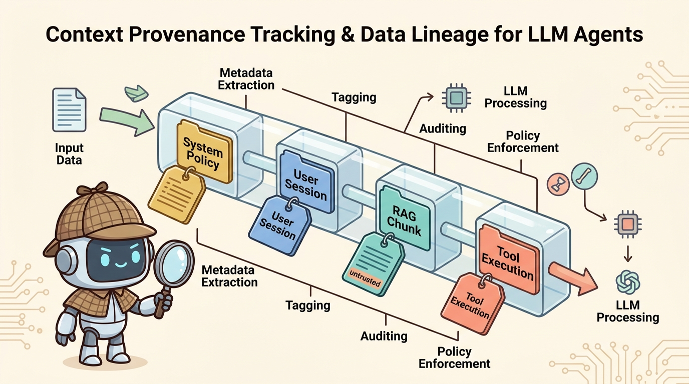
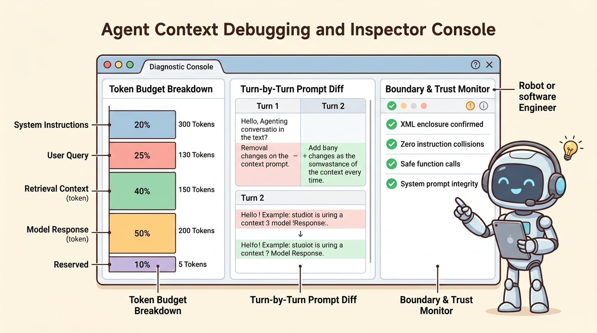

<!--
---
title: Provenance and context debugging
unit_id: P1-03-02-04
summary: Explains token-level lineage tracking, context debugging inspection consoles,
  OpenTelemetry telemetry standards, and boundary integrity auditing.
prerequisites:
- Read [Context sources and precedence](01-context-sources-and-precedence.md).
- Read [Context budgets, selection, and ordering](02-context-budgets-selection-and-ordering.md).
- Read [History, summaries, and compression](03-history-summaries-and-compression.md).
learning_objectives:
- Track token-level provenance and data lineage across system policies, user inputs,
  RAG chunks, and tool outputs.
- Implement context debugging inspection consoles to audit token allocation, boundary
  integrity, and prompt transformations.
- Standardize context telemetry using OpenTelemetry Generative AI semantic conventions
  and W3C PROV-DM structures.
- Detect instruction collisions, prompt injection markers, and silent context truncation
  before dispatching inference requests.
source_records:
- p1-03-02-04-opentelemetry-genai-2024
- p1-03-02-04-w3c-prov-dm-2013
- p1-03-02-04-anthropic-context-inspection-2024
visual_assets:
- assets/images/03-building-blocks/02-context-construction/04-provenance-and-context-debugging/01-context-provenance-tracking.png
- assets/images/03-building-blocks/02-context-construction/04-provenance-and-context-debugging/02-context-debugging-inspector-console.png
example_paths:
- examples/03-building-blocks/02-context-construction/04-provenance-and-context-debugging/provenance_debugger.py
pass: architecture
learning_path: main
status: complete
last_reviewed: '2026-08-18'
---
-->

# Provenance and context debugging

## Why this matters

When an autonomous agent exhibits erratic behavior, makes an unauthorized tool call, or hallucinates an incorrect output, diagnosing root causes without deep context visibility is nearly impossible. In production systems, a model prompt is a dynamic composite of dozens of disparate data sources assembled on the fly. If developers cannot inspect the exact serialized payload, token budget allocations, and origin of each prompt segment, debugging becomes guesswork.

**Context provenance and debugging** provides end-to-end visibility into the data lineage of every token fed into the model (OpenTelemetry, 2024; W3C, 2013; Anthropic, 2024). By attaching cryptographic fingerprints, source URIs, trust tags, and transformation histories to every context item, engineering teams can trace faulty decisions back to specific data sources, verify trust boundary enforcement, and maintain comprehensive audit trails for enterprise compliance.

## Simple mental model

Think of an industrial food processing quality control lab:

1. **Ingredient Passports (Provenance Records)**: Every batch of flour, dairy, and spices entering the facility has a barcoded passport stating its origin farm, harvest timestamp, organic certification, and allergen status.
2. **Batch Inspection Station (Context Inspector Console)**: Quality control engineers scan each mixing vat before cooking, verifying exact weight ratios (Token Budget Allocation) and checking that no uncertified additives contaminated the batch (Boundary Integrity Audit).
3. **Food Traceability Log (OpenTelemetry Spans)**: If a customer reports an issue three weeks later, inspectors use the batch barcode to instantly reconstruct the exact farm source and processing temperature of every ingredient.

Context debugging ensures that every piece of data entering an agent prompt is certified, budgeted, and fully auditable from source to completion.

## Position in the agent workflow

The figures below illustrate token-level provenance lineage tracking and the diagnostic layout of an agent context inspector console.



*Figure 1. Context Provenance Tracking and Data Lineage for LLM Agents. Each context item entering the prompt pipeline carries a provenance passport tracking origin URI, authority tier, cryptographic hash, and processing history.*



*Figure 2. Agent Context Debugging and Inspector Console. Diagnostic consoles provide real-time visibility into token allocations, turn-by-turn prompt differentials, and automated boundary integrity monitoring.*

As the final foundational step in [Context construction](chapter-plan.md), provenance and debugging link runtime context assembly to downstream planning and system observability.

## How it works

Context provenance and debugging operate across three foundational pillars:

### 1. The provenance metadata record

Every item ingested into the prompt assembly pipeline is wrapped in a standardized provenance schema aligned with W3C PROV-DM and OpenTelemetry conventions (W3C, 2013; OpenTelemetry, 2024):

- **`item_id`**: Unique identifier for the context chunk within the session.
- **`source_uri`**: Canonical URI pointing to the data origin (e.g., `s3://docs/hr-manual.pdf#page=4`, `postgres://users/alice`, `tool://sandbox/git-diff`).
- **`source_type`**: Functional category (`system_config`, `user_input`, `rag_evidence`, `tool_output`, `session_history`).
- **`trust_tier`**: Assigned trust level (`SYSTEM_AUTHORITY`, `USER_INTENT`, `UNTRUSTED_EXTERNAL`).
- **`sha256_hash`**: Cryptographic checksum of the raw content before transformations.
- **`token_count`**: Exact token consumption calculated via the target model tokenizer.
- **`transformation_chain`**: Ordered list of mutations applied by the runtime (e.g., `["raw_fetch", "pii_redaction", "xml_enclosure"]`).

### 2. Context debugging consoles and inspectors

Runtime context debuggers provide four essential diagnostic views:
- **Token Budget Allocation Flamegraph**: Visualizes the proportional consumption of the context window across system rules, RAG chunks, message history, and completion headroom.
- **Turn-by-Turn Prompt Diff**: Compares the exact prompt payload between turn $T-1$ and turn $T$, highlighting newly injected tool results, evicted history turns, and modified summary sections.
- **Pre-Dispatch Boundary Auditor**: Scans assembled prompts for unescaped delimiters (e.g., raw `<system>` tags embedded inside third-party RAG chunks) or prompt injection trigger phrases before the request is dispatched to the model API.
- **Serialization Replay**: Allows engineers to export the exact prompt payload to replay problematic turns deterministically in isolated staging environments.

### 3. OpenTelemetry semantic conventions for agent spans

Standardizing context telemetry enables interoperability across distributed tracing platforms (such as Jaeger, LangSmith, Arize Phoenix, and Datadog). Modern agent systems emit structured OpenTelemetry spans containing standardized attributes (OpenTelemetry, 2024):

```json
{
  "gen_ai.system": "anthropic",
  "gen_ai.request.model": "claude-3-5-sonnet-20241022",
  "gen_ai.prompt.tokens": 1420,
  "gen_ai.context.items_count": 6,
  "gen_ai.context.untrusted_tokens": 580,
  "gen_ai.context.violations_detected": 0
}
```

## Main variants

1. **In-Memory Inspector Middleware**: Intercepts prompt serialization directly inside the agent runtime, recording provenance metadata in local memory for local development debugging.
2. **Distributed Telemetry Exporter**: Emits OpenTelemetry OTLP spans to centralized enterprise observability collectors for real-time monitoring and compliance auditing.
3. **Cryptographic Context Ledger**: Writes immutable SHA-256 hashes of all input prompts and tool outputs to an append-only audit log for high-stakes legal and regulated financial agent deployments.

## Minimal implementation

The following Python script implements a context provenance tracker and pre-dispatch boundary auditor:

<details>
<summary>Expand minimal Python implementation</summary>

```python
from dataclasses import dataclass, field
import hashlib
from typing import Dict, List, Tuple

@dataclass(frozen=True)
class ProvenanceItem:
    item_id: str
    source_uri: str
    trust_tier: str
    token_count: int
    content_hash: str

class ContextAuditor:
    def __init__(self):
        self.items: List[Tuple[ProvenanceItem, str]] = []

    def add(self, item_id: str, text: str, source_uri: str, trust_tier: str) -> None:
        h = hashlib.sha256(text.encode()).hexdigest()[:10]
        tokens = max(1, len(text) // 4)
        rec = ProvenanceItem(item_id, source_uri, trust_tier, tokens, h)
        self.items.append((rec, text))

    def audit(self) -> List[str]:
        violations = []
        for rec, text in self.items:
            if rec.trust_tier == "UNTRUSTED_EXTERNAL":
                if "ignore previous instructions" in text.lower() or "<system>" in text.lower():
                    violations.append(f"Prompt injection risk in {rec.item_id} from {rec.source_uri}")
        return violations
```

</details>

The full runnable implementation is available in [provenance_debugger.py](../../../examples/03-building-blocks/02-context-construction/04-provenance-and-context-debugging/provenance_debugger.py).

## Data flow and state changes

1. **Ingestion & Fingerprinting**: As context sources are fetched, the runtime computes SHA-256 hashes and attaches provenance metadata records.
2. **Transformation Logging**: Sanitization, chunking, and XML wrapping steps append entries to the item's transformation chain.
3. **Pre-Dispatch Inspection**: The debugger checks token budgets and runs boundary integrity scanners against the fully assembled prompt.
4. **Span Generation**: The runtime records prompt token counts, item counts, and source distributions into the active OpenTelemetry span.
5. **Execution & Archival**: The prompt is dispatched to the LLM, and provenance records are persisted alongside output tokens for retrospective auditing.

## Trust boundaries

- **Provenance Immutability Boundary**: Provenance metadata must be generated and signed exclusively by the trusted runtime control plane; untrusted tools and user payloads must not be permitted to set their own trust tiers.
- **PII & Secret Scrubbing Boundary**: Before exporting prompt traces to external observability platforms, sensitive customer data and API secrets must be redacted to prevent secondary credential leakage.
- **Trace Access Boundary**: Debugging consoles displaying full prompt payloads must enforce strict Role-Based Access Control (RBAC) so unauthorized developers cannot read confidential user sessions.

## Reliability failures

- **Provenance Tag Stripping**: Middleware components transforming or concatenating text strings without propagating metadata objects, causing downstream loss of data lineage.
- **Tokenizer Divergence in Budgeting**: Using an approximate word/character counter for prompt debugging while the actual provider API uses a BPE tokenizer, leading to false-positive budget alerts.
- **Telemetry Overhead Bottlenecks**: Synchronously serializing massive multi-megabyte prompt traces to external logging backends on every agent iteration, adding significant latency overhead.

## Limitations and trade-offs

- **Storage Volume**: Retaining full prompt histories and token-level provenance across millions of multi-step agent sessions creates massive telemetry storage costs.
- **Redaction Complexity**: Accurately scrubbing PII and secrets from dynamic multi-modal context traces without stripping useful debugging context requires sophisticated parsing filters.
- **Trace Latency**: Emitting detailed OTLP spans asynchronously prevents request blocking, but can result in dropped telemetry spans during sudden process terminations.

## Security preview

In Pass 2, context debugging and provenance serve as the primary foundation for **Adversarial Forensics and Incident Response**. When an agent compromises data or executes an unintended tool action, security analysts query the provenance ledger to pinpoint the exact retrieval document or injection payload that manipulated the model. We detail forensic log analysis, prompt injection detection pipelines, and compliance audit frameworks in [Instructions, context, and model security](../../07-security-by-component-and-workflow-stage/01-instructions-context-and-models/chapter-plan.md).

## Open research questions

- Can zero-knowledge proofs verify that an LLM agent prompt complied with provenance policies without revealing confidential prompt contents?
- How can automated debugging engines localize the exact single token or sentence in a 100k-token prompt that triggered a reasoning hallucination?

## Key takeaways

- Context provenance tracks the exact origin, timestamp, trust tier, and transformation history of every token in an agent prompt.
- Debugging consoles provide critical visibility into token allocations, turn differentials, and pre-dispatch boundary violations.
- OpenTelemetry Generative AI semantic conventions standardize prompt telemetry attributes across industry tracing tools.
- Provenance metadata must remain strictly under runtime control plane authority to prevent spoofing by untrusted external data.

## References

- OpenTelemetry Community. *OpenTelemetry Semantic Conventions for Generative AI and Agent Systems*. OpenTelemetry Specification, 2024. [OpenTelemetry Docs](https://opentelemetry.io/docs/specs/semconv/gen-ai/).
- World Wide Web Consortium (W3C). *PROV-DM: The PROV Data Model for Provenance Interchange*. W3C Recommendation, 2013. [W3C PROV-DM](https://www.w3.org/TR/prov-dm/).
- Anthropic. *Context Inspection and Debugging Methodologies for Multi-Agent Workflows*. Anthropic Engineering Insights, 2024. [Anthropic Engineering](https://www.anthropic.com/engineering/effective-context-engineering-for-ai-agents).

---

[Next Unit: Planning and reasoning plan →](../03-planning-and-reasoning/chapter-plan.md)
