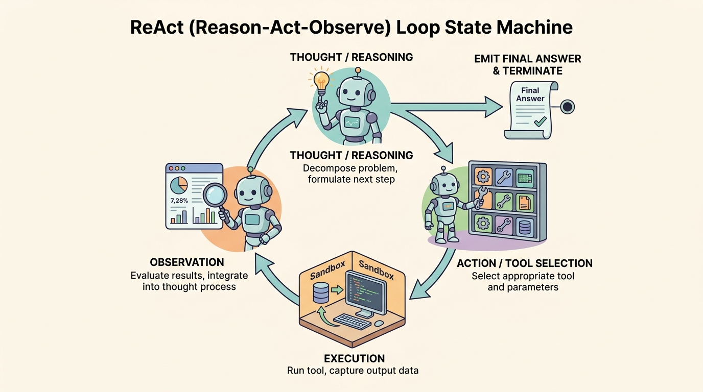
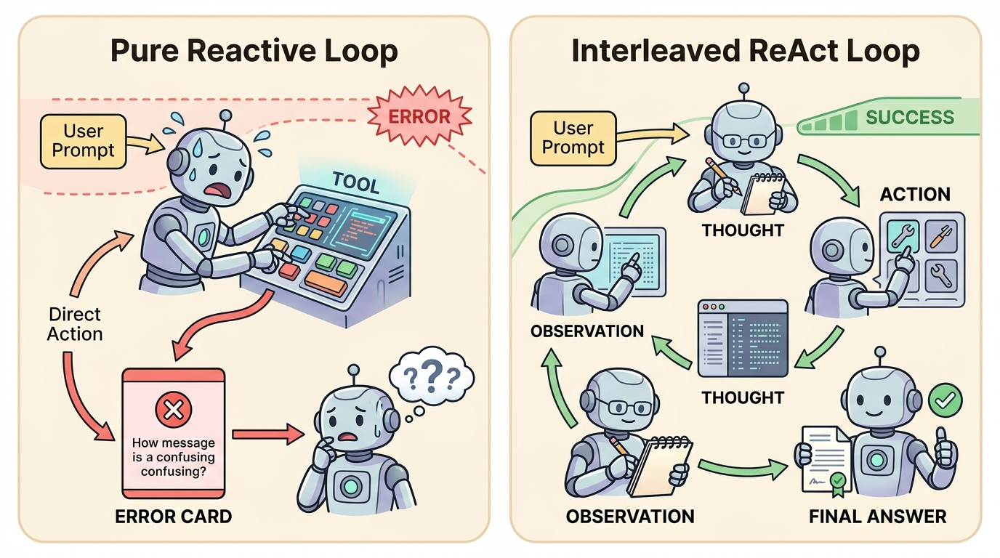

<!--
---
title: Reactive and reason-act patterns
unit_id: P1-03-03-01
summary: Explains reactive action selection and interleaved ReAct (Thought-Action-Observation)
  loops, error recovery, and cycle bounds in autonomous systems.
prerequisites:
- Read [Building blocks plan](../chapter-plan.md).
- Read [Provenance and context debugging](../02-context-construction/04-provenance-and-context-debugging.md).
learning_objectives:
- Contrast pure reactive tool calling against interleaved ReAct (Reason-Act-Observe)
  trajectories in autonomous agents.
- Implement the cyclical ReAct state machine across Thought, Action, Environment Execution,
  and Observation phases.
- Formulate deterministic loop bounding controls including max iteration limits, repetition
  traps, and error recovery policies.
- Ground model reasoning in empirical tool observations to prevent cascading hallucinations
  during complex task execution.
source_records:
- p1-03-03-01-yao-react-2022
- p1-03-03-01-shinn-reflexion-2023
- p1-03-03-01-langgraph-react-pattern-2024
visual_assets:
- assets/images/03-building-blocks/03-planning-and-reasoning/01-reactive-and-reason-act-patterns/01-react-loop-state-machine.png
- assets/images/03-building-blocks/03-planning-and-reasoning/01-reactive-and-reason-act-patterns/02-reactive-vs-reasonact-comparison.png
example_paths:
- examples/03-building-blocks/03-planning-and-reasoning/01-reactive-and-reason-act-patterns/react_loop_runner.py
pass: architecture
learning_path: main
status: complete
last_reviewed: '2026-08-18'
---
-->

# Reactive and reason-act patterns

## Why this matters

When building autonomous agents, the simplest approach to tool usage is **pure reactive execution**: the model receives a user prompt and immediately emits an API tool call without an explicit reasoning step. While fast for simple, single-turn lookups (such as checking current weather), pure reactive loops fail catastrophically on multi-step objectives. Without structured intermediate reasoning, models struggle to track intermediate variables, misinterpret subtle tool errors, and frequently enter infinite repetitive action loops.

The **ReAct (Reason + Act)** pattern solves this limitation by interleaving explicit verbal reasoning traces with concrete tool actions and empirical environment observations (Yao et al., 2022; Shinn et al., 2023; LangChain, 2024). By forcing the agent to formulate an explicit "Thought" before selecting an "Action", the runtime grounds decision-making in real-time observations, enables self-correction when tools return unexpected errors, and significantly increases multi-hop problem-solving accuracy.

## Simple mental model

Think of an electrician diagnosing a complex home electrical fault:

1. **Pure Reactive Electrician**: Starts randomly flipping circuit breakers and swapping light fixtures without testing voltage. When a breaker trips again, they guess randomly and swap the same fixture a second time.
2. **ReAct Methodical Electrician**:
   - **Thought**: "The living room lights flickered when the refrigerator kicked on. This suggests an overloaded shared 15A circuit or a loose neutral wire."
   - **Action**: Connects multimeter to living room outlet #2.
   - **Execution & Observation**: Multimeter reads 108V with an open neutral indicator.
   - **Thought**: "Voltage drop confirmed on outlet #2. Next, I need to inspect the junction box behind the kitchen wall."
   - **Final Resolution**: Tightens the neutral wire screw in the junction box and verifies stable 120V power.

Interleaving reasoning with measurement prevents wild guessing, isolates failures quickly, and creates an auditable trail of why each action was taken.

## Position in the agent workflow

The figures below illustrate the circular state machine of the ReAct pattern and contrast its execution trajectory against direct reactive tool invocation.



*Figure 1. ReAct Loop State Machine. The runtime cycles through Thought (reasoning decomposition), Action (tool selection), Execution (environment sandbox execution), and Observation (result assimilation) until the final termination condition is satisfied.*



*Figure 2. Pure Reactive vs Interleaved ReAct Pattern. Direct reactive execution is brittle on multi-step dependencies, whereas ReAct grounds each step in tool observations to enable dynamic error recovery.*

Following the context construction pipeline taught in [Context construction](../02-context-construction/chapter-plan.md), planning and reasoning patterns govern how agents dynamically formulate next actions across sequential turns.

## How it works

The ReAct pattern structures agent execution into a four-phase cyclical state transition graph:

### 1. The four phases of the ReAct cycle

- **Phase 1: Thought (Internal Reasoning)**: The model analyzes the current context, past execution history, and active goal. It generates a brief, natural-language reasoning trace explaining what sub-problem it is solving and what evidence it needs next (Yao et al., 2022).
- **Phase 2: Action (Tool Selection & Parameterization)**: The model emits a structured function call naming the target tool and its exact JSON arguments (e.g., `search_registry({"name": "Acme Corp"})`).
- **Phase 3: Environment Execution (Host Boundary)**: The agent runtime intercepts the tool call, validates permissions and arguments, executes the tool in a secure sandbox, and captures the raw output.
- **Phase 4: Observation (Feedback Assimilation)**: The runtime appends the execution result to the prompt context as an observation. The model reads this observation, updating its internal state representation before beginning the next Thought cycle.

### 2. Termination and exit criteria

A ReAct loop terminates when one of three conditions is met (LangChain, 2024):
1. **Goal Satisfaction (Final Answer)**: The model determines that all required subtasks are complete and emits a `Final Answer` response directly to the user.
2. **Max Iteration Bound**: The loop reaches a strict maximum iteration counter $K_{\text{max}}$ (typically 5 to 15 turns), halting execution to prevent runaway inference spend.
3. **Repetition Trap Detection**: The runtime detects that the model has emitted the exact same action and arguments consecutively without state progress, triggering an intervention or graceful failure.

### 3. Error recovery and self-reflection

When a tool returns an error code (such as HTTP 404, database timeout, or syntax validation failure), a pure reactive system often halts or crashes. In ReAct:
- The error message is formatted as an explicit observation: `Observation: Error 404: Resource 'user_88' not found.`
- The subsequent Thought step interprets the failure: `Thought: User ID 88 does not exist. Let me search by email address instead.`
- The agent emits an alternative Action, recovering autonomously from intermediate execution obstacles.

## Main variants

1. **Synchronous Single-Action ReAct**: The canonical model emits exactly one Thought and one Action per turn, waiting for the environment observation before proceeding.
2. **Parallel Tool Batching ReAct**: The model emits multiple independent actions in a single turn (e.g., querying three search queries simultaneously), and the runtime executes them concurrently before returning a combined observation block.
3. **Verbal Reinforcement Reflexion**: Extends ReAct by adding an explicit post-failure evaluator that generates linguistic self-reflection memos, storing them in episodic memory to prevent repeating the same mistake across subsequent runs (Shinn et al., 2023).

## Minimal implementation

The following Python script implements a complete ReAct loop with step tracking, tool execution, and cycle bounds:

<details>
<summary>Expand minimal Python implementation</summary>

```python
from dataclasses import dataclass
from typing import Any, Callable, Dict, Optional, Tuple

@dataclass
class Tool:
    name: str
    func: Callable[[dict], str]

class ReActRunner:
    def __init__(self, tools: Dict[str, Tool], max_turns: int = 5):
        self.tools = tools
        self.max_turns = max_turns

    def run_step(self, context: str) -> Tuple[Optional[str], Optional[str], Optional[dict]]:
        # In production: model emits "Thought: ...\nAction: tool_name(args)" or "Final Answer: ..."
        # Mocking turn 1 lookup
        if "Observation:" not in context:
            return "Need to check balance.", "get_balance", {"account_id": "ACC-99"}
        return "Balance verified.", None, {"final_answer": "Your account balance is $5,400."}

    def execute(self, user_prompt: str) -> str:
        context = f"User Goal: {user_prompt}\n"
        for turn in range(1, self.max_turns + 1):
            thought, tool_name, final_or_args = self.run_step(context)
            if tool_name is None and final_or_args:
                return str(final_or_args.get("final_answer", ""))  # Final Answer emitted

            tool = self.tools.get(tool_name) if tool_name else None
            observation = tool.func(final_or_args) if tool and final_or_args else f"Error: Tool '{tool_name}' not found"
            context += f"Thought: {thought}\nAction: {tool_name}\nObservation: {observation}\n"

        return "Error: Maximum iteration limit reached."
```

</details>

The full runnable implementation is available in [react_loop_runner.py](../../../examples/03-building-blocks/03-planning-and-reasoning/01-reactive-and-reason-act-patterns/react_loop_runner.py).

## Data flow and state changes

1. **Prompt Ingestion**: The agent loop receives the initial user query alongside available tool signatures and system policies.
2. **Thought & Action Generation**: The model performs auto-regressive generation, outputting its reasoning trace and target function call.
3. **Runtime Interception**: The execution engine intercepts the tool call, logging execution telemetry.
4. **Environment Execution**: The sandboxed tool runs and returns structured data or error codes.
5. **State Append**: The observation is appended to the message context, and the loop advances to the next turn index.

## Trust boundaries

- **Tool Execution Boundary**: Tools execute external side effects (file writes, database mutations, API requests). The runtime must enforce least-privilege access and never allow model-generated arguments to bypass parameter validation gates.
- **Thought Boundary Visibility**: Reasoning traces are internal agent scratchpad tokens. While visible to debugging consoles, user-facing interfaces may choose to conceal raw thoughts to prevent leaking internal heuristics.
- **Observation Injection Integrity**: Observations must be tagged explicitly with runtime containment wrappers to prevent adversarial tool responses from simulating system directives.

## Reliability failures

- **Tool Thrashing (Infinite Repetition)**: The agent repeatedly calls the same failing API endpoint with identical arguments, exhausting iteration budgets without adapting.
- **Hallucinated Tool Calls**: The model invents nonexistent tool names or generates parameter schemas that violate registered function specifications.
- **Premature Termination**: The model emits a final answer based on unverified assumptions before essential tool observations have returned.

## Limitations and trade-offs

- **Inference Latency & Cost Multiplier**: Executing multi-turn ReAct loops requires 3 to 10 sequential model calls, multiplying per-task latency and token expenditure compared to single-shot generation.
- **Context Accumulation**: Each Thought-Action-Observation turn adds tokens to the working context, accelerating token budget saturation and requiring active history compression.
- **Greedy Local Optimization**: ReAct plans step-by-step without a global multi-stage roadmap, making it prone to getting stuck in local dead ends during highly complex multi-stage tasks.

## Security preview

In Pass 2, ReAct loops are evaluated against **Adversarial Tool Manipulation and Goal Hijacking**. Attackers inject malicious instructions inside external web pages or database records retrieved during an Observation phase. When the agent processes the observation, the injected payload attempts to hijack the subsequent Thought phase, forcing the agent to execute unauthorized destructive actions. Defenses such as observation sandboxing, dual-model verification, and human confirmation gates are analyzed in [Instructions, context, and model security](../../07-security-by-component-and-workflow-stage/01-instructions-context-and-models/chapter-plan.md).

## Open research questions

- How can agents dynamically decide between zero-thought direct tool calling (for low-latency simple tasks) and multi-turn ReAct reasoning (for high-complexity tasks)?
- Can formal state machine verifiers mathematically guarantee that a ReAct loop will terminate within bounded step limits?

## Key takeaways

- Pure reactive tool calling is brittle on multi-step tasks, while ReAct interleaves explicit reasoning traces with empirical observations.
- The ReAct loop cycles through Thought (problem decomposition), Action (tool invocation), Execution (sandbox run), and Observation (result assimilation).
- Interleaving thoughts with observations enables autonomous recovery when tools return error codes.
- Production ReAct systems require strict iteration counters and repetition detectors to prevent runaway tool loops.

## References

- Yao, S., Zhao, J., Yu, D., Du, N., Shafran, I., Narasimhan, K., & Cao, Y. *ReAct: Synergizing Reasoning and Acting in Language Models*. International Conference on Learning Representations (ICLR), 2023. [arXiv:2210.03629](https://arxiv.org/abs/2210.03629).
- Shinn, N., Cassano, F., Berman, E., Gopinath, A., Narasimhan, K., & Yao, S. *Reflexion: Language Agents with Verbal Reinforcement Learning*. Advances in Neural Information Processing Systems (NeurIPS), 2023. [arXiv:2303.11366](https://arxiv.org/abs/2303.11366).
- LangChain Community. *Tool Calling and Reactive Agent Execution Loops*. LangGraph Documentation, 2024. [LangGraph Workflows](https://docs.langchain.com/oss/python/langgraph/workflows-agents).

---

[Next Unit: Decomposition and plan-execute →](chapter-plan.md)
