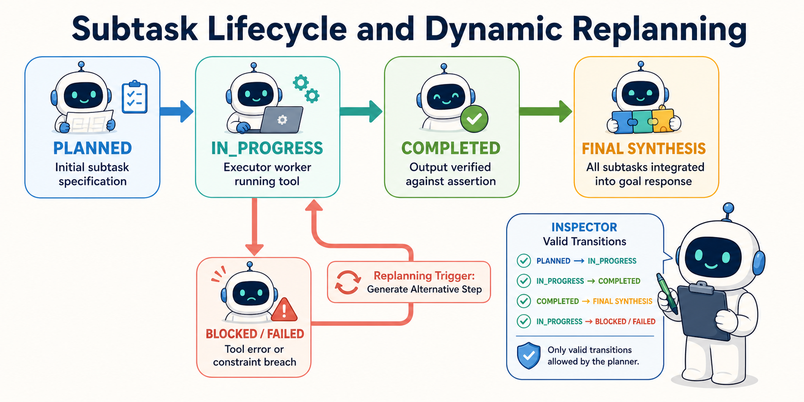

<!--
---
title: Decomposition and plan-execute
unit_id: P1-03-03-02
summary: Explains multi-step goal decomposition, the two-tier Planner-Executor pattern,
  subtask lifecycle management, and dynamic replanning protocols.
prerequisites:
- Read [Reactive and reason-act patterns](01-reactive-and-reason-act-patterns.md).
learning_objectives:
- Decompose complex high-level goals into directed subtask graphs with explicit dependency
  ordering.
- Decouple strategic planning (Planner Model) from tool execution (Executor Model)
  in two-tier agent architectures.
- Track subtask lifecycles across PENDING, IN_PROGRESS, COMPLETED, and FAILED states.
- Implement replanning protocols that trigger plan adaptation when intermediate tool
  executions fail.
source_records:
- p1-03-03-02-wang-plan-and-solve-2023
- p1-03-03-02-microsoft-taskweaver-2024
- p1-03-03-02-langchain-plan-execute-2024
visual_assets:
- assets/images/03-building-blocks/03-planning-and-reasoning/02-decomposition-and-plan-execute/01-plan-and-execute-architecture.png
- assets/images/03-building-blocks/03-planning-and-reasoning/02-decomposition-and-plan-execute/02-subtask-state-transitions.png
example_paths:
- examples/03-building-blocks/03-planning-and-reasoning/02-decomposition-and-plan-execute/plan_executor.py
pass: architecture
learning_path: main
status: complete
last_reviewed: '2026-08-21'
---
-->

# Decomposition and plan-execute

## Why this matters

Suppose an agent receives this goal: "Audit the customer authentication service, patch any open vulnerabilities, and write a release note." The agent must keep several dependent tasks on track. If one model chooses and performs each action turn by turn, intermediate tool results can pull it away from the larger goal. It may also skip an important check.

The **plan-and-execute** pattern separates planning from execution (Wang et al., 2023; Qiao et al., 2024; LangChain, 2024). A **planner** turns the overall goal into explicit subtasks. An **executor** performs one ready subtask at a time. The runtime records progress and asks the planner for a revised plan when a result does not match expectations.

## Simple mental model

Think of a commercial construction project:

1. **General contractor, the planner:** creates an ordered set of milestones: excavate the foundation, pour concrete, frame the walls, and install the roof.
2. **Job-site task board, the execution plan:** shows which milestones are `COMPLETED`, `IN_PROGRESS`, or `PENDING`.
3. **Specialist, the executor:** works on the current milestone without redesigning the whole project.
4. **Inspection and change order, replanning:** if excavation reveals a water pipe, the contractor pauses work and changes the remaining milestones.

Separating global blueprint creation from trade execution keeps workers focused while ensuring the overall project stays aligned with its original scope.

## Position in the agent workflow

The figure below illustrates the two-tier Planner-Executor agent architecture and its dynamic replanning feedback loop.


*Figure 1. Two-Tier Planner-Executor Agent Architecture. The Planner model generates an ordered list of subtasks displayed on a central task board. The Executor model runs individual subtasks in a sandbox, returning execution telemetry or triggering a replan on unexpected errors.*

The planner, task board, executor, and runtime have different jobs. The planner decides what work should happen. The runtime decides what work may happen, dispatches it, checks results, and stores state. The executor receives only the information and tools needed for the current subtask. This separation helps an agent stay aligned with a long-running goal.

## How it works

The Plan-and-Execute workflow operates across four interconnected stages:

### 1. Goal decomposition into structured subtasks

When given a goal, the planner produces a structured plan instead of making an immediate tool call (Wang et al., 2023). A plan can be a list for sequential work or a **directed acyclic graph (DAG)** when some subtasks depend on others. A DAG is a set of one-way dependency links with no circular path. Each subtask should include:

- **`step_id`**: Integer indexing the execution order.
- **`description`**: Clear, actionable objective for the individual step.
- **`tool_required`**: Target tool or environment capability needed.
- **`expected_output`**: Assertion criteria defining step success.
- **`dependencies`**: Prerequisites that must complete before this step can execute.

### 2. The subtask lifecycle state machine

Each subtask moves through a small set of explicit states (Qiao et al., 2024):

- **`PENDING`**: Subtask is queued and waiting for upstream dependencies to resolve.
- **`IN_PROGRESS`**: The Executor worker is actively invoking tools and processing observations.
- **`COMPLETED`**: The step produced valid output matching expected criteria, and results are recorded in the plan state.
- **`FAILED / BLOCKED`**: A tool error, timeout, or policy violation prevented step completion.



*Figure 2. A normal subtask moves from planned work to execution, verification, and final synthesis. A failed or blocked execution follows the coral branch. The runtime then asks the planner for an alternative step before execution resumes.*

### 3. Execution and state accumulation

The executor runs a focused loop over ready steps. It receives only:

1. The active subtask specification.
2. Necessary output variables extracted from previously completed steps.
3. The specific tool signatures needed for the active step.

This smaller working context can reduce token use and irrelevant context. It does not guarantee correct execution, so the runtime must still validate inputs, permissions, and outputs.

### 4. Dynamic replanning triggers

When a step transitions to `FAILED` or when an observation reveals new requirements, the runtime invokes the Planner with:
- The original goal.
- The list of completed steps and their extracted results.
- The failed step description and the specific error observation.

The planner then returns an updated plan. It may add a recovery step, change a dependency, or remove work that is no longer useful before execution resumes (LangChain, 2024).

## Main variants

1. **Static linear plan:** creates every step before execution and runs them in order. This works best when the environment is predictable.
2. **Dynamic plan:** re-evaluates the remaining work after each completed step. This adapts more quickly but costs more time and model calls.
3. **Dependency graph:** represents work as a DAG. Independent branches can run concurrently after their dependencies complete.

## Minimal implementation

The following Python excerpt shows the core planner-executor separation and subtask status tracking. The [full runnable example](../../../examples/03-building-blocks/03-planning-and-reasoning/02-decomposition-and-plan-execute/plan_executor.py) adds a bounded replanning path and deliberately fails one mock tool so you can inspect the transition.

<details>
<summary>Expand minimal Python implementation</summary>

```python
from dataclasses import dataclass, field
from enum import Enum, auto
from typing import Any, Callable, Dict, List, Optional

class StepStatus(Enum):
    PENDING = auto()
    IN_PROGRESS = auto()
    COMPLETED = auto()
    FAILED = auto()

@dataclass
class Subtask:
    step_id: int
    description: str
    tool_name: str
    tool_args: Dict[str, Any]
    status: StepStatus = StepStatus.PENDING
    result: Optional[str] = None

@dataclass
class ExecutionPlan:
    goal: str
    subtasks: List[Subtask] = field(default_factory=list)

class PlanExecutor:
    def __init__(self, tools: Dict[str, Callable[[dict], str]]):
        self.tools = tools

    def execute_plan(self, plan: ExecutionPlan) -> str:
        for step in plan.subtasks:
            step.status = StepStatus.IN_PROGRESS
            tool_fn = self.tools.get(step.tool_name)
            if not tool_fn:
                step.status = StepStatus.FAILED
                return f"Plan failed at step {step.step_id}: Tool '{step.tool_name}' missing."

            output = tool_fn(step.tool_args)
            step.status = StepStatus.COMPLETED
            step.result = output

        return f"Successfully completed {len(plan.subtasks)} steps for goal: '{plan.goal}'."
```

</details>

Run [plan_executor.py](../../../examples/03-building-blocks/03-planning-and-reasoning/02-decomposition-and-plan-execute/plan_executor.py) to see the initial plan, the failed step, its replacement, and the completed plan. All advisory names and tool results in the example are fictional.

## Data flow and state changes

1. **Plan generation:** the planner receives the goal and returns structured `Subtask` objects.
2. **Dispatch:** the runtime selects a `PENDING` subtask whose dependencies are complete.
3. **Execution:** the executor calls the allowed tool and captures its result.
4. **Validation:** the runtime compares that result with the step's expected output.
5. **State update:** verified facts are added to plan state for later steps.
6. **Termination:** when every required subtask is complete, the system creates the final response.

## Trust boundaries

- **Planner to executor:** the runtime must validate the generated plan before dispatch. A plan is model output, not trusted authorization.
- **Between steps:** content returned by a tool, such as text from a web page, remains untrusted when another step consumes it.
- **Replanning loop:** the runtime needs a fixed attempt or cost limit so repeated failures cannot create an endless loop.

## Reliability failures

- **Plan bloat:** the planner turns a simple lookup into many tiny steps, adding latency and model cost.
- **Unclear step contracts:** a subtask omits inputs or success criteria, so the executor must guess.
- **Replanning churn:** repeated failures make the planner alternate between incompatible plans without progress.

## Limitations and trade-offs

- **Slower first action:** creating a plan delays the first tool call compared with a reactive loop.
- **Stale plans:** a static plan can become outdated while the environment changes.
- **More orchestration:** dependencies, data passed between steps, validation, and recovery add runtime complexity.

## Security preview

In Pass 2, plan-and-execute architectures are evaluated against **Plan Injection and Subtask Tampering**. Attackers craft inputs designed to manipulate the Planner into inserting unauthorized subtasks (such as exfiltrating intermediate tokens or disabling audit logs). We analyze plan schema validation, invariant assertions, and human-in-the-loop approval gates for high-risk plan transitions in [Instructions, context, and model security](../../07-security-by-component-and-workflow-stage/01-instructions-context-and-models/chapter-plan.md).

## Open research questions

- How can agents learn optimal decomposition granularity dynamically based on past task success rates and execution cost metrics?
- What formal verification methods can prove that an assembled plan graph satisfies all system safety policies before execution begins?

## Key takeaways

- Plan-and-Execute decouples high-level strategic decomposition (Planner) from tactical step execution (Executor).
- Subtasks transition through structured states (`PENDING`, `IN_PROGRESS`, `COMPLETED`, `FAILED`), making agent workflows transparent and auditable.
- Executors run with minimal context per step, reducing token overhead and preventing reasoning drift.
- Replanning protocols allow agents to adapt dynamically to intermediate tool failures without losing global objective alignment.

## References

- Wang, L., Xu, W., Lan, Y., Hu, Z., Lan, Y., Lee, R. K., & Lim, E. *Plan-and-Solve Prompting: Improving Zero-Shot Chain-of-Thought Reasoning by Large Language Models*. Annual Meeting of the Association for Computational Linguistics (ACL), 2023. [ACL Anthology](https://aclanthology.org/2023.acl-long.147/).
- Qiao, B., Li, L., Zhang, X., He, S., Zhang, K., Zhang, C., Rajmohan, S., Lin, Q., & Zhang, D. *TaskWeaver: A Code-First Agent Framework for Seamless Data Analytics*. Microsoft Research, 2024. [arXiv:2311.17541](https://arxiv.org/abs/2311.17541).
- LangChain Community. *Plan-and-Execute Agent Architectures and State Graphs*. LangGraph Documentation, 2024. [LangGraph Workflows](https://docs.langchain.com/oss/python/langgraph/workflows-agents).

---

[Next Unit: Reflection, evaluation, and replanning →](chapter-plan.md)
