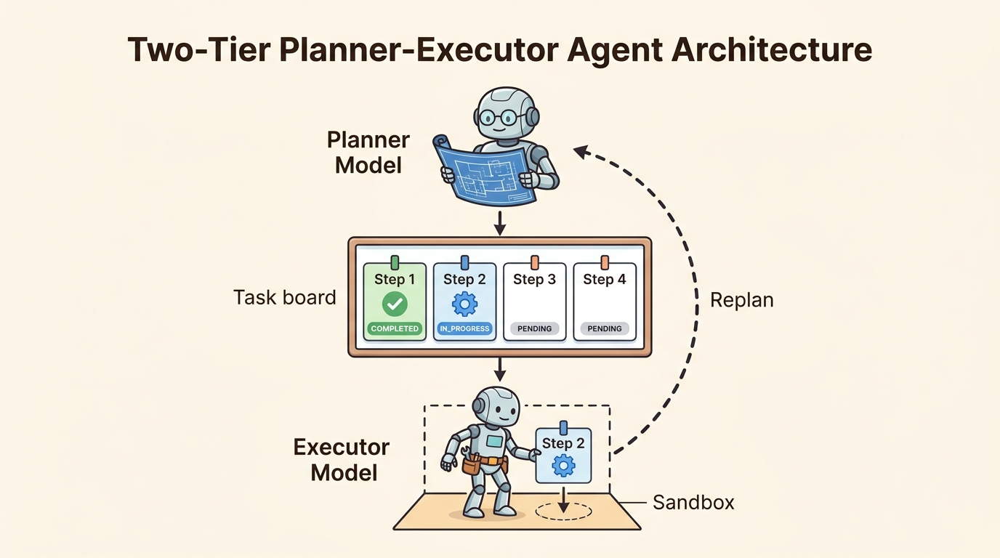

<!--
---
title: Decomposition and plan-execute
unit_id: P1-03-03-02
summary: Explains multi-step goal decomposition, the two-tier Planner-Executor pattern, subtask lifecycle management, and dynamic replanning protocols.
prerequisites:
- Read [Reactive and reason-act patterns](01-reactive-and-reason-act-patterns.md).
learning_objectives:
- Decompose complex high-level goals into directed subtask graphs with explicit dependency ordering.
- Decouple strategic planning (Planner Model) from tool execution (Executor Model) in two-tier agent architectures.
- Track subtask lifecycles across PENDING, IN_PROGRESS, COMPLETED, and FAILED states.
- Implement replanning protocols that trigger plan adaptation when intermediate tool executions fail.
source_records:
- p1-03-03-02-wang-plan-and-solve-2023
- p1-03-03-02-microsoft-taskweaver-2024
- p1-03-03-02-langchain-plan-execute-2024
visual_assets:
- assets/images/03-building-blocks/03-planning-and-reasoning/02-decomposition-and-plan-execute/01-plan-and-execute-architecture.png
example_paths:
- examples/03-building-blocks/03-planning-and-reasoning/02-decomposition-and-plan-execute/plan_executor.py
pass: architecture
learning_path: main
status: complete
last_reviewed: '2026-08-19'
---
-->

# Decomposition and plan-execute

## Why this matters

When an autonomous agent receives an ambiguous or multifaceted objective (such as "Audit customer auth-service, patch any open vulnerabilities, and write a release note"), forcing a single model to interleave reasoning and execution in a greedy turn-by-turn loop often leads to focus drift. Step-by-step loops like ReAct can get distracted by intermediate tool outputs, forget the broader mission, or skip vital verification phases.

The **Plan-and-Execute** pattern addresses this problem by separating strategic goal decomposition from tactical task execution (Wang et al., 2023; Qiao et al., 2024; LangChain, 2024). A high-capability Planner model breaks down the global goal into a structured sequence of discrete subtasks. A dedicated Executor worker then executes each subtask sequentially, maintaining a clean task board and triggering replanning only when execution results diverge from expected outcomes.

## Simple mental model

Think of a commercial construction project:

1. **The General Contractor (Planner)**: Drafts a structural blueprint with sequential milestones: 1. Excavate foundation, 2. Pour concrete, 3. Frame walls, 4. Install roof.
2. **The Job Site Task Board (Execution Plan)**: Tracks active status badges: Milestone 1 (`COMPLETED`), Milestone 2 (`IN_PROGRESS`), Milestones 3 & 4 (`PENDING`).
3. **The Specialized Tradesperson (Executor)**: Focuses exclusively on pouring concrete without needing to re-evaluate the entire architectural blueprint at every step.
4. **Site Inspection & Change Order (Replanning)**: If an underground water pipe is discovered during excavation, the general contractor pauses work, modifies the remaining milestones, and issues an updated construction schedule.

Separating global blueprint creation from trade execution keeps workers focused while ensuring the overall project stays aligned with its original scope.

## Position in the agent workflow

The figure below illustrates the two-tier Planner-Executor agent architecture and its dynamic replanning feedback loop.



*Figure 1. Two-Tier Planner-Executor Agent Architecture. The Planner model generates an ordered list of subtasks displayed on a central task board. The Executor model runs individual subtasks in a sandbox, returning execution telemetry or triggering a replan on unexpected errors.*

Building upon [Reactive and reason-act patterns](01-reactive-and-reason-act-patterns.md), decomposition allows agents to maintain long-range coherence across extended multi-hour workflows.

## How it works

The Plan-and-Execute workflow operates across four interconnected stages:

### 1. Goal decomposition into structured subtasks

When given a prompt, the Planner produces a structured JSON or YAML execution graph rather than immediate tool calls (Wang et al., 2023):
- **`step_id`**: Integer indexing the execution order.
- **`description`**: Clear, actionable objective for the individual step.
- **`tool_required`**: Target tool or environment capability needed.
- **`expected_output`**: Assertion criteria defining step success.
- **`dependencies`**: Prerequisites that must complete before this step can execute.

### 2. The subtask lifecycle state machine

Each subtask in the plan transitions through a deterministic state machine (Qiao et al., 2024):
- **`PENDING`**: Subtask is queued and waiting for upstream dependencies to resolve.
- **`IN_PROGRESS`**: The Executor worker is actively invoking tools and processing observations.
- **`COMPLETED`**: The step produced valid output matching expected criteria, and results are recorded in the plan state.
- **`FAILED / BLOCKED`**: A tool error, timeout, or policy violation prevented step completion.

### 3. Execution and state accumulation

The Executor runs in a focused loop over pending steps. Unlike full ReAct agents that hold entire multi-turn reasoning logs in context, the Executor receives only:
1. The active subtask specification.
2. Necessary output variables extracted from previously completed steps.
3. The specific tool signatures needed for the active step.

This partitioning drastically reduces token consumption and eliminates distracting context noise.

### 4. Dynamic replanning triggers

When a step transitions to `FAILED` or when an observation reveals new requirements, the runtime invokes the Planner with:
- The original goal.
- The list of completed steps and their extracted results.
- The failed step description and the specific error observation.

The Planner then synthesizes an updated subtask list, inserting remediation steps or skipping redundant operations before resuming execution (LangChain, 2024).

## Main variants

1. **Static Linear Plan-and-Execute**: Generates all steps upfront and executes them strictly in order without dynamic replanning. Suitable for deterministic, low-entropy pipelines.
2. **Dynamic Re-Evaluating Plan-and-Solve**: The Planner re-evaluates the remaining plan after *every* step completion, adjusting future subtasks based on newly acquired data.
3. **Hierarchical DAG Planner**: Generates a Directed Acyclic Graph (DAG) of subtasks, allowing independent branches to be dispatched concurrently to parallel worker instances.

## Minimal implementation

The following Python script implements a two-tier Planner-Executor agent with subtask status tracking and dynamic replanning on tool failures:

<details>
<summary>Expand minimal Python implementation</summary>

```python
from dataclasses import dataclass, field
from enum import Enum, auto
from typing import Any, Callable, Dict, List, Optional

class StepStatus(Enum):
    PENDING = auto()
    IN_PROGRESS = auto()
    COMPLETED = auto()
    FAILED = auto()

@dataclass
class Subtask:
    step_id: int
    description: str
    tool_name: str
    tool_args: Dict[str, Any]
    status: StepStatus = StepStatus.PENDING
    result: Optional[str] = None

@dataclass
class ExecutionPlan:
    goal: str
    subtasks: List[Subtask] = field(default_factory=list)

class PlanExecutor:
    def __init__(self, tools: Dict[str, Callable[[dict], str]]):
        self.tools = tools

    def execute_plan(self, plan: ExecutionPlan) -> str:
        for step in plan.subtasks:
            step.status = StepStatus.IN_PROGRESS
            tool_fn = self.tools.get(step.tool_name)
            if not tool_fn:
                step.status = StepStatus.FAILED
                return f"Plan failed at step {step.step_id}: Tool '{step.tool_name}' missing."

            output = tool_fn(step.tool_args)
            step.status = StepStatus.COMPLETED
            step.result = output

        return f"Successfully completed {len(plan.subtasks)} steps for goal: '{plan.goal}'."
```

</details>

The full runnable implementation is available in [plan_executor.py](../../../examples/03-building-blocks/03-planning-and-reasoning/02-decomposition-and-plan-execute/plan_executor.py).

## Data flow and state changes

1. **Plan Generation**: The Planner receives the user request and outputs a structured list of `Subtask` objects.
2. **Dispatch**: The execution engine selects the next `PENDING` subtask whose dependencies are satisfied.
3. **Execution**: The Executor invokes the required tool and captures the return payload.
4. **Validation**: Output is checked against expected criteria; the subtask status updates to `COMPLETED`.
5. **State Update**: Output facts are merged into the shared plan context for downstream steps.
6. **Termination**: When all subtasks reach `COMPLETED`, the agent synthesizes the final response.

## Trust boundaries

- **Planner-to-Executor Trust Boundary**: The plan structure generated by the Planner must be validated by the runtime control plane to prevent untrusted prompt injections from introducing unauthorized administrative subtasks.
- **Inter-Step Data Propagation Boundary**: Outputs from untrusted tool steps (such as scraped web pages) must be sanitized and isolated before being passed as input arguments to downstream steps.
- **Replan Rate Limiting**: The runtime must enforce a hard ceiling on total replan attempts per session to prevent adversarial tool responses from triggering infinite replanning loops.

## Reliability failures

- **Over-Decomposition (Plan Bloat)**: The Planner divides a simple two-second lookup into ten granular micro-steps, incurring unnecessary latency and token costs.
- **Under-Specified Step Contracts**: Subtasks lack explicit parameter specifications, forcing the Executor to guess arguments and causing runtime tool validation errors.
- **Replanning Churn**: The agent enters an oscillation cycle where it alternates between two conflicting plan formulations on successive step failures.

## Limitations and trade-offs

- **Higher Initial Time-to-First-Action**: The agent must generate a complete multi-step plan before invoking its first tool, increasing initial latency compared to reactive loops.
- **Plan Fragility in Dynamic Environments**: In environments where system state changes rapidly, static upfront plans become outdated before later steps can execute.
- **Coordination Complexity**: Managing dependency graphs, variable binding between steps, and failure rollbacks requires significantly more orchestration logic than single-loop agents.

## Security preview

In Pass 2, plan-and-execute architectures are evaluated against **Plan Injection and Subtask Tampering**. Attackers craft inputs designed to manipulate the Planner into inserting unauthorized subtasks (such as exfiltrating intermediate tokens or disabling audit logs). We analyze plan schema validation, invariant assertions, and human-in-the-loop approval gates for high-risk plan transitions in [Instructions, context, and model security](../../07-security-by-component-and-workflow-stage/01-instructions-context-and-models/chapter-plan.md).

## Open research questions

- How can agents learn optimal decomposition granularity dynamically based on past task success rates and execution cost metrics?
- What formal verification methods can prove that an assembled plan graph satisfies all system safety policies before execution begins?

## Key takeaways

- Plan-and-Execute decouples high-level strategic decomposition (Planner) from tactical step execution (Executor).
- Subtasks transition through structured states (`PENDING`, `IN_PROGRESS`, `COMPLETED`, `FAILED`), making agent workflows transparent and auditable.
- Executors run with minimal context per step, reducing token overhead and preventing reasoning drift.
- Replanning protocols allow agents to adapt dynamically to intermediate tool failures without losing global objective alignment.

## References

- Wang, L., Xu, W., Lan, Y., Hu, Z., Lan, Y., Lee, R. K., & Lim, E. *Plan-and-Solve Prompting: Improving Zero-Shot Chain-of-Thought Reasoning by Large Language Models*. Annual Meeting of the Association for Computational Linguistics (ACL), 2023. [ACL Anthology](https://aclanthology.org/2023.acl-long.147/).
- Qiao, B., Li, L., Zhang, X., He, S., Zhang, K., Zhang, C., Rajmohan, S., Lin, Q., & Zhang, D. *TaskWeaver: A Code-First Agent Framework for Seamless Data Analytics*. Microsoft Research, 2024. [arXiv:2311.17541](https://arxiv.org/abs/2311.17541).
- LangChain Community. *Plan-and-Execute Agent Architectures and State Graphs*. LangGraph Documentation, 2024. [LangGraph Workflows](https://docs.langchain.com/oss/python/langgraph/workflows-agents).

---

[Next Unit: Reflection, evaluation, and replanning →](chapter-plan.md)
