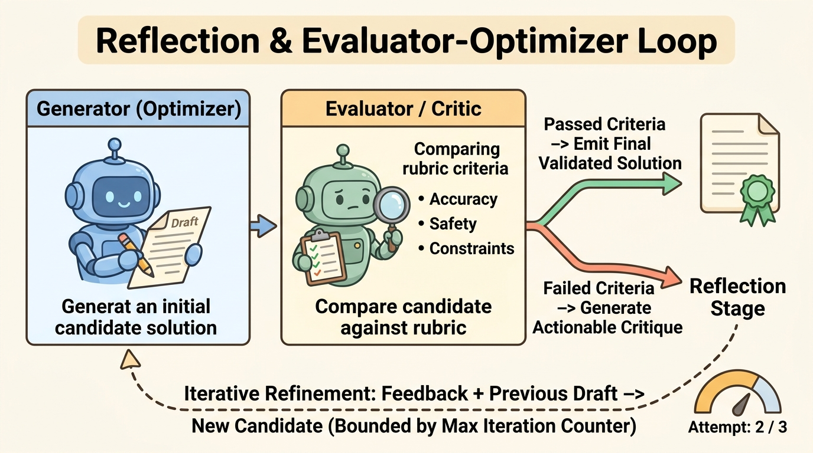
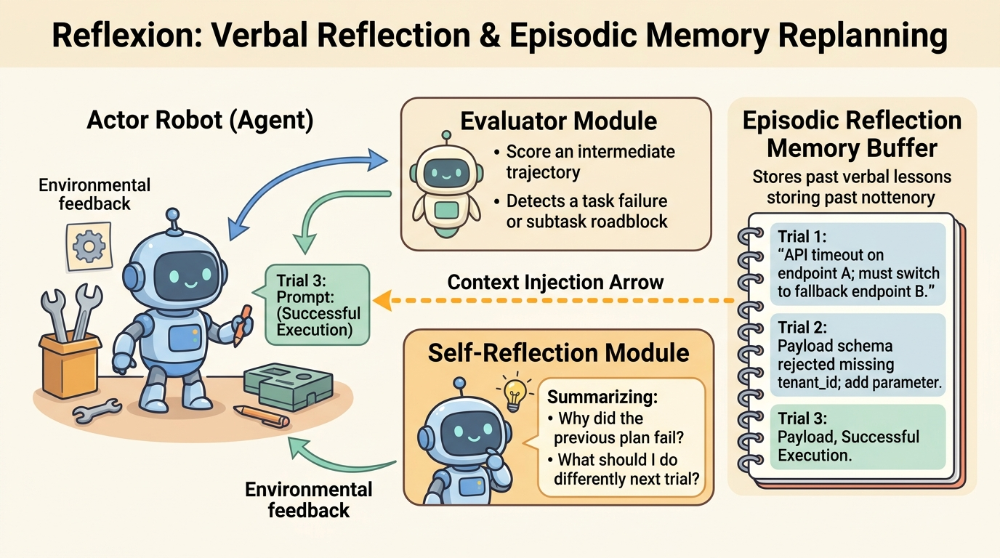

<!--
---
title: Reflection, evaluation, and replanning
unit_id: P1-03-03-03
summary: Explains iterative reflection, the Evaluator-Optimizer architecture, episodic
  verbal reflection memory, and dynamic replanning protocols in autonomous agents.
prerequisites:
- Read [Decomposition and plan-execute](02-decomposition-and-plan-execute.md).
learning_objectives:
- Differentiate between feed-forward execution, self-critique loops, and memory-backed
  verbal reflection.
- Implement the Evaluator-Optimizer pattern with explicit verification rubrics and
  stopping criteria.
- Maintain an episodic verbal memory buffer to prevent repeated mistakes across execution
  trials.
- Trigger dynamic replanning when intermediate subtask verification fails or environmental
  state diverges from expectations.
source_records:
- p1-03-03-03-madaan-self-refine-2023
- p1-03-03-03-shinn-reflexion-2023
- p1-03-03-03-anthropic-evaluator-optimizer-2024
- p1-03-03-03-langchain-reflection-patterns-2024
visual_assets:
- assets/images/03-building-blocks/03-planning-and-reasoning/03-reflection-evaluation-and-replanning/01-reflection-and-evaluator-optimizer-loop.png
- assets/images/03-building-blocks/03-planning-and-reasoning/03-reflection-evaluation-and-replanning/02-reflexion-episodic-memory-replanning.png
example_paths:
- examples/03-building-blocks/03-planning-and-reasoning/03-reflection-evaluation-and-replanning/reflexion_evaluator_optimizer.py
pass: architecture
learning_path: main
status: complete
last_reviewed: '2026-08-24'
---
-->

# Reflection, evaluation, and replanning

## Why this matters

When an autonomous agent generates code, solves a multi-step math problem, or invokes external APIs, its first attempt is often imperfect. In a purely feed-forward system, whatever the model outputs on its first pass is immediately executed or returned to the user. If that initial output contains a syntax error, a logic bug, or an unsafe database query, the entire run fails.

Human experts rarely publish their first draft without review. Instead, they inspect their work, identify mistakes, reflect on what went wrong, and revise the output. **Reflection and evaluation patterns** provide language agents with this same iterative refinement capability (Madaan et al., 2023; Shinn et al., 2023; Anthropic, 2024; LangChain, 2024). By coupling candidate generation with an explicit critique step and verbal reflection memory, agents can detect their own mistakes and adapt their plans before committing irreversible side effects.

## Simple mental model

Think of an author submitting a manuscript to a publishing house:

1. **The author (generator):** writes an initial draft chapter based on the project outline.
2. **The editor (evaluator):** reviews the draft against a clear editorial checklist, evaluating clarity, factual accuracy, and style guidelines.
3. **Editorial notes (reflection):** if the draft has issues, the editor provides specific, actionable feedback explaining why certain paragraphs failed and what rules to follow.
4. **The revision (optimizer):** the author reads the notes, updates their working notes, and produces a revised draft that corrects the identified problems.
5. **Approval or change order (replanning):** if a chapter concept is fundamentally flawed, the team steps back and revises the book outline before continuing.

Separating drafting from evaluation ensures that quality standards are enforced objectively before publication.

## Position in the agent workflow

The Reflection and Evaluator-Optimizer feedback architecture separates candidate drafting from validation gating. The Generator produces a candidate solution draft. The Evaluator checks the draft against verification rubrics. Passed solutions emit a validated artifact, while failed checks trigger actionable critique notes that feed back into the next refinement iteration under a strict loop counter.



*Figure 1. Reflection and Evaluator-Optimizer Loop. The Generator produces candidate solutions, which an independent Evaluator evaluates against objective rubrics. Passed candidates finalize the output, while failed candidates trigger actionable critiques for bounded iterative refinement.*

Reflection sits between initial action generation and final state commitment. In a single-turn agent, reflection refines text or code output before delivery. In a multi-step agent, reflection operates at subtask boundaries, inspecting intermediate tool outputs to determine whether the agent should continue along the planned path or trigger dynamic replanning.

## How it works

Iterative reflection and replanning operate through four coordinated phases:

### 1. Candidate solution generation

The generator (or actor) receives the user task along with any previous failure reflections stored in working memory. It synthesizes an initial candidate artifact, such as a database query, code snippet, or subtask plan, alongside an explicit rationale explaining its approach (Madaan et al., 2023).

### 2. Multi-criteria evaluation and critique

An evaluator assesses the candidate artifact against objective criteria. The evaluation can be performed by an independent model, a deterministic test harness (such as a linter, compiler, or unit test suite), or a hybrid of both (Anthropic, 2024). The evaluator scores the candidate across explicit dimensions:

- **Syntax and schema validity:** Does the output conform to required JSON schemas or programming syntax?
- **Correctness and functional tests:** Does the output solve the task without unintended errors?
- **Safety and policy compliance:** Does the output respect security invariants, access controls, and resource limits?

If all criteria are met, the evaluator marks the artifact as approved. If any check fails, the evaluator produces an actionable critique detailing the exact failure cause.

### 3. Verbal reflection and episodic memory

Rather than discarding failed attempts, the **Reflexion** architecture converts raw failure signals into natural language lessons (Shinn et al., 2023). A dedicated self-reflection prompt asks: *"What caused this attempt to fail, and what concrete rule should guide the next attempt?"*



*Figure 2. Reflexion: Verbal Reflection and Episodic Memory Replanning. When tool execution in the environment fails or roadblocks occur, a Self-Reflection module formulates a verbal lesson stored in an Episodic Working Memory buffer. On subsequent trials, accumulated reflections are injected into the Actor prompt to guide successful execution.*

The Actor interacts with tools in an execution sandbox. When the Evaluator detects a failure, the Self-Reflection module formulates a verbal lesson stored in an Episodic Working Memory buffer. On the next trial, these accumulated lessons are prepended to the Actor prompt to guide successful execution.

These verbal reflections are stored in an episodic working memory buffer. When the agent begins its next refinement iteration or subtask trial, these reflections are prepended to its prompt context. This verbal reinforcement prevents the model from repeating identical mistakes across successive attempts.

### 4. Dynamic replanning triggers

When an intermediate tool call fails or environmental feedback diverges significantly from the planned state, local refinement may be insufficient. In such cases, the runtime triggers a **replan protocol** (LangChain, 2024). The planner receives the original goal, the completed subtasks, the failed step error trace, and the reflected diagnostic lesson. The planner then adapts the remaining plan graph by inserting fallback subtasks, reordering dependencies, or switching to alternative tools.

## Main variants

1. **Self-Refine:** A single model generates an output, evaluates its own output against a prompt rubric, and rewrites the output iteratively (Madaan et al., 2023). This pattern is simple to implement but vulnerable to model self-bias.
2. **Reflexion:** An actor-critic architecture where external environment feedback (such as unit test failures or tool error codes) triggers verbal self-reflection stored in episodic working memory across distinct trials (Shinn et al., 2023).
3. **Dual-Model Evaluator-Optimizer:** Decouples the generator model from an independent evaluator model or deterministic test harness (Anthropic, 2024). The evaluator enforces strict criteria without sharing the generator context biases.
4. **Graph-State Replanner:** Integrates reflection into state graph workflows, dynamically altering node transitions and subtask execution paths when runtime validation gates fail (LangChain, 2024).

## Minimal implementation

The following Python snippet demonstrates the core Evaluator-Optimizer pattern with verbal reflection memory and bounded iteration limits. The [full runnable example](../../../examples/03-building-blocks/03-planning-and-reasoning/03-reflection-evaluation-and-replanning/reflexion_evaluator_optimizer.py) simulates an agent generating and refining a parameterized database query across iterative evaluation checks.

<details>
<summary>Expand minimal Python implementation</summary>

```python
from dataclasses import dataclass, field
from enum import Enum, auto
from typing import List, Optional, Tuple

class EvaluationStatus(Enum):
    NEEDS_REFINEMENT = auto()
    APPROVED = auto()
    FAILED_MAX_ITERATIONS = auto()

@dataclass
class CandidateDraft:
    iteration: int
    content: str
    rationale: str

@dataclass
class EvaluationRubric:
    passed: bool
    critique: str

@dataclass
class ReflexionMemory:
    reflections: List[str] = field(default_factory=list)

    def add_reflection(self, iteration: int, critique: str, lesson: str) -> None:
        self.reflections.append(f"[Trial {iteration}] Critique: {critique} -> Rule: {lesson}")

class EvaluatorOptimizerAgent:
    def __init__(self, max_iterations: int = 3):
        self.max_iterations = max_iterations
        self.memory = ReflexionMemory()

    def generate_candidate(self, task: str, iteration: int) -> CandidateDraft:
        if iteration == 1:
            # Naive unparameterized query
            content = "SELECT * FROM users WHERE tenant_id = '{tenant_id}';"
            rationale = "Direct string interpolation."
        else:
            # Refined parameterized query adhering to reflection memory
            content = "SELECT id, username FROM users WHERE tenant_id = :tenant_id LIMIT 100;"
            rationale = "Parameterized query preventing injection with explicit columns."
        return CandidateDraft(iteration, content, rationale)

    def evaluate_candidate(self, draft: CandidateDraft) -> EvaluationRubric:
        if "{" in draft.content and ":" not in draft.content:
            return EvaluationRubric(False, "Raw string interpolation detected; use parameterized binding (:param).")
        return EvaluationRubric(True, "All validation assertions satisfied.")

    def reflect_on_failure(self, rubric: EvaluationRubric) -> str:
        return "Always enforce parameterized placeholders (:param) for database queries."

    def run(self, task: str) -> Tuple[EvaluationStatus, CandidateDraft]:
        for iteration in range(1, self.max_iterations + 1):
            draft = self.generate_candidate(task, iteration)
            rubric = self.evaluate_candidate(draft)
            if rubric.passed:
                return EvaluationStatus.APPROVED, draft
            lesson = self.reflect_on_failure(rubric)
            self.memory.add_reflection(iteration, rubric.critique, lesson)
        return EvaluationStatus.FAILED_MAX_ITERATIONS, draft
```

</details>

Run [reflexion_evaluator_optimizer.py](../../../examples/03-building-blocks/03-planning-and-reasoning/03-reflection-evaluation-and-replanning/reflexion_evaluator_optimizer.py) to inspect the complete execution trace, including candidate drafting, rubric critique, verbal memory accumulation, and final approval.

## Data flow and state changes

1. **Initial synthesis:** The generator consumes the user task and produces `CandidateDraft_1`.
2. **Evaluation:** The evaluator executes automated rubrics against `CandidateDraft_1`.
3. **Assessment gate:** If all checks pass, status transitions to `APPROVED` and the artifact is emitted.
4. **Reflective diagnosis:** If checks fail, the reflection module diagnoses the failure cause and writes a structured lesson into `ReflexionMemory`.
5. **Memory injection:** The updated reflection memory is prepended to the generator prompt context.
6. **Iterative optimization:** The generator produces `CandidateDraft_k+1` incorporating the lessons.
7. **Termination or replan:** If iterations exceed `max_iterations`, the runtime terminates or escalates to a full plan graph reorganization.

## Trust boundaries

The Generator boundary separates untrusted candidate drafts from the validation gate. Key hazards include evaluator sycophancy (addressed by objective test harnesses), infinite refinement churn (addressed by hard iteration counters), and feedback injection (addressed by input sanitization and isolated evaluator context).

- **Generator to evaluator boundary:** All generator outputs must be treated as untrusted candidates until validated. An agent must not execute unverified code or make persistent state changes during intermediate refinement steps.
- **Evaluator isolation:** The evaluator prompt context should be isolated from untrusted user content where possible to prevent prompt injection attacks from manipulating evaluation criteria.
- **Reflection memory sanitation:** Feedback strings stored in episodic memory must be sanitized to prevent malicious tool responses from poisoning future planning iterations.

## Reliability failures

- **Evaluator sycophancy and drift:** When the evaluator is an LLM without external grounding, it may agree with a flawed generator draft simply because the draft sounds confident or plausible.
- **Infinite refinement churn:** Without convergence metrics, the generator and evaluator can enter a loop where minor stylistic edits are traded back and forth without resolving fundamental logic errors.
- **Hallucinated self-reflections:** An ungrounded reflection step can diagnose the wrong failure cause, recording a misleading rule in memory that impairs subsequent trials.
- **Context window bloat:** Storing lengthy error traces and full historical drafts across multiple trials rapidly consumes context tokens and degrades model attention.

## Limitations and trade-offs

- **Increased latency and cost:** Each reflection turn multiplies token consumption and inference latency. A 3-turn Evaluator-Optimizer loop can take three to four times longer than a single direct call.
- **Diminishing returns:** Studies indicate that most accuracy gains occur in the first one to two refinement iterations; subsequent turns often yield marginal improvement while increasing the risk of over-editing.
- **Dependence on objective signals:** Reflection is highly effective when clear verification signals exist (such as compilers, linters, or schema validators), but less reliable for open-ended creative tasks where correctness is subjective.

## Security preview

In Pass 2, reflection and evaluation architectures are analyzed under **Evaluator Manipulation, Feedback Poisoning, and Sycophancy Exploitation**. Attackers craft adversarial inputs designed to trick LLM evaluators into approving malicious code or inject misleading diagnostic traces into episodic reflection memory. We examine deterministic validation sandboxes, isolated critic contexts, and immutable policy gates in [Instructions, context, and model security](../../07-security-by-component-and-workflow-stage/01-instructions-context-and-models/chapter-plan.md).

## Open research questions

- How can agents autonomously distinguish between tasks that benefit from multi-turn reflection versus those where zero-shot generation is already optimal?
- What mechanisms can reliably detect and halt evaluator drift when ground-truth test oracles are unavailable?

## Key takeaways

- Reflection and Evaluator-Optimizer patterns decouple candidate creation from quality verification, enabling autonomous error detection and correction.
- The Reflexion architecture converts concrete execution failures into natural language lessons stored in episodic working memory to guide future trials.
- Dynamic replanning adapts structured subtask graphs when environmental tool observations deviate from expected preconditions.
- Production reflection loops require strict iteration limits, token budgets, and objective evaluation oracles to prevent infinite loops and evaluator sycophancy.

## References

- Madaan, A., Tandon, N., Gupta, P., Hallinan, S., Gao, L., Wiegreffe, S., Alon, U., Dziri, N., Prabhumoye, S., Yang, Y., Gupta, S., Majumder, B. P., Hermann, K., Welleck, S., Yazdanbakhsh, A., & Clark, P. *Self-Refine: Iterative Refinement with Self-Feedback*. Advances in Neural Information Processing Systems (NeurIPS), 2023. [arXiv:2303.17651](https://arxiv.org/abs/2303.17651).
- Shinn, N., Cassano, F., Berman, E., Gopinath, A., Narasimhan, K., & Yao, S. *Reflexion: Language Agents with Verbal Reinforcement Learning*. Advances in Neural Information Processing Systems (NeurIPS), 2023. [arXiv:2303.11366](https://arxiv.org/abs/2303.11366).
- Anthropic. *Building Effective Agents: The Evaluator-Optimizer Workflow*. Anthropic Research, 2024. [Anthropic Research](https://www.anthropic.com/research/building-effective-agents).
- LangChain Community. *Reflection and Replanning in Agentic Workflows*. LangGraph Documentation, 2024. [LangGraph Workflows](https://docs.langchain.com/oss/python/langgraph/workflows-agents).

---

[Next Unit: Search, budgets, and termination →](chapter-plan.md)
