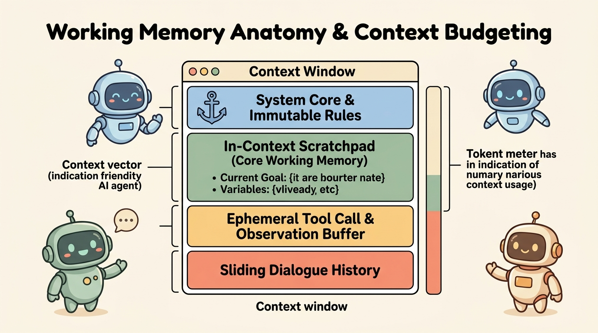
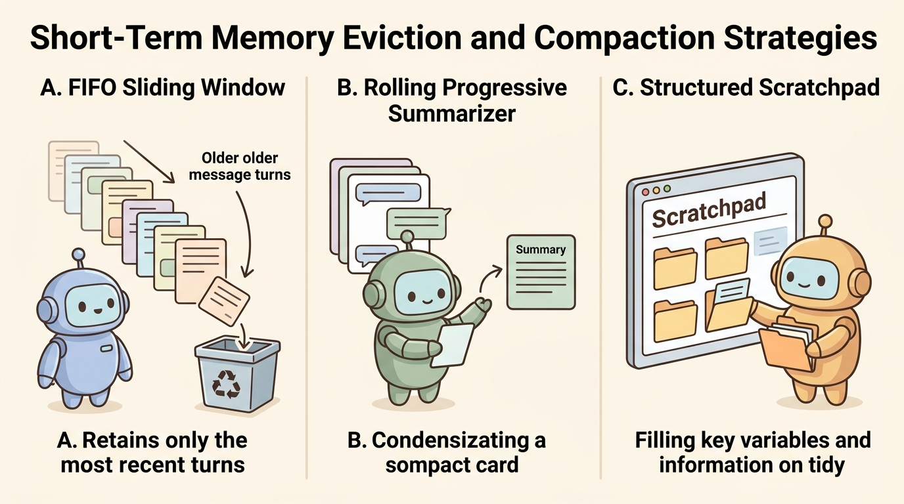
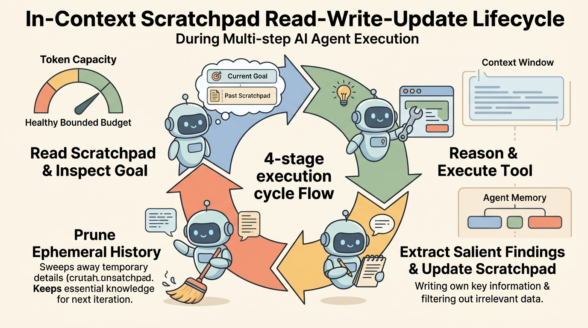

<!--
---
title: Short-term and working memory
unit_id: P1-03-05-02
summary: Explores short-term and working memory mechanisms in AI agents, including
  in-context scratchpads, conversation buffers, token budgeting, and eviction strategies.
prerequisites:
- Read [Memory versus context and state](01-memory-versus-context-and-state.md).
learning_objectives:
- Define the operational role of working memory and short-term conversation buffers
  during active agent execution.
- Implement structured in-context scratchpads to preserve active goals, intermediate
  variables, and subtask progress.
- Compare memory eviction and compaction strategies including sliding windows, progressive
  rolling summarization, and salience pruning.
- Manage token budgets across system instructions, working state, and ephemeral tool
  outputs without exceeding context window limits.
source_records:
- p1-03-05-02-packer-memgpt-2023
- p1-03-05-02-langchain-memory-buffers-2024
- p1-03-05-02-microsoft-autogen-context-2024
visual_assets:
- assets/images/03-building-blocks/05-memory/02-short-term-and-working-memory/01-working-memory-anatomy.png
- assets/images/03-building-blocks/05-memory/02-short-term-and-working-memory/02-eviction-and-compaction-strategies.png
- assets/images/03-building-blocks/05-memory/02-short-term-and-working-memory/03-dynamic-scratchpad-lifecycle.png
example_paths:
- examples/03-building-blocks/05-memory/02-short-term-and-working-memory/working_memory_runtime.py
pass: architecture
learning_path: main
status: complete
last_reviewed: '2026-08-31'
---
-->

# Short-term and working memory

## Why this matters

When an autonomous agent executes a multi-step workflow, such as debugging a test suite or conducting market research, it generates a stream of intermediate observations, user clarifications, and tool call results. If the agent dumps every raw message and tool payload into an unmanaged context window, two failure modes immediately emerge: rapid exhaustion of the model token budget and loss of reasoning focus due to context distraction.

In human cognition, working memory acts as the mental workbench that holds and manipulates the limited pieces of information necessary for immediate reasoning. In agentic AI systems, **working memory** is the structured, run-scoped portion of the context window dedicated to holding active goals, subtask progress, and intermediate variables (Packer et al., 2023; LangChain, 2024).

Without disciplined short-term and working memory management, an agent risks discarding critical user constraints when the conversation grows long, or hallucinating false assumptions when intermediate tool outputs overwhelm its attention. Mastering working memory design allows developers to build agents that maintain rock-solid task focus across dozens of execution steps while strictly bounding compute and token costs.

## Simple mental model

Think of a surgeon performing a complex procedure in an operating theater:

1. **The surgical whiteboard (the in-context scratchpad):** A prominent board listing the patient name, surgical objective, vital signs, completed incisions, and next anatomical target. It is continuously updated and never erased until the operation finishes.
2. **The instrument tray (ephemeral tool buffer):** A small tray holding only the instruments and sample vials needed for the current step. Once a biopsy specimen is logged on the whiteboard, the used tray is cleared to make room for suture needles.
3. **The ongoing scrub nurse dialogue (sliding dialogue buffer):** The recent spoken dialogue between the surgeon and assistants ("Clamp applied", "Suction active"). While the team remembers the overall surgical plan, earlier routine verbal exchanges from two hours ago are not repeated word for word.

If the surgical team filled the whiteboard with verbatim transcripts of every casual phrase uttered during the operation, they would quickly run out of room for critical vital signs.

## Position in the agent workflow

Working memory operates at the immediate interface between the planning loop, tool execution engine, and model context window. At every execution cycle, the agent reads its active scratchpad, inspects the latest user turn or tool observation, and formulates its next reasoning step.

Before invoking the foundation model, the context manager allocates token budgets across system instructions, structured scratchpad state, progressive summaries, and raw dialogue history. As tools return data, the memory manager extracts salient facts into the scratchpad and compacts or trims raw observation payloads before they can bloat future prompts.



*Figure 1. The context window is partitioned into deterministic token budgets: immutable system instructions, structured in-context working scratchpad, ephemeral tool observation slots, and sliding conversation history.*

## How it works

Managing short-term and working memory requires four foundational architectural mechanisms: context window budgeting, scratchpad state structuring, eviction and compaction strategies, and the dynamic update lifecycle.

### 1. Context window token budgeting

An agent context window is a finite resource. To prevent prompt overflow, production systems divide available context capacity ($C_{\text{total}}$) into dedicated, bounded compartments (Packer et al., 2023; Microsoft, 2024):

$$C_{\text{total}} = C_{\text{system}} + C_{\text{scratchpad}} + C_{\text{tools}} + C_{\text{dialogue}} + C_{\text{reserve}}$$

- **System budget ($C_{\text{system}}$):** Fixed token allocation reserved for the core agent persona, safety rules, output schemas, and tool definitions.
- **Working scratchpad budget ($C_{\text{scratchpad}}$):** Dedicated token space for active goals, subtask checklists, and extracted key-value state variables.
- **Ephemeral tool buffer ($C_{\text{tools}}$):** Temporary token capacity for the inputs and outputs of the most recent tool invocations.
- **Dialogue history budget ($C_{\text{dialogue}}$):** Elastic token window reserved for recent user and assistant interaction turns.
- **Completion reserve ($C_{\text{reserve}}$):** Reserved output capacity ensuring the model can generate a full, unclipped response.

### 2. The in-context working scratchpad

Unlike raw dialogue history, which is an unstructured log of conversational turns, the **working scratchpad** is an explicitly structured, model-readable data block placed high in the context window (Packer et al., 2023). It tracks:

- **Primary task goal:** The high-level objective requested by the user.
- **Active subtasks:** The remaining sequence of actionable steps.
- **Completed milestones:** A verifiable log of finished sub-goals to prevent duplicate execution.
- **Working variables:** Key entities, file paths, database identifiers, or intermediate calculation results required across multiple steps.

```text
=== ACTIVE WORKING SCRATCHPAD ===
Goal: Ingest and clean daily customer telemetry data
Active Subgoals: Deduplicate records, Upload to warehouse
Completed Subgoals: Download S3 payload, Schema validation
Working Variables:
  - records_ingested: 14500
  - s3_checksum: a8f9c1b
  - null_email_policy: warning
```

### 3. Eviction and compaction strategies

When conversation turns or tool outputs exceed the allocated dialogue budget ($C_{\text{dialogue}}$), the memory manager must apply one or more compaction strategies (LangChain, 2024):

1. **Fixed FIFO sliding window:** Retains only the most recent $K$ message turns, evicting older turns entirely. While simple and zero-cost, it risks dropping initial user constraints.
2. **Progressive rolling summarization:** Periodically takes batches of older conversation turns, synthesizes them into a dense natural language summary paragraph using a fast utility model, and prepends this summary to the active dialogue window (LangChain, 2024).
3. **Tool observation trimming and truncation:** Aggressively strips raw verbose payloads (such as 500 lines of JSON or raw HTML) once the salient variables have been committed to the scratchpad, replacing them with a lightweight acknowledgment token (Microsoft, 2024).



*Figure 2. A comparison of short-term memory management strategies: fixed FIFO sliding windows drop old turns, progressive summarization condenses old dialogue into a rolling brief, and structured scratchpads isolate key variables from raw logs.*

### 4. The dynamic scratchpad execution cycle

During multi-step execution, working memory undergoes a continuous four-stage state transition cycle:

1. **Inspect:** The agent inspects the working scratchpad to identify the next active subgoal and relevant variables.
2. **Execute:** The agent invokes external tools to gather information or enact changes in the environment.
3. **Extract and mutate:** The agent extracts new findings from raw tool observations and updates its working variables and subgoal checklists.
4. **Prune:** The memory manager cleans raw tool payloads and evicts out-of-budget dialogue turns, preparing a clean context window for the next reasoning cycle.



*Figure 3. The continuous working memory lifecycle. The runtime reads the scratchpad, executes tool actions, extracts salient variables, and immediately prunes ephemeral payloads to preserve token budget.*

## Main variants

1. **Explicit core-memory paging (MemGPT):** Treats working memory as an operating system main memory with dedicated functions (`core_memory_append`, `core_memory_replace`) that the model invokes autonomously to update its own scratchpad (Packer et al., 2023).
2. **Deterministic framework reducers (LangGraph):** Treats working memory as a typed dictionary state schema that is updated deterministically by graph node transition functions rather than relying on unstructured model edits.
3. **Transform-based message pipelines (AutoGen):** Implements context transforms that run before every model call, truncating tool messages and trimming dialogue length dynamically based on token counting (Microsoft, 2024).

## Minimal implementation

The following Python snippet demonstrates an in-context working scratchpad combined with a token-constrained dialogue manager and ephemeral tool observation pruning. The [full runnable example](../../../examples/03-building-blocks/05-memory/02-short-term-and-working-memory/working_memory_runtime.py) demonstrates multi-turn context assembly and rolling summarization.

<details>
<summary>Expand minimal Python implementation</summary>

```python
from dataclasses import dataclass, field
from datetime import datetime, timezone
from typing import Any, Dict, List, Optional

@dataclass
class WorkingScratchpad:
    task_goal: str
    active_subgoals: List[str] = field(default_factory=list)
    completed_subgoals: List[str] = field(default_factory=list)
    variables: Dict[str, Any] = field(default_factory=dict)

    def update_variable(self, key: str, value: Any) -> None:
        self.variables[key] = value

    def complete_subgoal(self, subgoal: str) -> None:
        if subgoal in self.active_subgoals:
            self.active_subgoals.remove(subgoal)
        if subgoal not in self.completed_subgoals:
            self.completed_subgoals.append(subgoal)

    def render(self) -> str:
        lines = [
            "=== ACTIVE WORKING SCRATCHPAD ===",
            f"Goal: {self.task_goal}",
            f"Active Subgoals: {', '.join(self.active_subgoals) or 'None'}",
            f"Completed Subgoals: {', '.join(self.completed_subgoals) or 'None'}",
            "Working Variables:",
        ]
        for k, v in self.variables.items():
            lines.append(f"  - {k}: {v}")
        return "\n".join(lines)

class ShortTermMemoryManager:
    def __init__(self, system_prompt: str, max_dialogue_tokens: int = 500) -> None:
        self.system_prompt = system_prompt
        self.max_dialogue_tokens = max_dialogue_tokens
        self.scratchpad: Optional[WorkingScratchpad] = None
        self.dialogue: List[Dict[str, Any]] = []

    def prune_tool_observations(self) -> None:
        for msg in self.dialogue:
            if msg.get("is_tool") and len(msg["content"]) > 80:
                msg["content"] = f"[Compacted: {msg['content'][:50]}...]"
```

</details>

Run [working_memory_runtime.py](../../../examples/03-building-blocks/05-memory/02-short-term-and-working-memory/working_memory_runtime.py) to inspect working scratchpad rendering, progressive rolling summarization, and observation pruning.

## Data flow and state changes

1. **User instruction arrival:** The user submits a multi-step task prompt to the agent runtime.
2. **Scratchpad initialization:** The agent populates the working scratchpad with the overall goal and initial subtasks.
3. **Step execution:** The agent issues tool calls; raw execution outputs land in the ephemeral tool buffer.
4. **Scratchpad mutation:** Key results (e.g., entity IDs, status codes) are committed to the scratchpad variables.
5. **Payload compaction:** The memory manager prunes raw tool outputs and checks dialogue token count against budget limits.
6. **Rolling summarization:** If dialogue history exceeds threshold, the oldest turns are condensed into the progressive summary block.
7. **Task conclusion:** When all subgoals are completed, the scratchpad state is archived or cleared.

## Trust boundaries

- **Untrusted tool output containment:** Ephemeral tool buffers often ingest untrusted third-party data (such as web search responses or external API payloads). The memory manager must ensure that raw tool output is treated strictly as data, preventing prompt injection attacks from overwriting system instructions.
- **Scratchpad integrity boundary:** Working variables should be validated against expected schemas before being referenced in sensitive downstream tool calls (such as file paths or database queries).
- **Session boundary isolation:** Working scratchpads are strictly run-scoped. Memory contents from one user session must never leak into concurrent or subsequent sessions without explicit persistence authorization.

## Reliability failures

- **Context amnesia via over-aggressive pruning:** If a sliding window or summarizer drops critical initial user constraints, the agent may revert to default behaviors or violate user preferences midway through a task.
- **Summary drift and hallucination:** Successive rounds of rolling summarization can introduce subtle factual drift, where repeated summarizations distort original figures or conditions.
- **Scratchpad desynchronization:** If an agent fails to update its completed subgoals checklist after a tool failure, it may become trapped in an infinite execution loop repeating the same action.

## Limitations and trade-offs

- **Token overhead of explicit scratchpads:** Maintaining a detailed scratchpad consumes a portion of the context budget on every single LLM call.
- **Summarization latency and cost:** Running secondary LLM passes to summarize older dialogue turns introduces latency and increases API costs.
- **Lossy vs. lossless retention:** Sliding windows and summarizers are lossy techniques that sacrifice fine-grained conversational nuances in exchange for token sustainability.

## Security preview

In Pass 2, short-term and working memory architectures are analyzed under **Prompt Injection and Working State Tampering**. Attackers craft adversarial tool outputs designed to trick the agent into writing malicious payloads directly into its working scratchpad, corrupting subsequent reasoning steps. We explore defenses including structured schema enforcement, output sanitization, and isolated parsing contexts in [Retrieval, memory, and data security](../../07-security-by-component-and-workflow-stage/02-retrieval-memory-and-data/chapter-plan.md).

## Open research questions

- How can agents autonomously decide the optimal boundary between lossless verbatim retention and semantic summarization during dynamic execution?
- Can attention-masking techniques allow foundation models to ignore compacted tool observations without requiring explicit string pruning?

## Key takeaways

- Working memory is the run-scoped, structured scratchpad in the context window that holds active goals, subtasks, and variables.
- Context window budgeting requires deterministic token boundaries across system rules, scratchpad state, tool buffers, and dialogue.
- Compaction techniques include sliding windows, rolling summarization, and raw tool observation pruning.
- Working memory operates on an inspect-execute-extract-prune lifecycle to prevent token exhaustion and reasoning distraction.

## References

- Packer, C., Fang, V., Patil, S. G., Lin, K., Wooders, S., & Gonzalez, J. E. (2023). *MemGPT: Towards LLMs as Operating Systems*. arXiv preprint arXiv:2310.08560. [MemGPT Paper](https://arxiv.org/abs/2310.08560).
- LangChain Community. (2024). *LangChain: Memory Types and Conversation Window Management*. LangChain Documentation. [LangChain Memory Concepts](https://python.langchain.com/v0.2/docs/concepts/#memory).
- Microsoft Research. (2024). *AutoGen: Managing Agent Context and Short-Term Conversation History*. AutoGen Documentation. [AutoGen Context Guide](https://microsoft.github.io/autogen/stable/user-guide/agentchat-user-guide/tutorial/index.html).

---

[Next Unit: Persistent memory types and lifecycle →](chapter-plan.md)
