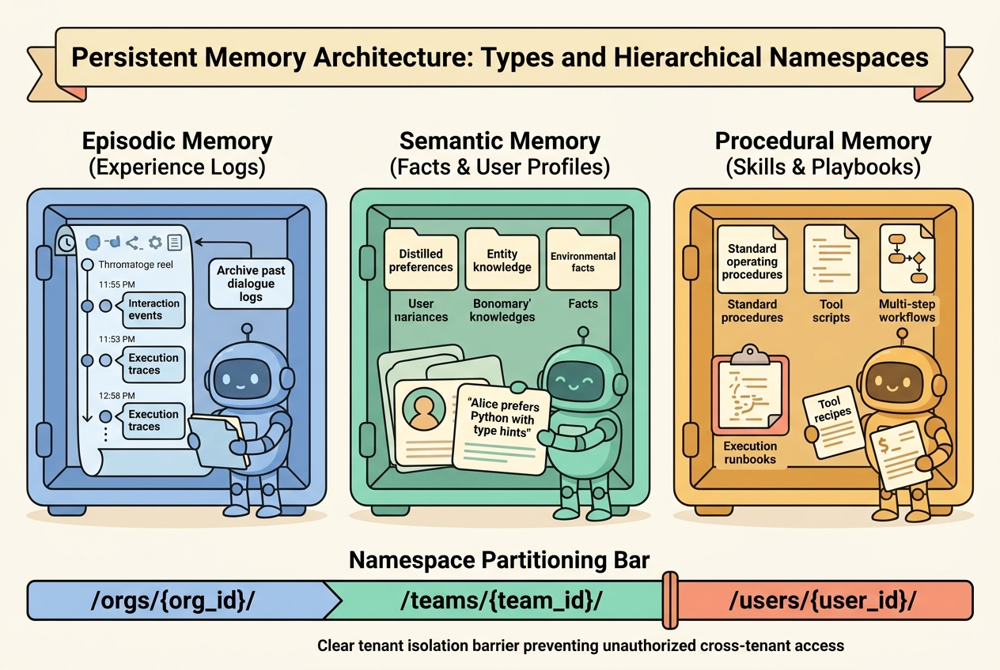
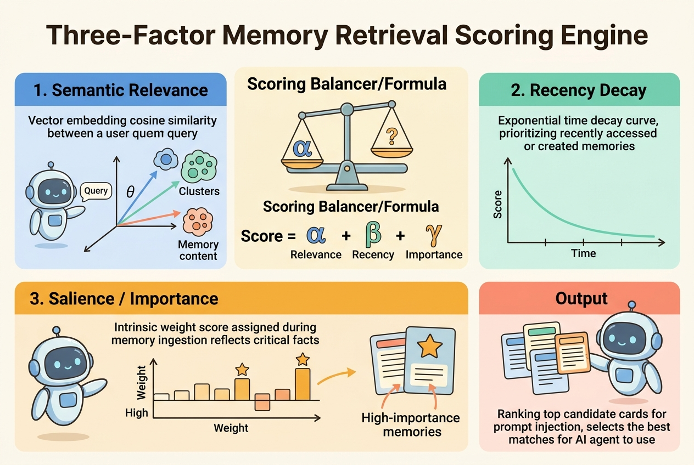
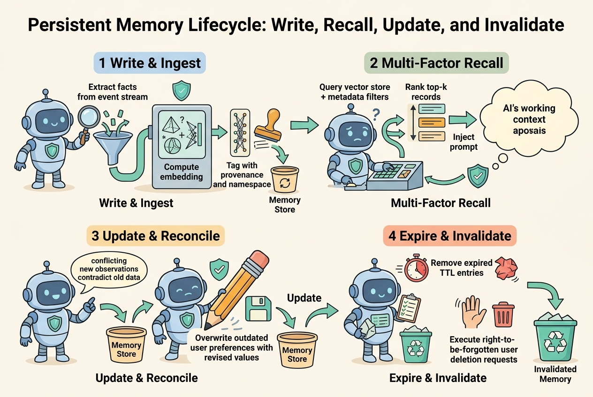

<!--
---
title: Persistent memory types and lifecycle
unit_id: P1-03-05-03
summary: Explores persistent agent memory architectures across episodic, semantic, and procedural tiers, including hierarchical namespacing, multi-factor retrieval, and record mutation.
prerequisites:
- Read [Short-term and working memory](02-short-term-and-working-memory.md).
learning_objectives:
- Classify persistent agent memory into episodic experience streams, semantic fact/profile stores, and procedural skill playbooks.
- Implement hierarchical namespacing to isolate memory records across organizations, teams, and individual users.
- Apply a three-factor retrieval ranking engine balancing semantic relevance, recency decay, and intrinsic salience.
- Manage the end-to-end persistent memory lifecycle across ingestion, indexed recall, state mutation, and right-to-be-forgotten deletion.
source_records:
- p1-03-05-03-park-generative-agents-2023
- p1-03-05-03-packer-memgpt-2023
- p1-03-05-03-langgraph-store-2024
visual_assets:
- assets/images/03-building-blocks/05-memory/03-persistent-memory-types-and-lifecycle/01-persistent-memory-taxonomy-and-namespaces.png
- assets/images/03-building-blocks/05-memory/03-persistent-memory-types-and-lifecycle/02-three-factor-retrieval-scoring.png
- assets/images/03-building-blocks/05-memory/03-persistent-memory-types-and-lifecycle/03-persistent-memory-crud-lifecycle.png
example_paths:
- examples/03-building-blocks/05-memory/03-persistent-memory-types-and-lifecycle/persistent_memory_runtime.py
pass: architecture
learning_path: main
status: complete
last_reviewed: '2026-08-31'
---
-->

# Persistent memory types and lifecycle

## Why this matters

When an AI agent assists human teams across days, weeks, or quarters, it must retain knowledge beyond the lifespan of any single session or thread. If an agent forgets a user established coding style, team architecture guidelines, or past debugging resolutions between conversations, users waste significant time re-establishing basic context.

Unlike short-term working memory, which is cleared when a run completes, **persistent memory** provides durable, cross-thread knowledge retention (Packer et al., 2023; Park et al., 2023). However, building a scalable persistent memory subsystem involves far more than simply appending conversation logs to an external database.

An unmanaged persistent store quickly degrades due to three fundamental challenges: semantic noise from thousands of low-value interaction logs, memory staleness when user preferences change, and privacy violations when sensitive data is retained without deletion governance. Understanding persistent memory taxonomy, multi-factor retrieval scoring, and mutation lifecycles enables developers to construct agents that maintain high-quality, long-term intelligence across sessions.

## Simple mental model

Think of a senior software consultant working with a long-term enterprise client:

1. **The consultant project log (episodic memory):** A dated journal recording past meetings, incident post-mortems, and milestone deployments ("On March 12th, migrated the auth service to OAuth2").
2. **The client profile dossier (semantic memory):** A distilled cheat sheet of permanent facts and preferences ("Client uses strict TypeScript", "Production deployments require two approvals").
3. **The consultant engineering playbook (procedural memory):** Standardized, repeatable scripts, checklists, and debugging procedures that the consultant applies to solve recurring technical problems.
4. **The secure filing cabinet (hierarchical namespacing):** Dedicated client drawers with strict locks. Notes from Client A are never placed in Client B drawer, and expired data is shredded upon request.

By maintaining separate logs, profile sheets, and playbooks, the consultant quickly recalls relevant insights without confusing different clients or digging through thousands of pages of raw meeting notes.

## Position in the agent workflow

Persistent memory operates externally to the active model context window and thread execution state. During an active run, the memory extractor detects salient facts, preferences, and action outcomes from the event stream, creating structured records in persistent storage.

When a user initiates a new thread or submits a complex query, the memory manager queries the persistent store using hierarchical namespace filters and multi-factor ranking. The top-ranked records are injected into the initial system context, allowing the agent to begin the task with full awareness of relevant history and user constraints.

## How it works

Architecting a durable memory subsystem requires four foundational components: cognitive memory taxonomy, hierarchical namespacing, three-factor retrieval ranking, and the CRUD (create, read, update, delete) lifecycle.

### 1. The three persistent memory tiers

Drawing upon cognitive science models of memory retention (Packer et al., 2023; Park et al., 2023), persistent storage is categorized into three functional tiers:

- **Episodic memory (autobiographical experience stream):** A time-ordered, immutable log of past events, tool invocations, and conversation turns. Each record retains exact creation timestamps, dialogue snippets, and execution outcomes.
- **Semantic memory (facts, concepts, and profiles):** Generalized, non-temporal knowledge extracted from past episodes. Examples include user preferences ("User prefers concise replies"), environment configurations ("API endpoint is api.acme.corp"), and domain concepts.
- **Procedural memory (skills and playbooks):** Reusable operational workflows, tool calling templates, and step-by-step algorithms that guide the agent in executing complex tasks reliably.

### 2. Hierarchical namespacing and metadata schema

To prevent cross-tenant data leaks and allow targeted recall, persistent records are partitioned using hierarchical path namespaces (LangChain, 2024):

```text
/orgs/{org_id}/teams/{team_id}/users/{user_id}/{memory_tier}
```

Every persistent record contains standardized governance metadata:

- **Memory ID:** Unique UUID for indexing, updates, and targeted deletion.
- **Namespace:** Hierarchical isolation path (e.g., `/users/alice/preferences`).
- **Memory Tier:** Enum classification (`episodic`, `semantic`, or `procedural`).
- **Content:** The text payload or structured JSON representation.
- **Salience Score ($S \in [0, 1]$):** Intrinsic importance score assigned during extraction.
- **Creation and Access Timestamps:** $t_c$ (creation) and $t_a$ (last access), used for decay calculation.
- **Access Count:** Integer tracking how frequently this memory has been recalled.
- **Provenance Reference:** Originating `thread_id` or `run_id` establishing evidence traceability.
- **Time-to-Live (TTL):** Optional expiration timestamp for temporary persistent items.



*Figure 1. Persistent memory architecture. Episodic event logs, semantic user profiles, and procedural playbooks are partitioned across tenant namespaces.*

### 3. Three-factor retrieval scoring engine

When querying persistent memory, vector similarity alone is insufficient because it ignores recency and intrinsic importance. A foundational scoring formula combines three distinct factors (Park et al., 2023):

$$\text{Score}(m, q) = \alpha \cdot \text{Relevance}(m, q) + \beta \cdot \text{Recency}(m) + \gamma \cdot \text{Salience}(m)$$

- **Semantic relevance ($\text{Relevance}(m, q)$):** Cosine similarity between the embedding vector of the search query $q$ and the memory text $m$.
- **Recency decay ($\text{Recency}(m)$):** An exponential decay function based on the elapsed time $\Delta t$ since the memory was last accessed:

$$\text{Recency}(m) = \lambda^{\Delta t}$$

where $\lambda \in (0, 1]$ represents the decay parameter and $\Delta t$ is measured in hours or days.
- **Intrinsic salience ($\text{Salience}(m)$):** An importance score $S \in [0, 1]$ evaluated by an extraction model during initial ingestion, ensuring critical instructions (such as "Never deploy on Friday") are not forgotten merely because they are old.



*Figure 2. Three-factor retrieval scoring engine. Vector similarity, exponential time decay, and intrinsic importance combine to select the most relevant memories.*

### 4. The persistent memory CRUD lifecycle

Persistent memory transitions through four key operational phases (Packer et al., 2023; LangChain, 2024):

1. **Ingest and Write:** The extraction engine parses completed conversation turns, extracts persistent facts, computes vector embeddings, and stores the record under the appropriate tenant namespace.
2. **Multi-factor Recall:** Incoming user prompts trigger a filtered vector and metadata search, ranking top candidate records for prompt context injection.
3. **Reconciliation and Update:** When a user expresses a revised preference ("I switched from PostgreSQL to ClickHouse"), the memory manager locates the existing record and updates its content and salience in-place.
4. **Invalidation and Deletion:** Expired TTL entries are pruned automatically, and user deletion requests purge records across all vector indexes and relational stores.



*Figure 3. Persistent memory lifecycle. Memory transitions through ingestion, indexed recall, state reconciliation, and expiration or deletion.*

## Main variants

1. **Autonomous archival storage (MemGPT):** Provides agents with explicit database querying tools (`archival_memory_search`, `archival_memory_insert`), allowing the model to perform autonomous retrieval and storage when in-context information is insufficient (Packer et al., 2023).
2. **Generative memory streams and reflection trees:** Maintains an append-only stream of natural language observations, using periodic background agents to generate synthetic reflections and store them as higher-level memory nodes (Park et al., 2023).
3. **Cross-thread key-value stores (LangGraph Store):** Provides structured persistence where memories are stored as JSON documents indexed by hierarchical namespaces and semantic embeddings (LangChain, 2024).

## Minimal implementation

The following Python snippet demonstrates a multi-tier persistent memory store with three-factor retrieval ranking, record updates, and right-to-be-forgotten deletion. The [full runnable example](../../../examples/03-building-blocks/05-memory/03-persistent-memory-types-and-lifecycle/persistent_memory_runtime.py) demonstrates namespace filtering and decay calculation.

<details>
<summary>Expand minimal Python implementation</summary>

```python
from dataclasses import dataclass, field
from datetime import datetime, timezone
from enum import Enum
import math
from typing import Dict, List, Optional, Tuple
import uuid

class MemoryTier(Enum):
    EPISODIC = "episodic"
    SEMANTIC = "semantic"
    PROCEDURAL = "procedural"

@dataclass
class MemoryRecord:
    id: str
    tier: MemoryTier
    namespace: str
    content: str
    salience: float
    created_at: datetime
    last_accessed: datetime

class PersistentMemoryStore:
    def __init__(self, decay_rate: float = 0.95) -> None:
        self.records: Dict[str, MemoryRecord] = {}
        self.decay_rate = decay_rate

    def write(self, tier: MemoryTier, namespace: str, content: str, salience: float) -> MemoryRecord:
        now = datetime.now(timezone.utc)
        rec = MemoryRecord(
            id=str(uuid.uuid4()), tier=tier, namespace=namespace,
            content=content, salience=salience, created_at=now, last_accessed=now
        )
        self.records[rec.id] = rec
        return rec

    def retrieve(self, namespace_prefix: str, query: str, top_k: int = 2) -> List[Tuple[MemoryRecord, float]]:
        now = datetime.now(timezone.utc)
        q_words = set(query.lower().split())
        scored = []
        for rec in self.records.values():
            if not rec.namespace.startswith(namespace_prefix):
                continue
            # Relevance: word overlap
            r_words = set(rec.content.lower().split())
            rel = len(q_words.intersection(r_words)) / max(1, len(q_words.union(r_words)))
            # Recency: exponential decay
            hrs = max(0.0, (now - rec.last_accessed).total_seconds() / 3600.0)
            recency = math.pow(self.decay_rate, hrs)
            score = 0.5 * rel + 0.3 * recency + 0.2 * rec.salience
            scored.append((rec, score))
        scored.sort(key=lambda x: x[1], reverse=True)
        return scored[:top_k]

    def delete(self, memory_id: str) -> bool:
        return self.records.pop(memory_id, None) is not None
```

</details>

Run [persistent_memory_runtime.py](../../../examples/03-building-blocks/05-memory/03-persistent-memory-types-and-lifecycle/persistent_memory_runtime.py) to inspect multi-tier storage, three-factor ranking, and record mutation.

## Data flow and state changes

1. **Session completion:** A conversation thread finishes; raw event logs are delivered to the memory extraction worker.
2. **Fact extraction:** The extractor identifies generalized semantic facts and assigns salience ratings.
3. **Embedding and storage:** Vector embeddings are generated, and records are committed to persistent storage under `/users/{user_id}/semantic`.
4. **New query arrival:** In a subsequent session, a user submits a prompt.
5. **Namespaced 3-factor search:** The store computes composite scores and returns the top-k relevant records.
6. **Prompt injection:** Selected memories are formatted into the system prompt.
7. **Record reconciliation:** When new interactions contradict old facts, the existing record is updated or marked deprecated.

## Trust boundaries

- **Tenant namespace isolation:** Memory storage must strictly enforce namespace boundaries. A user querying an agent must never receive records partitioned under another user or organization namespace.
- **Ingestion sanitization boundary:** Memory extraction must sanitize input to prevent indirect prompt injection payloads from being permanently stored in semantic memory.
- **Cryptographic provenance verification:** Memory records should retain verified cryptographic hashes of the originating run and author identity to ensure auditability.
- **Right-to-be-forgotten compliance:** Systems must provide verifiable hard deletion mechanisms that purge records from both primary stores and downstream vector caches.

## Reliability failures

- **Stale memory retention:** If an agent fails to update or invalidate outdated memories, it will continue to apply obsolete preferences in future tasks.
- **Retrieval interference:** Injecting loosely related historical memories can bias the foundation model away from the user current explicit instructions.
- **Over-generalized semantic extraction:** If an extraction model makes an unjustified generalization from a single unique incident, it may corrupt the user profile with false rules.

## Limitations and trade-offs

- **Search latency and compute cost:** Computing vector similarity, recency decay, and salience ranking across large memory databases introduces additional query latency before prompt generation.
- **Storage and indexing costs:** Maintaining dense vector embeddings, metadata indexes, and audit logs across millions of user sessions incurs non-trivial infrastructure expenses.
- **Lossy reflection:** Automated memory synthesis can inadvertently omit edge-case constraints present in the original episodic dialogue.

## Security preview

In Pass 2, persistent memory systems are evaluated against **Persistent Indirect Prompt Injection, Cross-Tenant Memory Exfiltration, and Memory Poisoning**. Attackers seek to inject malicious behavioral instructions into persistent stores to achieve permanent persistence across sessions. We explore defensive architectures including cryptographically signed memory provenance, taint tracking, and isolated memory verification agents in [Retrieval, memory, and data security](../../07-security-by-component-and-workflow-stage/02-retrieval-memory-and-data/chapter-plan.md).

## Open research questions

- How can autonomous memory systems reliably resolve multi-hop contradictions across hundreds of historical records without human oversight?
- What scalable indexing architectures enable real-time 3-factor ranking across billions of persistent memory records?

## Key takeaways

- Persistent memory spans episodic experience streams, semantic fact/profile stores, and procedural skill playbooks.
- Hierarchical namespacing enforces tenant and user isolation across durable storage.
- Three-factor retrieval ranking balances semantic relevance, exponential recency decay, and intrinsic salience.
- A complete persistent memory lifecycle requires structured write, multi-factor recall, in-place reconciliation, and right-to-be-forgotten deletion.

## References

- Park, J. S., O'Brien, J. C., Cai, C. J., Morris, M. R., Liang, P., & Bernstein, M. S. (2023). *Generative Agents: Interactive Simulacra of Human Behavior*. In Proceedings of the 36th Annual ACM Symposium on User Interface Software and Technology (UIST '23), pp. 1-22. [DOI: 10.1145/3586183.3606763](https://doi.org/10.1145/3586183.3606763).
- Packer, C., Fang, V., Patil, S. G., Lin, K., Wooders, S., & Gonzalez, J. E. (2023). *MemGPT: Towards LLMs as Operating Systems*. arXiv preprint arXiv:2310.08560. [MemGPT Paper](https://arxiv.org/abs/2310.08560).
- LangChain Community. (2024). *LangGraph Store: Hierarchical Namespaced Persistence Across Threads*. LangGraph Documentation. [LangGraph Store Concepts](https://langchain-ai.github.io/langgraph/concepts/memory/).

---

[Next Unit: Consolidation, forgetting, and evaluation →](chapter-plan.md)
