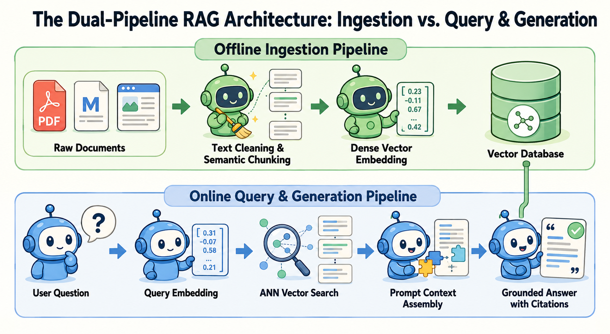
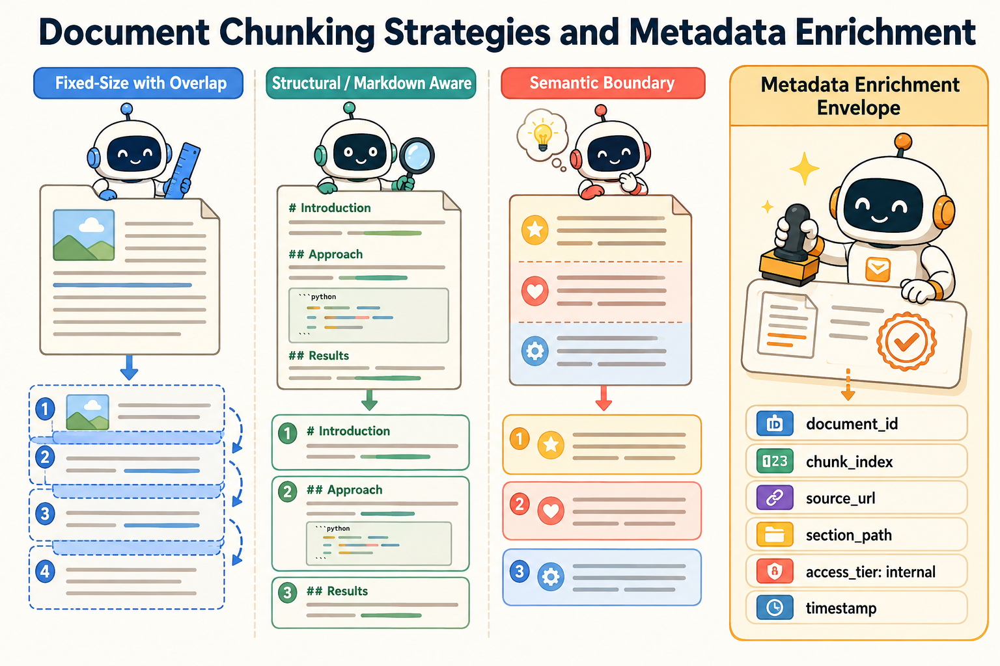
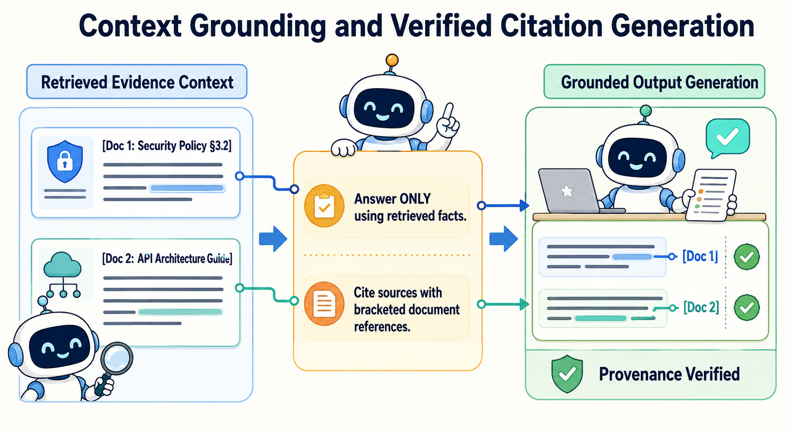

<!--
---
title: RAG system and ingestion
unit_id: P1-03-06-01
summary: Explores the foundational architecture of Retrieval-Augmented Generation (RAG) systems, comparing offline document ingestion pipelines with online query and grounded generation flows.
prerequisites:
- Read [Memory versus context and state](../05-memory/01-memory-versus-context-and-state.md).
learning_objectives:
- Explain the dual-pipeline architecture separating offline document ingestion from online retrieval and generation.
- Implement text extraction, semantic chunking strategies, and metadata enrichment for document corpora.
- Build dense vector embedding indices with approximate nearest neighbor retrieval.
- Assemble grounded context prompts that enforce verifiable inline citations and eliminate parametric hallucinations.
source_records:
- p1-03-06-01-lewis-rag-2020
- p1-03-06-01-karpukhin-dpr-2020
- p1-03-06-01-langchain-rag-ingestion-2024
visual_assets:
- assets/images/03-building-blocks/06-retrieval-and-rag/01-rag-system-and-ingestion/01-rag-dual-pipeline-architecture.png
- assets/images/03-building-blocks/06-retrieval-and-rag/01-rag-system-and-ingestion/02-chunking-and-metadata-enrichment.png
- assets/images/03-building-blocks/06-retrieval-and-rag/01-rag-system-and-ingestion/03-context-grounding-and-citation.png
example_paths:
- examples/03-building-blocks/06-retrieval-and-rag/01-rag-system-and-ingestion/rag_ingestion_runtime.py
pass: architecture
learning_path: main
status: complete
last_reviewed: '2026-09-04'
---
-->

# RAG system and ingestion

## Why this matters

Pre-trained foundation models possess vast general knowledge encoded in their parametric weights. However, this parametric memory suffers from three fundamental constraints in real-world software engineering and enterprise applications: knowledge staleness (inability to reflect events after training cutoff), absence of private domain data (internal engineering wikis, private code repositories, or customer databases), and hallucination (confidently asserting plausible but fictitious facts).

To overcome these constraints, modern AI architectures employ **Retrieval-Augmented Generation (RAG)** (Lewis et al., 2020). Rather than relying entirely on internal model weights, a RAG system dynamically retrieves relevant external document passages and injects them into the model prompt context before generating a response.

Connecting external document knowledge to agent reasoning bridges the gap between static model weights and dynamic enterprise reality. While [Memory](../05-memory/chapter-plan.md) tracks user interactions across sessions and [Tools](../07-tools-and-function-calling/chapter-plan.md) execute actions in external environments, RAG provides the foundational knowledge grounding layer that ensures agent responses are accurate, current, and verifiably attributed to source documents.

## Simple mental model

Think of an open-book final examination taken by a university student:

1. **The closed-book exam (pure foundation model):** The student must answer complex domain questions solely from memory. If a question asks about a company updated 2026 security policy, the student can only guess or hallucinate based on general patterns learned years ago.
2. **The open-book reference library (the RAG corpus):** The student sits in a well-organized library containing verified textbooks, policy manuals, and research papers.
3. **The research index (the ingestion pipeline):** Before the exam begins, a librarian indexes every book by topic, chapter, and keyword, creating a detailed catalog.
4. **The retrieval and citation answer (the online RAG flow):** When asked a specific policy question, the student checks the catalog, pulls the exact two relevant pages from the shelf, places them on the desk, and writes an answer citing the exact paragraph numbers.

By consulting the library index and citing specific passages, the student guarantees 100% factual accuracy without memorizing every word in the building.

## Position in the agent workflow

RAG functions as the primary evidence retrieval mechanism within the agentic architecture. When an agent planner identifies that answering a user request requires external factual domain knowledge, it queries the RAG retrieval subsystem.

The RAG architecture operates through two decoupled pipelines: an **offline ingestion pipeline** that prepares and indexes documents, and an **online query pipeline** that handles real-time user prompts, searches the vector index, and generates citation-grounded completions.



*Figure 1. The shared vector database connects the offline ingestion pipeline to the online query and generation pipeline without coupling their execution schedules.*

## How it works

A production RAG system is built upon four architectural pillars: the ingestion lifecycle, chunking strategies, vector embedding indexing, and grounded citation generation.

### 1. The offline ingestion lifecycle

The offline ingestion pipeline prepares raw unstructured documents for sub-second retrieval through five sequential stages (Karpukhin et al., 2020; LangChain, 2024):

1. **Document extraction:** Ingests raw data formats (PDFs, Markdown, HTML, API schemas, and source code files) and extracts clean plain text.
2. **Text normalization:** Strips boilerplate, converts non-standard encodings, and normalizes whitespace while preserving logical layout.
3. **Chunking:** Divides long documents into bounded text passages that fit within retrieval and attention limits.
4. **Metadata enrichment:** Attaches structural attributes (source URL, document ID, header hierarchy, author, and security access tags) to each chunk.
5. **Dense embedding & indexing:** Passes chunks through an embedding model to produce dense vector representations, storing them in an Approximate Nearest Neighbor (ANN) vector database.

### 2. Document chunking strategies

Chunking determines the granularity of retrieved evidence. Choosing the right chunking strategy balances semantic completeness with retrieval precision (LangChain, 2024):

- **Fixed-size sliding window:** Splits text into chunks of fixed character or token length with a small overlap (e.g., 500 characters with 50-character overlap) to prevent cutting sentences in half.
- **Structural / Markdown-aware chunking:** Respects document syntax by splitting along headers (`#`, `##`, `###`), list items, or code block boundaries, ensuring related paragraphs stay grouped together.
- **Semantic boundary chunking:** Uses embedding distance spikes between consecutive sentences to identify natural topic transitions.



*Figure 2. Chunk boundaries control what evidence can be retrieved, while metadata preserves origin, structure, access tier, and freshness for filtering and attribution.*

### 3. Dense vector embeddings and similarity search

Dense retrieval maps queries and document chunks into a shared high-dimensional vector space $\mathbb{R}^d$ (Karpukhin et al., 2020):

$$\vec{v}_{\text{doc}} = \text{Embed}(c), \quad \vec{v}_{\text{query}} = \text{Embed}(q)$$

When a user query $q$ arrives, the vector database computes the cosine similarity between the query vector and candidate chunk vectors:

$$\text{Sim}(\vec{v}_{\text{query}}, \vec{v}_{\text{doc}}) = \frac{\vec{v}_{\text{query}} \cdot \vec{v}_{\text{doc}}}{\|\vec{v}_{\text{query}}\| \|\vec{v}_{\text{doc}}\|}$$

Top-$K$ nearest neighbors are returned, filtered by security access metadata tags (such as tenant ID or permission level).

### 4. Context grounding and verified citations

Once the top-$K$ passages are retrieved, the context assembler formats them into a structured prompt with explicit numbered document tags `[Doc 1]`, `[Doc 2]`. The system prompt instructs the foundation model to base its reasoning strictly on the retrieved passages and cite source tags inline (Lewis et al., 2020).



*Figure 3. Grounding keeps evidence and instructions together, while citation verification checks whether each factual claim is supported. It reduces unsupported answers but does not guarantee correctness.*

## Main variants

1. **RAG-Sequence (Lewis et al., 2020):** Retrieves a single top-$K$ document set and conditions the generation of the entire output sequence on that evidence.
2. **RAG-Token (Lewis et al., 2020):** Evaluates retrieved document distributions at every individual token generation step, blending evidence dynamically.
3. **Modular agentic RAG:** Uses an autonomous agent planner to formulate dynamic multi-step search queries, evaluate retrieval relevance, and iteratively refine queries before generating a final answer.

## Minimal implementation

The following Python snippet demonstrates document chunking, metadata tagging, dense similarity retrieval, and grounded citation prompt assembly. The [full runnable example](../../../examples/03-building-blocks/06-retrieval-and-rag/01-rag-system-and-ingestion/rag_ingestion_runtime.py) demonstrates multi-document indexing and access-tier filtering.

<details>
<summary>Expand minimal Python implementation</summary>

```python
from dataclasses import dataclass
from typing import Dict, List, Tuple

@dataclass
class DocumentChunk:
    chunk_id: str
    doc_id: str
    content: str
    source_url: str
    embedding: List[float]

def cosine_similarity(v1: List[float], v2: List[float]) -> float:
    return sum(a * b for a, b in zip(v1, v2)) if len(v1) == len(v2) else 0.0

class SimpleVectorStore:
    def __init__(self) -> None:
        self.chunks: Dict[str, DocumentChunk] = {}

    def add_chunk(self, chunk: DocumentChunk) -> None:
        self.chunks[chunk.chunk_id] = chunk

    def search(self, query_vec: List[float], top_k: int = 2) -> List[Tuple[DocumentChunk, float]]:
        scored = [(c, cosine_similarity(query_vec, c.embedding)) for c in self.chunks.values()]
        scored.sort(key=lambda x: x[1], reverse=True)
        return scored[:top_k]

def build_grounded_prompt(query: str, results: List[Tuple[DocumentChunk, float]]) -> str:
    lines = ["=== RETRIEVED EVIDENCE ==="]
    for idx, (chunk, _) in enumerate(results, 1):
        lines.append(f"[Doc {idx}] ({chunk.source_url}):\n{chunk.content}\n")
    lines.append(f"=== USER QUERY ===\n{query}\n\nInstructions: Answer strictly using evidence above with [Doc N] citations.")
    return "\n".join(lines)
```

</details>

Run [rag_ingestion_runtime.py](../../../examples/03-building-blocks/06-retrieval-and-rag/01-rag-system-and-ingestion/rag_ingestion_runtime.py) to inspect sliding chunking, mock dense vector indexing, similarity retrieval, and grounded citation generation.

## Data flow and state changes

1. **Document publishing:** Raw documentation files are ingested by the offline pipeline worker.
2. **Chunking and embedding:** Documents are partitioned into passages, transformed into embedding vectors, and indexed in the vector database.
3. **User query submission:** An online user query is received by the agent runtime.
4. **Query embedding:** The query string is embedded into a dense vector using the same embedding model.
5. **Similarity search & filtering:** The vector database finds the top-$K$ matching chunks matching the user security access tier.
6. **Prompt assembly:** Chunks are formatted into a structured prompt with `[Doc N]` references.
7. **Grounded completion:** The LLM generates an answer with verifiable citations referencing the retrieved passages.

## Trust boundaries

- **Document ingestion trust boundary:** Ingested documents may originate from untrusted external sources (such as public websites or third-party submissions). The ingestion parser must sanitize raw HTML/scripts to prevent prompt injection payloads from entering the vector store.
- **Access control metadata filtering:** Retrieval queries must strictly enforce user permission filters at the database level so unauthorized users cannot retrieve confidential internal documents.
- **Parametric hallucination boundary:** The model generation prompt must enforce strict instructions prohibiting the model from inventing claims unsupported by retrieved chunks.

## Reliability failures

- **Chunk boundary information loss:** If a critical formula or table is sliced in half across two separate chunks, neither chunk may contain enough context to answer queries accurately.
- **Retrieval of irrelevant distractors:** High vector similarity does not guarantee semantic relevance; retrieving misleading distractors can cause the generator to produce flawed answers.
- **Citation fabrication:** Without automated post-generation citation checking, models may hallucinate plausible-looking `[Doc N]` citations for claims that are not actually supported by the source text.

## Limitations and trade-offs

- **Embedding and indexing latency:** Processing millions of documents through embedding models requires significant compute and storage infrastructure.
- **Fixed vs. dynamic chunk sizes:** Small chunks offer precise retrieval but lack contextual depth; large chunks preserve context but consume more prompt tokens and increase noise.
- **Dual-encoder semantic blind spots:** Dense embedding models can overlook exact keyword matches, serial numbers, and specialized code identifiers that traditional lexical search handles easily.

## Security preview

In Pass 2, RAG systems are evaluated against **Corpus Poisoning, Access-Filter Bypass, and Indirect Prompt Injection via Retrieved Documents**. Attackers insert malicious instructions into public documentation pages designed to hijack the agent context upon retrieval. We analyze defensive mechanisms including pre-ingestion content sanitization, cryptographic corpus signatures, and isolated citation verification gates in [Retrieval, memory, and data security](../../07-security-by-component-and-workflow-stage/02-retrieval-memory-and-data/chapter-plan.md).

## Open research questions

- How can ingestion pipelines dynamically determine optimal chunk boundaries without human-tuned heuristic rules?
- What verification algorithms can validate citation faithfulness in real time with sub-10ms overhead?

## Key takeaways

- RAG combines parametric model reasoning with non-parametric external document retrieval to eliminate hallucinations and staleness.
- The RAG system operates via two decoupled pipelines: offline document ingestion and online query retrieval/generation.
- Ingestion involves text extraction, semantic chunking, metadata enrichment, and dense vector embedding.
- Grounded prompt assembly injects numbered document evidence and requires verified inline citations.

## References

- Lewis, P., Perez, E., Piktus, A., Petroni, F., Karpukhin, V., Goyal, N., Küttler, H., Lewis, M., Yih, W., Rocktäschel, T., Riedel, S., & Kiela, D. (2020). *Retrieval-Augmented Generation for Knowledge-Intensive NLP Tasks*. Advances in Neural Information Processing Systems (NeurIPS 2020). [arXiv:2005.11401](https://arxiv.org/abs/2005.11401).
- Karpukhin, V., Oğuz, B., Min, S., Lewis, P., Wu, L., Edunov, S., Chen, D., & Yih, W. (2020). *Dense Passage Retrieval for Open-Domain Question Answering*. In Proceedings of the 2020 Conference on Empirical Methods in Natural Language Processing (EMNLP 2020), pp. 6769-6781. [arXiv:2004.04906](https://arxiv.org/abs/2004.04906).
- LangChain Community. (2024). *LangChain: Document Loading, Chunking, and Vector Ingestion Pipelines*. LangChain Documentation. [LangChain Retrieval Concepts](https://python.langchain.com/v0.2/docs/concepts/#retrieval).

---

[Next Unit: Sparse, dense, and hybrid retrieval →](chapter-plan.md)
