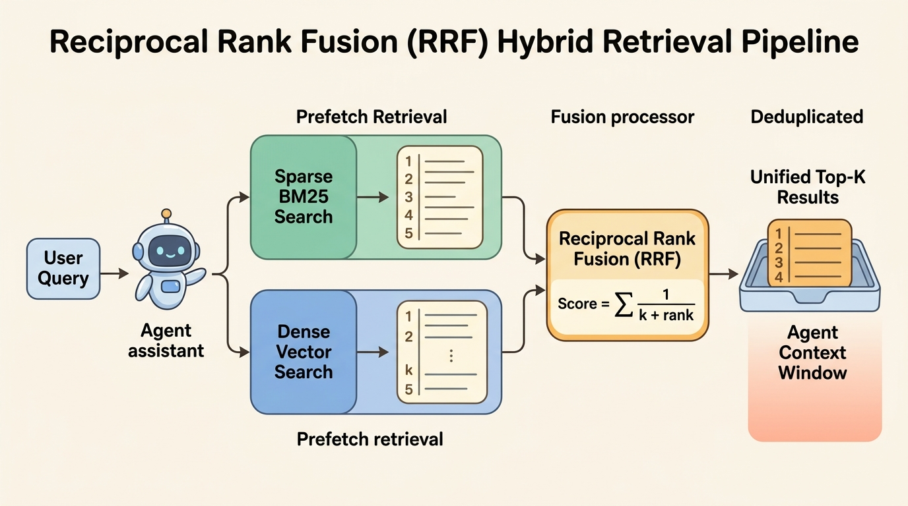

<!--
---
title: Sparse, dense, and hybrid retrieval
unit_id: P1-03-06-02
summary: Examines lexical, vector, and hybrid search methods, demonstrating how combining
  BM25 exact-token matching with dense semantic embeddings via Reciprocal Rank Fusion
  overcomes vocabulary mismatch and semantic drift.
prerequisites:
- Read [RAG system and ingestion](01-rag-system-and-ingestion.md).
learning_objectives:
- Compare the mathematical foundations and retrieval characteristics of sparse lexical
  indexing (BM25) and dense embedding retrieval (dual encoders).
- Analyze the complementary failure modes of pure sparse retrieval (vocabulary mismatch)
  and pure dense retrieval (identifier blindness and semantic drift).
- Implement Reciprocal Rank Fusion (RRF) and distribution-based score normalization
  to merge multiple candidate rankings without manual score calibration.
- Evaluate storage, compute, and latency trade-offs when operating dual-index hybrid
  search architectures in production agent systems.
source_records:
- p1-03-06-02-robertson-bm25-2009
- p1-03-06-02-karpukhin-dpr-2020
- p1-03-06-02-cormack-rrf-2009
- p1-03-06-02-qdrant-hybrid-2026
visual_assets:
- assets/images/03-building-blocks/06-retrieval-and-rag/02-sparse-dense-and-hybrid-retrieval/01-sparse-dense-and-hybrid-retrieval-landscape.png
- assets/images/03-building-blocks/06-retrieval-and-rag/02-sparse-dense-and-hybrid-retrieval/02-reciprocal-rank-fusion-workflow.png
example_paths:
- examples/03-building-blocks/06-retrieval-and-rag/02-sparse-dense-and-hybrid-retrieval/hybrid_retrieval_runtime.py
pass: architecture
learning_path: main
status: complete
last_reviewed: '2026-09-12'
---
-->

# Sparse, dense, and hybrid retrieval

## Why this matters

In Retrieval-Augmented Generation (RAG), the quality of an agent response depends entirely on whether the retrieval subsystem provides relevant, precise evidence. If the retriever returns irrelevant documents, the model hallucinates or fails to execute its assigned task. In production systems, relying on a single retrieval paradigm frequently leads to silent failures.

Pure dense vector retrieval excels at conceptual similarity. It easily links paraphrases such as "fault-tolerant routing" to "resilient microservice proxies" (Karpukhin et al., 2020). However, dense embeddings struggle with exact identifiers, specific error codes (such as `ERR-4039`), product serial numbers, and specialized function signatures. Conversely, classic sparse lexical retrieval (such as Okapi BM25) finds exact keywords instantly through inverted indexes, but fails when users express concepts using synonyms or natural conversational language (Robertson & Zaragoza, 2009).

Hybrid retrieval bridges this divide by executing both sparse lexical search and dense semantic search across the same query, then merging the resulting candidate lists through rank fusion algorithms (Cormack et al., 2009; Couzon, 2026). While [Memory](../05-memory/chapter-plan.md) maintains user context across sessions and [Tools](../07-tools-and-function-calling/chapter-plan.md) allow agents to take external actions, hybrid retrieval ensures that knowledge grounding is resilient to both keyword mismatches and semantic ambiguity.

## Simple mental model

Think of an investigator solving a case in a large city records archive:

1. **The exact index clerk (sparse retrieval):** The clerk checks a physical alphabetical catalog. When given a specific driver license number or vehicle VIN, the clerk pulls the exact folder in two seconds. But if asked for "records about someone feeling sad and leaving town," the clerk finds nothing because the cards do not record abstract feelings or synonyms.
2. **The conceptual detective (dense retrieval):** The detective grasps the emotional and thematic essence of the request. The detective navigates directly to the missing persons and mental health support archives. But if given an alphanumeric serial number like `XJ-904-B`, the detective cannot locate the file because all serial numbers look conceptually similar.
3. **The collaborative team (hybrid fusion):** Both the clerk and the detective conduct their searches simultaneously. A coordinator takes the top five folders from each, compares where documents placed across both searches, and hands the investigator a single combined stack.

Combining exact keyword indexing with semantic meaning ensures that whether a user provides a strict error code or a vague conceptual description, the right evidence reaches the agent.

## Position in the agent workflow

Hybrid retrieval operates at the core of the RAG evidence extraction step. When an agent planner determines that an incoming task requires external domain knowledge, it formulates a retrieval query.

Rather than committing to either an inverted index or a vector database, the query coordinator dispatches parallel prefetch requests to both engines. Once both candidate lists arrive, a fusion layer reconciles their differing score distributions and produces a unified top-$K$ evidence bundle that is injected into the model context window.


*Figure 1. Sparse retrieval prioritizes exact lexical tokens, dense retrieval captures semantic proximity, and hybrid fusion combines both strengths to maximize precision and recall.*

## How it works

A production retrieval subsystem relies on understanding the distinct mechanics of sparse lexical scoring, dense vector similarity, and score fusion algorithms.

### 1. Sparse lexical retrieval and Okapi BM25

Sparse retrieval represents documents and queries as high-dimensional, sparse vectors where each dimension corresponds to a unique word or token in the vocabulary. The vast majority of dimensions contain zeros.

The standard algorithm for sparse lexical search is **Okapi BM25** (Robertson & Zaragoza, 2009). BM25 calculates the relevance score of a document $D$ given a query $Q$ containing search tokens $q_1, q_2, \dots, q_n$:

$$\text{Score}_{\text{BM25}}(D, Q) = \sum_{i=1}^{n} \text{IDF}(q_i) \cdot \frac{f(q_i, D) \cdot (k_1 + 1)}{f(q_i, D) + k_1 \cdot \left(1 - b + b \cdot \frac{|D|}{\text{avgdl}}\right)}$$

Here, $f(q_i, D)$ is the term frequency of token $q_i$ in document $D$, $|D|$ is the document length, and $\text{avgdl}$ is the average document length across the entire corpus. The constant $k_1$ (typically 1.2 to 2.0) calibrates term frequency saturation, preventing repetitive keyword stuffing from artificially inflating scores. The parameter $b$ (typically 0.75) controls document length normalization.

The inverse document frequency $\text{IDF}(q_i)$ penalizes common words and boosts rare, informative terms:

$$\text{IDF}(q_i) = \ln\left(1 + \frac{N - n(q_i) + 0.5}{n(q_i) + 0.5}\right)$$

Where $N$ is the total number of documents and $n(q_i)$ is the number of documents containing token $q_i$. Sparse search uses inverted indexes, enabling sub-millisecond lookups over millions of documents without requiring GPU acceleration.

### 2. Dense semantic retrieval and dual encoders

Dense retrieval projects both queries and passages into a shared continuous vector space $\mathbb{R}^d$ (typically 384 to 1536 dimensions) using deep neural networks (Karpukhin et al., 2020). Unlike sparse vectors, dense embeddings are dense: every dimension contains a non-zero continuous floating-point number representing latent semantic features.

In a **dual-encoder architecture**, two separate transformer encoders (or two parameter-shared heads) process queries and documents independently:

$$\vec{e}_{\text{query}} = E_Q(q), \quad \vec{e}_{\text{doc}} = E_D(d)$$

Relevance is measured using cosine similarity or inner product:

$$\text{Sim}(q, d) = \frac{\vec{e}_{\text{query}} \cdot \vec{e}_{\text{doc}}}{\|\vec{e}_{\text{query}}\| \|\vec{e}_{\text{doc}}\|}$$

Because document vectors are precomputed offline and indexed in Approximate Nearest Neighbor (ANN) structures (such as HNSW or IVF), query execution requires only a single forward pass through the query encoder followed by fast vector graph traversal.

### 3. Complementary failure modes

Neither retrieval paradigm is sufficient on its own:

- **Vocabulary mismatch (Sparse failure):** If a user asks "How do I make my application fault-tolerant?" and the documentation describes "building resilient systems with automated failover," BM25 scores the document near zero because the exact words "fault-tolerant" do not appear.
- **Identifier blindness and semantic drift (Dense failure):** If a user asks for "patch notes for CVE-2024-38077" or "issue with component SKU-402," dense models often map these unique tokens to general security or hardware clusters, returning unrelated CVEs or nearby product models that share high semantic proximity but lack the exact identifier.

| Retrieval dimension | Sparse retrieval (BM25) | Dense retrieval (Dual encoders) | Hybrid retrieval (Fusion) |
| --- | --- | --- | --- |
| **Representation** | High-dimensional sparse bag-of-words | Low-dimensional continuous dense vector | Dual representation (inverted index + vector index) |
| **Primary strength** | Exact keyword matching, codes, part numbers | Semantic understanding, synonyms, paraphrasing | High precision on identifiers and high recall on concepts |
| **Primary weakness** | Vocabulary mismatch, zero semantic awareness | Identifier blindness, out-of-domain degradation | Increased storage, dual indexing, query overhead |
| **Compute cost** | Low (CPU inverted index) | Medium-high (GPU/CPU neural embeddings) | Combined cost of both pipelines |
| **Tuning requirements** | Minimal ($k_1, b$ heuristics) | High (model selection, fine-tuning, embedding dimension) | Moderate (fusion algorithm and candidate depth) |

### 4. Hybrid rank fusion algorithms

To merge results from disparate retrievers, systems cannot simply add raw BM25 scores to cosine similarity values. Dense cosine similarity is bounded between $-1.0$ and $+1.0$, whereas BM25 produces unbounded positive numbers whose scale shifts drastically depending on query length and term rarity (Couzon, 2026).

Two primary fusion strategies address this challenge:

#### Reciprocal Rank Fusion (RRF)

Reciprocal Rank Fusion bypasses score scale discrepancies by operating purely on the rank positions of candidates across result sets (Cormack et al., 2009). For a set of queries or retrievers $M$, the RRF score of document $d$ is:

$$\text{Score}_{\text{RRF}}(d) = \sum_{m \in M} \frac{1}{k + \text{rank}_m(d)}$$

Where $\text{rank}_m(d)$ is the position of document $d$ in the result list of retriever $m$ (starting at 1), and $k$ is a smoothing constant (standardized at 60). The constant $k$ ensures that high-ranking candidates are rewarded without allowing an extreme top rank from one list to completely overpower consistent top-10 appearances across multiple lists.



*Figure 2. Parallel prefetch queries feed candidate lists into the Reciprocal Rank Fusion stage, which merges rankings based on positional reciprocity rather than uncalibrated raw scores.*

#### Distribution-Based Score Fusion (DBSF) and linear combination

When score margins contain valuable confidence information that pure ranks discard, systems apply score normalization before linear weighting. Min-max normalization scales scores to a standard $[0, 1]$ interval:

$$S_{\text{norm}}(d) = \frac{S(d) - S_{\min}}{S_{\max} - S_{\min}}$$

The unified score combines normalized scores with configurable weights $\alpha \in [0, 1]$:

$$\text{Score}_{\text{Hybrid}}(d) = \alpha \cdot S_{\text{norm, sparse}}(d) + (1 - \alpha) \cdot S_{\text{norm, dense}}(d)$$

While linear combination allows operators to prioritize exact matches ($\alpha > 0.5$) or semantic meaning ($\alpha < 0.5$), it remains sensitive to outliers in individual result distributions. Consequently, RRF serves as the robust production default.

## Main variants

1. **Classic lexical + dense hybrid:** Runs BM25 on an inverted index engine (such as Lucene or Elasticsearch) alongside dense vector search (such as Qdrant, Pinecone, or Milvus), combining candidates via RRF (Cormack et al., 2009; Couzon, 2026).
2. **Learned sparse representations (SPLADE):** Uses neural language models to predict sparse term expansion vectors directly in vocabulary space (Formal et al., 2021). SPLADE retains inverted index efficiency while automatically injecting synonyms into document weights.
3. **Late interaction multi-vector retrieval (ColBERT):** Preserves token-level embeddings for both queries and passages, computing token-to-token maximum similarity (MaxSim) at retrieval time. This captures fine-grained term interactions while retaining semantic vector representations.
4. **Graph and agentic retrieval:** Extends retrieval beyond passage similarity by traversing knowledge graphs (GraphRAG) or using autonomous agent loops to iteratively formulate multi-hop queries across structured databases and vector indices.

## Minimal implementation

The following Python snippet demonstrates dual-index construction (Okapi BM25 and dense vector similarity) and merges search candidates using Reciprocal Rank Fusion. The [full runnable example](../../../examples/03-building-blocks/06-retrieval-and-rag/02-sparse-dense-and-hybrid-retrieval/hybrid_retrieval_runtime.py) demonstrates comparative tests across exact code queries, semantic paraphrases, and composite prompts.

<details>
<summary>Expand minimal Python implementation</summary>

```python
from dataclasses import dataclass
import math
from typing import Dict, List, Set, Tuple

@dataclass
class Document:
    doc_id: str
    content: str
    tokens: List[str]
    vector: List[float]

class BM25Index:
    def __init__(self, k1: float = 1.5, b: float = 0.75) -> None:
        self.k1, self.b = k1, b
        self.docs: Dict[str, Document] = {}
        self.inverted_index: Dict[str, Set[str]] = {}
        self.doc_lens: Dict[str, int] = {}
        self.avg_dl: float = 0.0

    def add_documents(self, documents: List[Document]) -> None:
        total_len = 0
        for doc in documents:
            self.docs[doc.doc_id] = doc
            self.doc_lens[doc.doc_id] = len(doc.tokens)
            total_len += len(doc.tokens)
            for token in doc.tokens:
                self.inverted_index.setdefault(token, set()).add(doc.doc_id)
        self.avg_dl = total_len / max(len(documents), 1)

    def search(self, query_tokens: List[str]) -> List[Tuple[str, float]]:
        scores: Dict[str, float] = {}
        n_docs = len(self.docs)
        for t in query_tokens:
            matching = self.inverted_index.get(t, set())
            idf = math.log(1.0 + (n_docs - len(matching) + 0.5) / (len(matching) + 0.5))
            for d_id in matching:
                tf = self.docs[d_id].tokens.count(t)
                denom = tf + self.k1 * (1.0 - self.b + self.b * (self.doc_lens[d_id] / self.avg_dl))
                scores[d_id] = scores.get(d_id, 0.0) + idf * (tf * (self.k1 + 1.0) / denom)
        return sorted(scores.items(), key=lambda x: x[1], reverse=True)

def reciprocal_rank_fusion(
    sparse_hits: List[Tuple[str, float]],
    dense_hits: List[Tuple[str, float]],
    k_rrf: int = 60,
    top_k: int = 3
) -> List[Tuple[str, float]]:
    rrf_scores: Dict[str, float] = {}
    for rank, (doc_id, _) in enumerate(sparse_hits, start=1):
        rrf_scores[doc_id] = rrf_scores.get(doc_id, 0.0) + (1.0 / (k_rrf + rank))
    for rank, (doc_id, _) in enumerate(dense_hits, start=1):
        rrf_scores[doc_id] = rrf_scores.get(doc_id, 0.0) + (1.0 / (k_rrf + rank))
    return sorted(rrf_scores.items(), key=lambda x: x[1], reverse=True)[:top_k]
```

</details>

Run [hybrid_retrieval_runtime.py](../../../examples/03-building-blocks/06-retrieval-and-rag/02-sparse-dense-and-hybrid-retrieval/hybrid_retrieval_runtime.py) to inspect exact identifier lookups, conceptual paraphrase queries, and RRF rank fusion behavior.

## Data flow and state changes

1. **Dual indexing:** During ingestion, raw documents are parsed into text chunks. Each chunk is indexed into an inverted index (recording token frequencies and document lengths) and passed to an embedding model to generate a dense vector stored in an ANN index.
2. **Query dispatch:** When a user prompt arrives, the retrieval coordinator sends the raw text to the sparse engine and computes the query embedding before querying the vector store.
3. **Prefetch candidate retrieval:** Both retrievers return candidate lists (typically top-50 or top-100 items) with their respective raw scores.
4. **Rank fusion calculation:** The fusion processor computes the RRF score for each unique document ID across both candidate lists.
5. **Candidate union pruning:** The merged list is sorted in descending order and truncated to the final retrieval limit $K$ (e.g., top-5).
6. **Prompt injection:** The selected passages are formatted into structured grounding context for the agent language model.

## Trust boundaries

- **Index synchronization boundary:** In dual-index architectures, document insertions, updates, and deletions must execute atomically across both the inverted index and vector store. If a revoked document is deleted from the vector store but remains in the sparse index, unauthorized records can leak through hybrid search.
- **Tenant and permission filter enforcement:** Security access filters (such as organization ID or user access role) must be evaluated within both prefetch queries before fusion occurs. Filtering only after fusion can cause unauthorized documents to displace authorized candidates from the top-$K$ window.
- **Input sanitization:** Lexical queries must sanitize boolean operators, regex characters, and escape syntax to prevent query injection attacks against underlying search engines.

## Reliability failures

- **Prefetch cutoff truncation:** Fusion operates strictly on the union of candidates returned by the prefetch queries. If a relevant document ranks 101st in both sparse and dense prefetch lists, and the prefetch cutoff is 100, fusion cannot recover the document regardless of the fusion algorithm used (Couzon, 2026).
- **Dominance by noisy lexical matches:** Queries containing high-frequency common words alongside domain jargon can lead to sparse result sets flooded with irrelevant documents that happen to share repeated common words, degrading the fused ranking.
- **Score distortion under linear weighting:** When using linear score combination instead of RRF, sudden score spikes from BM25 on short documents can overshadow high-confidence dense semantic matches, distorting the final ordering.

## Limitations and trade-offs

- **Infrastructure and storage overhead:** Operating both an inverted index and a vector database doubles document storage requirements and increases memory consumption for in-memory graphs.
- **Query latency:** Executing two retrieval queries in parallel and merging candidates adds latency compared to single-index search. In high-concurrency systems, network transit and lock contention can impact throughput.
- **Cold start and term tuning:** BM25 parameters ($k_1, b$) and embedding models must be evaluated against representative domain workloads. Generic out-of-the-box embeddings often degrade on specialized proprietary terminology without domain adaptation.

## Security preview

In Pass 2, hybrid retrieval systems are analyzed against **Adversarial Keyword Stuffing, Dual-Index Inconsistency Exploits, and Indirect Prompt Injection**. Attackers exploit sparse and dense blind spots by crafting documents that fool semantic vector similarity while concealing malicious instructions in unindexed text regions, or manipulating lexical frequencies to hijack top RRF ranks. We examine index isolation, cryptographic corpus provenance, and multi-stage reranking gates in [Retrieval, memory, and data security](../../07-security-by-component-and-workflow-stage/02-retrieval-memory-and-data/chapter-plan.md).

## Open research questions

- How can hybrid systems dynamically adjust prefetch depth and fusion weights based on query intent classification without adding runtime latency?
- Can learned sparse models (such as SPLADE) fully replace dual-index architectures across highly technical enterprise domains with high lexical precision?

## Key takeaways

- Sparse retrieval (BM25) provides fast, exact-match keyword lookups, but fails when queries and documents use different terminology.
- Dense retrieval (dual encoders) captures semantic meaning and handles paraphrases, but is prone to identifier blindness and semantic drift on specific codes and numbers.
- Hybrid retrieval runs both engines in parallel and merges candidates using Reciprocal Rank Fusion (RRF) or distribution-based score normalization.
- Reciprocal Rank Fusion scores candidates based on their reciprocal rank positions ($1 / (k + \text{rank})$), avoiding uncalibrated score scale mismatches.
- Hybrid search requires careful prefetch depth tuning to ensure relevant evidence is not excluded before the fusion stage.

## References

- Robertson, S., & Zaragoza, H. (2009). *The Probabilistic Relevance Framework: BM25 and Beyond*. Foundations and Trends in Information Retrieval, 3(4), 333-389. [DOI:10.1561/1500000019](https://doi.org/10.1561/1500000019).
- Karpukhin, V., Oğuz, B., Min, S., Lewis, P., Wu, L., Edunov, S., Chen, D., & Yih, W. (2020). *Dense Passage Retrieval for Open-Domain Question Answering*. In Proceedings of the 2020 Conference on Empirical Methods in Natural Language Processing (EMNLP 2020), pp. 6769-6781. [arXiv:2004.04906](https://arxiv.org/abs/2004.04906).
- Cormack, G. V., Clarke, C. L. A., & Buettcher, S. (2009). *Reciprocal Rank Fusion Outperforms Condorcet and Individual Rank Learning Methods*. In Proceedings of the 32nd International ACM SIGIR Conference on Research and Development in Information Retrieval (SIGIR '09), pp. 758-759. [DOI:10.1145/1571941.1572114](https://doi.org/10.1145/1571941.1572114).
- Couzon, D. (2026). *Hybrid Search in Qdrant*. Qdrant Technical Documentation. [Qdrant Hybrid Search](https://qdrant.tech/articles/hybrid-search/).
- Formal, T., Piwowarski, B., & Clinchant, S. (2021). *SPLADE: Sparse Lexical and Expansion Model for First Stage Ranking*. In Proceedings of the 44th International ACM SIGIR Conference on Research and Development in Information Retrieval (SIGIR '21), pp. 2288-2292. [arXiv:2107.05720](https://arxiv.org/abs/2107.05720).

---

[Next Unit: Chunking, ranking, and advanced retrieval →](03-chunking-ranking-and-advanced-retrieval.md)
